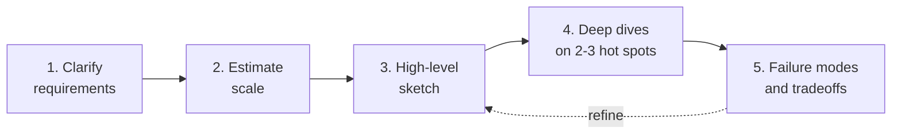
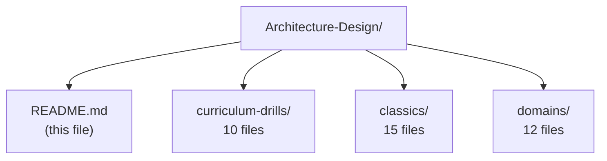

# Architecture Design — Scenario Catalog

[Back to top README](../../README.md)

This folder is a catalog of architecture-design challenges for practicing what the four weeks taught you. Week 4 Day 28 showed one fully-designed system (the mobile game skin purchase). This folder gives you **37 more** — across curriculum drills, classic "Design X" interview prompts, and industry-domain scenarios — so you can stress-test the patterns against every shape of real-world problem.

---

## How to approach any system design

Every scenario file in this folder is written around the same 5-step framework. Practice the framework, and any new problem (interview, project, or real-world system) becomes tractable.

1. **Clarify requirements.** Functional (what does it do?), non-functional (how fast, how available, how consistent, how big?). Ambiguity is the enemy — pin it down before drawing anything.
2. **Estimate scale.** Users, QPS reads vs writes, storage growth, bandwidth. Back-of-envelope math drives every downstream decision.
3. **High-level sketch.** Draw the boxes: clients, edge/gateway, services, data stores, brokers. Label the arrows with protocols.
4. **Deep dives.** Pick the 2-3 hardest subsystems and explain: data model, communication pattern, consistency model, cache strategy.
5. **Failure modes and tradeoffs.** What breaks first under load? Where is the dual-write? What is eventually consistent? What monitoring would catch a silent outage?

---

## Legends

### Difficulty

| Icon | Level | Meaning |
|---|---|---|
| E | Easy | 1-2 services, single pattern, no cross-cutting concerns |
| M | Medium | 3-5 services, 2+ patterns, some operational concerns |
| H | Hard | Multi-pattern, consistency tradeoffs, scale pressure |
| X | Expert | Multi-region, exotic consistency, p99 guarantees |

### Tags (curriculum alignment)

| Tag | Maps to |
|---|---|
| Sync | Week 1 — REST, gRPC, gateways |
| Async | Week 2 — RabbitMQ, SQS/SNS |
| Stream | Week 3 — Kafka, Redis Pub/Sub, CQRS, Event Sourcing |
| Resil | Week 4 — Saga, Outbox, Circuit Breaker, Retries |
| Sec | Week 4 — mTLS, JWT |
| RT | Real-time (WebSocket / SSE / gRPC streaming) |

---

## Folder layout

- **`curriculum-drills/`** — Each file pins the spotlight on one pattern from Weeks 1-4. Use these to solidify a specific tool.
- **`classics/`** — The "Design X" canon (URL shortener, Twitter feed, WhatsApp, etc.). Use these to practice interviewing and to see how multiple patterns combine.
- **`domains/`** — Industry-specific scenarios (fintech, gaming, ride-sharing, ad-tech, etc.). Use these to see how domain constraints reshape architectures.

---

## Master index

### Curriculum drills — [curriculum-drills/](curriculum-drills/)

| # | Scenario | Difficulty | Tags |
|---|---|---|---|
| 01 | [Sync Stack — Read-Heavy Product Catalog](curriculum-drills/01-sync_stack_product_catalog.md) | M | Sync |
| 02 | [Work Queue — Order Ingestion at 1M/day](curriculum-drills/02-work_queue_order_ingestion.md) | M | Async |
| 03 | [Fanout — Multichannel Notifications](curriculum-drills/03-fanout_multichannel_notifications.md) | M | Async |
| 04 | [Event Streaming — Activity Log](curriculum-drills/04-event_streaming_activity_log.md) | H | Stream |
| 05 | [CQRS — Product Search](curriculum-drills/05-cqrs_product_search.md) | H | Stream, Sync |
| 06 | [Event Sourcing — Bank Ledger](curriculum-drills/06-event_sourcing_bank_ledger.md) | H | Stream, Resil |
| 07 | [Saga — Travel Booking](curriculum-drills/07-saga_travel_booking.md) | H | Resil, Async |
| 08 | [Outbox — Inventory to Many Consumers](curriculum-drills/08-outbox_inventory_to_many_consumers.md) | H | Resil, Stream |
| 09 | [Circuit Breaker — Dashboard Aggregator](curriculum-drills/09-circuit_breaker_dashboard_aggregator.md) | M | Resil, Sync |
| 10 | [Multi-Region Active-Active](curriculum-drills/10-multi_region_active_active.md) | X | Resil, Sec |

### Classics — [classics/](classics/)

| # | Scenario | Difficulty | Tags |
|---|---|---|---|
| 01 | [URL Shortener (bit.ly)](classics/01-url_shortener.md) | M | Sync, Stream |
| 02 | [Pastebin](classics/02-pastebin.md) | E | Sync |
| 03 | [Distributed Rate Limiter](classics/03-rate_limiter.md) | M | Sync |
| 04 | [Notification System](classics/04-notification_system.md) | H | Async, RT |
| 05 | [Typeahead Autocomplete](classics/05-typeahead_autocomplete.md) | M | Sync, Stream |
| 06 | [Twitter News Feed](classics/06-twitter_news_feed.md) | H | Stream, RT |
| 07 | [WhatsApp Chat](classics/07-whatsapp_chat.md) | H | RT, Stream |
| 08 | [Instagram Feed + Media](classics/08-instagram_feed_and_media.md) | H | Stream, Sync |
| 09 | [Uber — Ride Matching](classics/09-uber_ride_matching.md) | X | RT, Stream, Resil |
| 10 | [Netflix Streaming](classics/10-netflix_streaming.md) | H | Sync, Stream |
| 11 | [Google Drive / Dropbox](classics/11-google_drive_dropbox.md) | H | Sync, Stream |
| 12 | [Google Docs — Realtime Collab](classics/12-google_docs_realtime_collab.md) | X | RT, Stream |
| 13 | [YouTube — Upload & Playback](classics/13-youtube_upload_and_playback.md) | H | Async, Sync |
| 14 | [Distributed Search Engine](classics/14-distributed_search_engine.md) | H | Stream, Sync |
| 15 | [Web Crawler](classics/15-web_crawler.md) | H | Async, Stream |

### Domains — [domains/](domains/)

| # | Scenario | Difficulty | Tags |
|---|---|---|---|
| 01 | [E-commerce — Black Friday Checkout](domains/01-ecommerce_black_friday_checkout.md) | X | Resil, Async, Stream |
| 02 | [Fintech — Payment Processor](domains/02-fintech_payment_processor.md) | X | Resil, Sec |
| 03 | [Gaming — Leaderboard + Matchmaking](domains/03-gaming_leaderboard_and_matchmaking.md) | H | RT, Stream |
| 04 | [Ride-Sharing — Live Location](domains/04-ride_sharing_live_location.md) | X | RT, Stream |
| 05 | [Video Streaming + CDN](domains/05-video_streaming_with_cdn.md) | H | Sync, Async |
| 06 | [Ad-tech — Realtime Bidding](domains/06-ad_tech_realtime_bidding.md) | X | Sync, Stream |
| 07 | [Social Media — Timeline + Stories](domains/07-social_media_timeline_and_stories.md) | H | Stream, RT |
| 08 | [SaaS — Multi-Tenant Platform](domains/08-saas_multi_tenant_platform.md) | H | Sec, Sync |
| 09 | [Logistics — Package Tracking](domains/09-logistics_and_package_tracking.md) | M | Stream, RT |
| 10 | [Figma-style Live Collaboration](domains/10-figma_style_live_collaboration.md) | X | RT, Stream |
| 11 | [Realtime Analytics Dashboard](domains/11-realtime_analytics_dashboard.md) | H | Stream, RT |
| 12 | [Healthcare — Appointments + Records](domains/12-healthcare_appointments_and_records.md) | H | Sec, Resil |

---

## Cross-scenario pattern matrix

A compact view of which scenarios exercise which patterns. Use it to pick a drill that covers the patterns you want to practice.

| Scenario | REST | gRPC | WS | SSE | Rabbit | SNS/SQS | Kafka | Redis PS | Outbox | Saga | CQRS | ES | CB | mTLS/JWT |
|---|---|---|---|---|---|---|---|---|---|---|---|---|---|---|
| cd-01 Sync Stack | X | X |  |  |  |  |  | X |  |  |  |  |  | X |
| cd-02 Work Queue | X |  |  |  | X |  |  |  |  |  |  |  |  |  |
| cd-03 Fanout | X |  |  |  |  | X |  |  |  |  |  |  |  |  |
| cd-04 Event Log | X |  |  |  |  |  | X |  |  |  |  |  |  |  |
| cd-05 CQRS | X | X |  |  |  |  | X |  | X |  | X |  |  |  |
| cd-06 Event Sourcing | X |  |  |  |  |  | X |  |  |  | X | X |  |  |
| cd-07 Saga |  | X |  |  | X |  | X |  | X | X |  |  | X |  |
| cd-08 Outbox | X |  |  |  |  |  | X |  | X |  |  |  |  |  |
| cd-09 Circuit Breaker |  | X |  |  |  |  |  |  |  |  |  |  | X |  |
| cd-10 Multi-Region | X | X |  |  |  |  | X | X | X |  |  |  | X | X |
| cl-01 URL Shortener | X |  |  |  |  |  | X | X |  |  |  |  |  |  |
| cl-02 Pastebin | X |  |  |  |  |  |  |  |  |  |  |  |  |  |
| cl-03 Rate Limiter | X |  |  |  |  |  |  | X |  |  |  |  |  |  |
| cl-04 Notifications | X |  | X |  | X | X | X | X |  |  |  |  | X |  |
| cl-05 Typeahead | X |  |  |  |  |  | X | X |  |  |  |  |  |  |
| cl-06 Twitter | X |  | X | X |  |  | X | X |  |  | X |  |  |  |
| cl-07 WhatsApp | X |  | X |  |  |  | X | X | X |  |  |  |  | X |
| cl-08 Instagram | X |  | X |  |  |  | X | X |  |  | X |  |  |  |
| cl-09 Uber | X | X | X |  |  |  | X | X | X | X |  |  | X |  |
| cl-10 Netflix | X | X |  |  |  |  | X | X |  |  |  |  | X | X |
| cl-11 Drive | X | X |  |  |  |  | X |  |  |  |  |  |  | X |
| cl-12 Docs | X |  | X |  |  |  | X | X |  |  |  | X |  |  |
| cl-13 YouTube | X |  |  |  | X |  | X |  |  |  |  |  |  |  |
| cl-14 Search | X |  |  |  |  |  | X |  |  |  | X |  |  |  |
| cl-15 Crawler | X |  |  |  | X |  | X |  |  |  |  |  |  |  |
| dm-01 Ecom BF | X | X |  |  | X |  | X | X | X | X | X |  | X | X |
| dm-02 Fintech | X | X |  |  |  |  | X |  | X | X |  | X | X | X |
| dm-03 Gaming | X | X | X |  |  |  | X | X |  |  |  |  |  |  |
| dm-04 Ride | X | X | X |  |  |  | X | X | X |  | X |  | X |  |
| dm-05 Video | X |  |  |  | X |  | X | X |  |  |  |  | X |  |
| dm-06 Ad-tech | X | X |  |  |  |  | X | X |  |  | X |  | X |  |
| dm-07 Social | X |  | X | X |  |  | X | X |  |  | X |  |  |  |
| dm-08 SaaS | X | X |  |  |  |  | X |  |  |  |  |  | X | X |
| dm-09 Logistics | X |  | X |  |  |  | X |  |  |  |  |  |  |  |
| dm-10 Figma | X |  | X |  |  |  | X | X |  |  |  | X |  |  |
| dm-11 Analytics | X | X |  | X |  |  | X | X |  |  | X |  |  |  |
| dm-12 Healthcare | X |  |  |  | X |  | X |  | X | X |  | X |  | X |

---

## How to use this catalog

- **Practice a specific pattern.** Find it in the legend columns, pick a scenario that uses it, read the file, then try to re-derive the architecture without looking.
- **Practice whiteboard interviews.** Pick a classic at random. Set a 45-minute timer. Draw the architecture from requirements to failure modes. Only then read the file.
- **Understand domain tradeoffs.** Compare e.g. `cl-07 WhatsApp` vs `dm-03 Gaming` — both use WS + Kafka + Redis PS, but the latency budgets and failure tolerance are completely different. Seeing why is where design intuition comes from.
- **Compare approaches across scenarios.** The matrix above lets you see, for example, that CQRS shows up in a product catalog, in a bank ledger, in Twitter, and in ride-sharing — but for different reasons each time.
