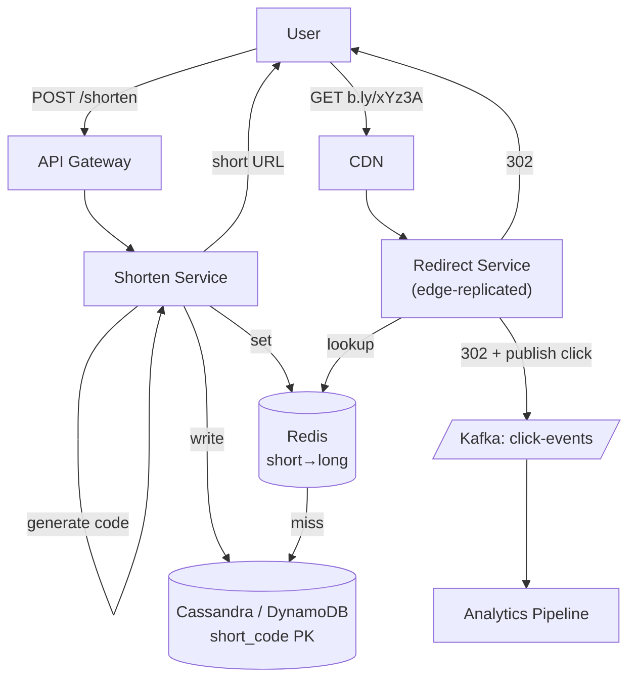

### **Classic 01: URL Shortener (bit.ly)**

> Difficulty: **Medium**. Tags: **Sync, Stream**.

---

#### **The Scenario**

Build bit.ly. Users paste a long URL and get back a short code like `b.ly/xYz3A`. Anyone visiting the short URL gets redirected to the original. Track click analytics.

---

#### **1. Requirements**

| Functional | Non-functional |
|---|---|
| Shorten: long URL → short code | Shorten p99 < 100ms |
| Redirect: short → long, 302 | Redirect p99 < 30ms |
| Custom aliases (premium) | 100B URLs over 5 years |
| Click analytics | 10k shortens/sec, 1M redirects/sec |
| Link expiry | 99.99% availability on redirect |

---

#### **2. Estimation**

- 100B URLs × 500 bytes = 50TB stored.
- Read:write = 100:1.
- Short code length: 7 chars from base62 (62^7 = 3.5 trillion). Safe for 100B URLs.

---

#### **3. Architecture**

---

#### **4. Deep Dives**

**4a. Code generation: hash vs counter**

- **Hash of URL (MD5/SHA) → base62 → first 7 chars.** Deterministic (same URL → same code), but collisions exist; must check DB.
- **Monotonic counter + base62.** Simple, predictable, but exposes sequence (competitors can enumerate).
- **Distributed counter service / Snowflake ID → base62.** Best of both: unique without DB round-trip, unpredictable (bits of randomness).

Production answer: counter-based with some bits of randomness, managed by a small dedicated ID service (ZooKeeper/DB sequence with range reservations).

**4b. Storage**

- Cassandra or DynamoDB: partition key = `short_code`, value = `long_url, owner, expires_at, created_at`. Perfect for key-value read pattern.
- Postgres works up to ~5B rows with proper indexing and sharding.

**4c. Redirect path — extreme read optimization**

- Hot links (top 1%) account for 90% of traffic. Redis caches everything.
- Redirect service deployed at edge (CloudFront functions / Cloudflare Workers) for sub-20ms globally.
- The record is small (< 200 bytes); edge KV stores like Cloudflare Workers KV can hold all of it for free.

**4d. Analytics via Kafka**

- Every redirect fires `{short_code, timestamp, ip, ua, referrer}` to Kafka (async, non-blocking).
- Downstream: batch jobs compute per-URL daily/hourly stats → writes to analytics DB.

---

#### **5. Failure Modes**

- **DB down.** Redis absorbs most reads. New shortens fail (accept the write outage).
- **Kafka down.** Analytics lags, redirects continue (don't block user on async logging).
- **Hot key.** One URL getting 100k QPS: CDN + edge caching handles it.

---

### **Revision Question**

Why does this design use Cassandra/DynamoDB over Postgres?

**Answer:** The access pattern is **point-lookup by a randomly-distributed key** with massive scale (100B rows, 1M QPS reads). Cassandra and DynamoDB are native partition-by-hash-key stores; they scale horizontally by adding nodes and shard automatically. Postgres would need manual sharding, and joins / transactions aren't needed here. Picking the DB that matches the access pattern is half the design.
