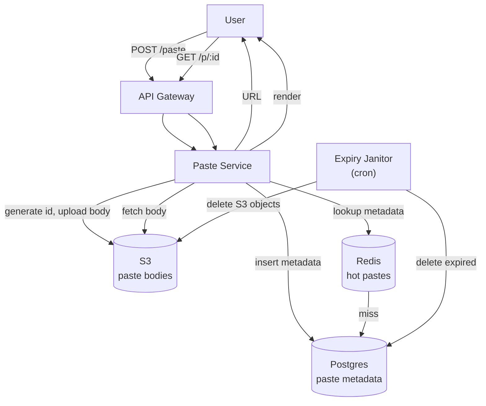

### **Classic 02: Pastebin**

> Difficulty: **Easy**. Tags: **Sync**.

---

#### **The Scenario**

Users paste text (code, logs, notes) and get a shareable URL. Text is immutable once posted. Optional expiry. Optional private/password-protected pastes.

---

#### **1. Requirements**

| Functional | Non-functional |
|---|---|
| Create paste: text → URL | p99 create < 300ms |
| Read paste by URL | p99 read < 100ms |
| Expiry: 10min, 1day, 1 month, forever | 100M pastes total |
| Syntax highlighting (client-side) | 100 creates/sec, 10k reads/sec |
| Private, password-protected | 99.9% available |

---

#### **2. Estimation**

- 100M pastes × avg 10KB text = 1 TB. Big for DB, small for S3.
- Create:read = 1:100.

---

#### **3. Architecture**

---

#### **4. Deep Dives**

**4a. Storage split: metadata in PG, body in S3**

- Metadata (id, owner, created_at, expires_at, is_public, password_hash, syntax) stays in Postgres — small rows, queried by id.
- Body (large text) in S3 — cheap, virtually unlimited, served directly via pre-signed URL for big pastes.
- Reads: metadata from PG/Redis, body from S3 (or directly from CDN in front of S3).

**4b. Private pastes**

- Password-protected: store `argon2(password)` in metadata. Reader provides password, service validates, streams body.
- Private (owner-only): check JWT owner claim against metadata.owner.

**4c. Expiry**

- `expires_at` column indexed. Janitor cron runs every 5min: `DELETE FROM pastes WHERE expires_at < now() LIMIT 1000`, then S3 delete.
- S3 lifecycle policies can delete objects automatically based on tags (set at upload).

---

#### **5. Failure Modes**

- **S3 down.** Reads fail for bodies; metadata still viewable (degraded UX: "paste temporarily unavailable").
- **Janitor misses a batch.** Worst case: expired pastes readable a bit longer. Idempotent retry catches up.

---

### **Revision Question**

Why not store paste bodies directly in Postgres as TEXT?

**Answer:** Pastes can be up to 1MB. Storing large TEXT in Postgres bloats the table, slows sequential scans, worsens replication lag (WAL ships huge rows), and costs more than S3. Postgres is best for small rows you query richly; S3 is for blobs you retrieve by key. The split pays operational dividends in cost, backup speed, and replica performance.
