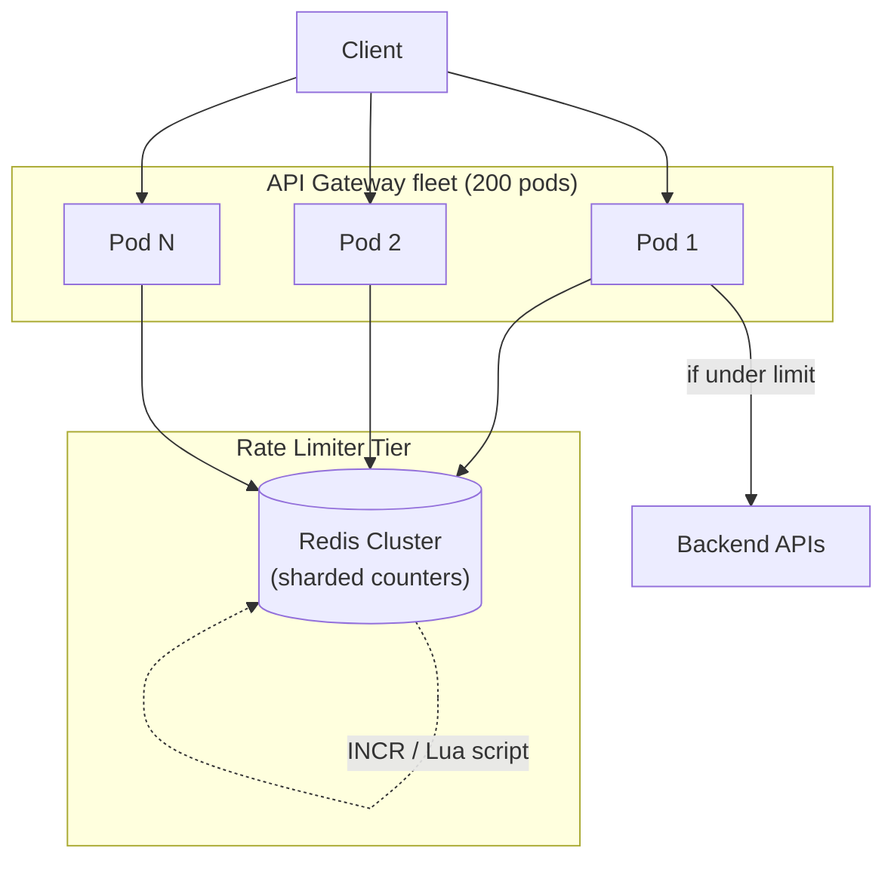
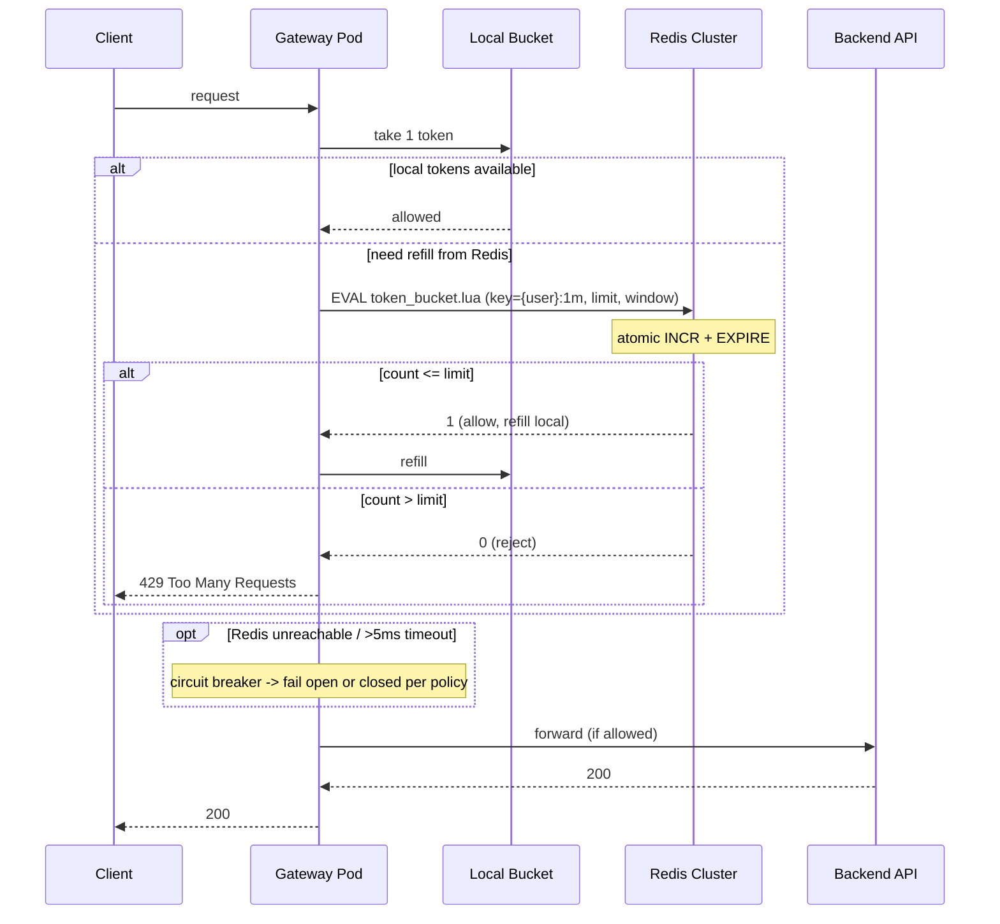

### **Classic 03: Distributed Rate Limiter**

> Difficulty: **Medium**. Tags: **Sync**.

---

#### **The Scenario**

Build a rate limiter that protects APIs from abuse. Must enforce limits like "100 req / min / user" and "10,000 req / hour / IP" across a fleet of 200 API gateway pods, with consistent counting.

---

#### **1. Requirements**

| Functional | Non-functional |
|---|---|
| Per-user, per-IP, per-endpoint limits | Add < 2ms to request path |
| Global limits enforced consistently | Tolerate pod scale-up/scale-down |
| Multiple algorithms (fixed, sliding, token bucket) | 500k decisions/sec |
| Graceful degradation when limiter is down | Observability: which limits fire |

---

#### **2. Estimation**

- 200 gateway pods × 2,500 rps each = 500k rate-limit checks/sec.
- 10M active users × multiple limit buckets = ~50M counters kept live.

---

#### **3. Architecture**



---

#### **4. Request Flow (Sequence)**



---

#### **5. Deep Dives**

**4a. Algorithm — token bucket via Redis Lua**

```lua
-- key = "rl:user:123:1minute"
-- arg = {limit=100, window=60s, cost=1}
local current = redis.call("INCR", KEYS[1])
if current == 1 then
    redis.call("EXPIRE", KEYS[1], ARGV[2])
end
if current > tonumber(ARGV[1]) then
    return 0  -- reject
end
return 1      -- allow
```

- Atomic INCR in Redis. Lua script ensures the EXPIRE is set on first increment.
- Fixed window: simple; suffers boundary burstiness. Sliding window log: accurate but memory-heavy. Token bucket: balanced.

**4b. Sliding window with sub-buckets**

- Break the minute into 6 × 10-second sub-buckets. Sum the last 6 to compute the rolling count.
- Memory bounded, no "double limit at boundary" bug.

**4c. Redis Cluster for horizontal scaling**

- Hash tag: `{user:123}:requests` — all keys for user 123 land on the same Redis shard.
- 200 gateways × 2,500 rps → 500k Redis ops/sec. One Redis handles ~100k/sec. Cluster: 6 nodes.
- Use Redis Replica for read-only introspection (observability).

**4d. Local token cache (optional optimization)**

- Each gateway pod holds a local bucket that is refilled from Redis every N seconds. Most requests hit local memory (sub-ms). Periodic sync limits drift to a small window.
- Trade: some over-limit requests may pass during sync windows. OK for most APIs.

**4e. Graceful degradation**

- Redis down → **fail open** (allow all) or **fail closed** (deny all). Choose per-endpoint: paywalled API → fail closed; public read → fail open.
- Circuit breaker around Redis call with 5ms timeout.

---

#### **6. Failure Modes**

- **Redis down.** Covered above.
- **Hot user.** Concentrated traffic on one hash tag → one Redis shard. Mitigate with local caches.
- **Time skew.** Use Redis TIME command for consistent clock across pods, not each pod's clock.

---

### **Revision Question**

Your app has a `/login` endpoint that you limit to 5 attempts / minute / IP. An attacker drives 1000 pods behind a rotating proxy, hitting 5 attempts per IP. Does your rate limiter help?

**Answer:** Not by itself. IP-based limits are **trivially bypassed by botnets**. The real defenses layer:

1. **Rate limit by IP** catches only the lazy attacker.
2. **Rate limit by account** catches "5 failed logins for account X" regardless of IP. Critical for credential stuffing.
3. **CAPTCHA or progressive challenge** after N failures.
4. **Anomaly detection** (velocity, geography, fingerprint) catches distributed attacks.

Rate limiting is a speed-bump, not a fence. It must be paired with account-level lockouts, MFA, and behavioral detection for authentication endpoints. The design shown here is the first layer, not the whole defense.
