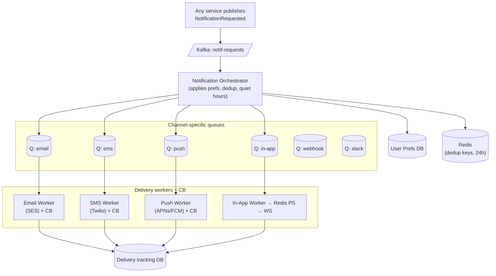

### **Classic 04: Notification System**

> Difficulty: **Hard**. Tags: **Async, RT**.

---

#### **The Scenario**

A unified notification system serving **email, SMS, push (iOS/Android), in-app (WebSocket), Slack, webhooks**. Any service can trigger notifications. Users configure channel preferences per notification type. Must handle 100M notifications/day, respect quiet hours, handle provider outages, and deduplicate.

---

#### **1. Requirements**

| Functional | Non-functional |
|---|---|
| Multi-channel delivery | 100M notifications/day |
| User preferences + quiet hours | < 5s latency for real-time channels |
| Template rendering per channel | Deduplicate identical notifications |
| Rate limiting per user | Per-channel outage isolation |
| Delivery tracking | At-least-once per selected channel |

---

#### **2. Estimation**

- 100M/day ≈ 1150/sec avg, 10k/sec peak.
- Channels split: ~50% push, 30% email, 10% in-app, 10% SMS/webhook/slack.

---

#### **3. Architecture**

---

#### **4. Deep Dives**

**4a. The Orchestrator**

For each `NotificationRequested`:
1. Load user prefs (from Redis cache over PrefsDB).
2. Filter channels the user has opted into for this notif type.
3. Check quiet hours for each channel (skip or defer to next allowed window).
4. Dedup: hash(`user_id + notif_type + body_hash`) → check Redis; skip if seen in last 24h.
5. For each remaining channel, enqueue a task with `{channel, user, template_id, vars}`.

**4b. Per-channel isolation + circuit breakers**

Each channel has its own queue and workers. If Twilio is down:
- SMS queue grows.
- SMS worker's breaker opens. New messages sit in queue with a short-circuit error.
- Push, email, in-app deliver unaffected.

**4c. In-app notifications via WebSocket**

- Worker publishes `{user_id, payload}` to Redis Pub/Sub `user:U`.
- WS tier (see [Week 1 Bonus 3](../../Week1-Fundamentals_and_Synchronous_communication/bonus3-websocket_architecture_patterns.md)) delivers the frame to the connected user.
- If offline: message persists in DB as "unread", shown next login.

**4d. Quiet hours and scheduling**

- Each notification has `not_before` timestamp. Orchestrator checks; if in the future, writes a row to `scheduled_notifications` instead of enqueuing.
- A cron scans `scheduled_notifications WHERE not_before <= now()` every minute and enqueues.

**4e. Delivery tracking**

- Every delivery attempt writes `{notif_id, channel, status, at}` to the tracking DB.
- Webhooks from SES ("bounce"), Twilio ("delivered"), APNs ("rejected") come back; updater service applies them.
- Users can see per-notification delivery status; product can compute per-channel success rates.

---

#### **5. Failure Modes**

- **Provider outage (SES/Twilio).** Queue absorbs backlog. Breaker trips. Recovery on its own.
- **Dedup cache wipe.** 24h duplicates pass through. Annoying but not catastrophic.
- **Rogue publisher.** One service sends 10M in a minute. Per-user rate limit in orchestrator caps. Global emergency kill switch via feature flag.
- **Schema mismatch in template.** Template validation at publish time; fall back to plain text.

---

### **Revision Question**

A user reports: "I got 50 identical push notifications when I opened the app." What architectural flaws could cause this, and what prevents it?

**Answer:**

Likely causes:

1. **Missing dedup.** An alert service publishes the same `NotificationRequested` in a retry loop; orchestrator fires every one. Fix: dedup key in Redis; check before enqueuing.
2. **Per-channel retry without idempotency.** Push worker retries on transient error, APNs accepts both, user sees 2× or more. Fix: APNs idempotency token; tracking DB's unique index on `(notif_id, channel)`.
3. **Replay during recovery.** Kafka consumer crashed mid-batch, replays on restart. Fix: consumer side idempotency keyed by Kafka offset + user.
4. **At-least-once, no idempotent receiver.** Every queue → worker hop is at-least-once. The worker must dedupe — typically via the tracking DB row.

The architectural principle: **"at-least-once delivery with idempotent processing"** is the standard; anything less leaks duplicates at every hop. Every layer must have a dedup story.
