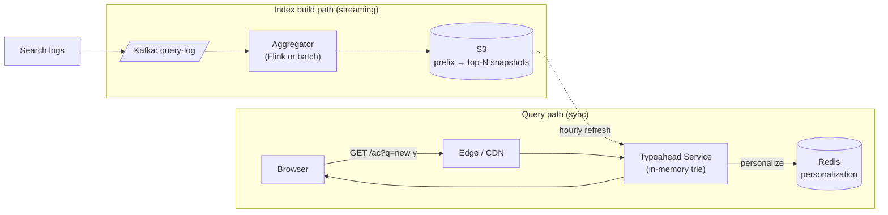

### **Classic 05: Typeahead Autocomplete**

> Difficulty: **Medium**. Tags: **Sync, Stream**.

---

#### **The Scenario**

Build Google-style autocomplete: user types `new y`, within 50ms suggest `new york`, `new york times`, `new year`. Must serve 100k QPS globally, reflect trending queries within minutes, personalize per user.

---

#### **1. Requirements**

| Functional | Non-functional |
|---|---|
| Top 10 suggestions per prefix | p99 < 50ms |
| Global popularity + personalization | 100k QPS |
| Reflect trends in ~10 min | Multi-region |
| Prefix of any length ≥ 2 | Data size: 100M unique queries |

---

#### **2. Estimation**

- 100M unique queries × ~30 bytes avg = 3 GB trie-size. Fits in memory.
- 100k QPS × 30 bytes response = 3 MB/sec outbound.

---

#### **3. Architecture**

---

#### **4. Deep Dives**

**4a. The data structure — ranked trie or prefix map**

- **Trie with top-K per node:** each trie node precomputes the top 10 completions of its prefix. O(length of prefix) query, no sorting at read time.
- Alternative: **prefix-sorted list + binary search** + top-K lookup. Simpler, equally fast.
- Alternative: **Elasticsearch completion suggester**. Works but slower than in-memory custom structure at this scale.

**4b. Aggregation pipeline**

- Every search hits `search-events` topic.
- Flink job windows by prefix: for each prefix (all 2-20 char prefixes of each query), count searches in the last 24h with decay.
- Output: map of prefix → list of top 10 queries with scores.
- Dump to S3 every 15 minutes.

**4c. Service loading the index**

- Typeahead service loads S3 snapshot on startup into in-memory trie.
- Hot reload: every 15min, fetch new snapshot, build new trie, atomic pointer swap.
- 3GB snapshot × 100 service instances = ~300GB network transfer per refresh; use a CDN between S3 and services, or shard by prefix range across instance groups.

**4d. Personalization**

- Base: top 10 global for this prefix (from trie).
- Boost: entries matching user's recent history (from Redis, keyed by user).
- Merge: weighted sum. Return top 10.

**4e. Caching**

- CDN cache on prefix → not personalized version (fine for most users).
- Personalized results bypass CDN or use vary header on user cookie.

---

#### **5. Failure Modes**

- **Index build pipeline lags.** Stale suggestions by a few hours. Non-fatal.
- **Typeahead service OOM** during snapshot swap. Use phased rollout and memory headroom checks.
- **Traffic spike.** Typeahead is in-memory-only; horizontal scaling is trivial.

---

### **Revision Question**

Why not query Elasticsearch live for every keystroke?

**Answer:** Elasticsearch can handle it, but at the cost of latency and load:

- ES query takes 20-100ms. Typeahead needs < 50ms end-to-end. Adding a network hop to ES eats most of the budget.
- At 100k QPS, ES would be a giant cluster just for autocomplete. Wasteful.
- The index rarely changes per query; precomputing top-K per prefix is thousand-fold cheaper per lookup.

The principle: **read-optimize by shape.** When reads are 10,000× writes and the output is a small fixed-K list per input, precomputing the answer is always cheaper than running a full query engine. This is CQRS applied to search suggestions.
