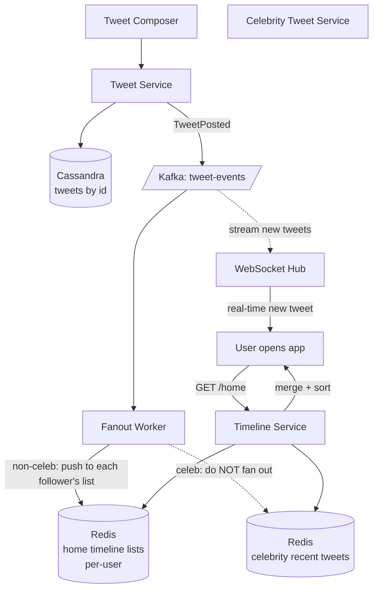

### **Classic 06: Twitter News Feed**

> Difficulty: **Hard**. Tags: **Stream, RT**.

---

#### **The Scenario**

Build the Twitter/X home timeline. Each user follows N accounts. When they open the app, they see recent tweets from those accounts, newest first, in < 300ms. Scale: 500M users, 500M tweets/day.

---

#### **1. Requirements**

| Functional | Non-functional |
|---|---|
| Compose tweet | Timeline load p99 < 300ms |
| Home timeline: tweets from followed accounts | 500M DAU, 500M tweets/day |
| Real-time updates when scrolling | Follower counts up to 100M (celebrities) |
| Search, notifications, likes | Fanout budget: finite |

---

#### **2. Estimation**

- 500M DAU × 10 timeline loads/day = 5B loads/day ≈ 58k/sec avg.
- Tweets: 500M/day = 5.8k/sec. Each tweet ~2KB.
- Fan-out to followers: average 200 followers/user → 1.16M writes/sec just for tweet fanout.

---

#### **3. Architecture — hybrid fanout**

---

#### **4. Deep Dives**

**4a. Fanout-on-write (push) vs fanout-on-read (pull)**

- **Push:** when Alice tweets, write a pointer to every follower's home-timeline list. Read = cheap. Write = expensive if Alice has 50M followers.
- **Pull:** at read time, query every followed user's tweets, merge, sort, limit. Read = expensive. Write = cheap.

Twitter's answer: **hybrid**.
- For most users (< 10k followers): push. Fan-out writes a row to each follower's Redis list.
- For **celebrities** (> 10k or > 1M followers): don't fan out. At read time, pull recent tweets from the celeb's personal cache and merge with the user's pre-fanned timeline.

This avoids writing 1M rows when one celebrity tweets while keeping normal reads fast.

**4b. Home timeline structure**

- Redis list per user: `home:U = [tweet_id_1, tweet_id_2, ...]`, capped at ~800 entries.
- Tweet contents fetched from Cassandra or a hot-tweet cache.
- Celebrities-followed list: `celebs_followed:U = [celeb_1, celeb_2, ...]`.
- Timeline service: read home list + query each followed celeb's recent tweets + merge + limit.

**4c. Real-time updates**

- Timeline service holds a WebSocket for active user sessions.
- Fanout worker, after updating home list, publishes to Redis Pub/Sub `user:U`.
- WS tier pushes "new tweet available" to the app; the app fetches fresh timeline or does an optimistic insert.

**4d. Ranking**

- Chronological is classic. Modern timelines rank by relevance: ML model scores each candidate using features (author affinity, recency, engagement). Feature store populated from Kafka; model served by a separate ranking service.

---

#### **5. Failure Modes**

- **Celebrity tweet storm** still punishes cache (many followers fetching the celeb's tweets). Cache at edge with aggressive TTLs.
- **Fanout lag** for a normal user. Acceptable; timeline converges in seconds.
- **Redis home-list loss.** Rebuild from Kafka event log by replaying last 800 tweets per followed account.

---

### **Revision Question**

Dr. Zog has 100,000,000 followers. Every time he tweets, the fanout worker would do 100M writes — saturating the system. How does the hybrid approach avoid this, and what is the tradeoff?

**Answer:**

In the hybrid approach, Dr. Zog is classified as a **celebrity** (> 10k followers threshold). When he tweets:

1. Tweet is written to Cassandra and a `celebrity:Zog:recent` Redis cache.
2. Fanout worker **skips** writing to each follower's home timeline.
3. When a follower opens their timeline, the Timeline Service pulls Dr. Zog's recent tweets from the celeb cache and merges them with their push-based timeline.

Tradeoff: **reads for celebrity-followers become more expensive** (extra lookups), but writes are O(1) instead of O(100M). Since reads are distributed across 100M users while the single write would spike one service, the system prefers spreading the cost.

The merge point is where the two fanout styles meet. This hybrid approach is why Twitter (and every other follow-graph social net) can scale beyond a few million followers per account. Pure push breaks; pure pull is too slow for ordinary users. The hybrid respects the power law of the follower graph.
