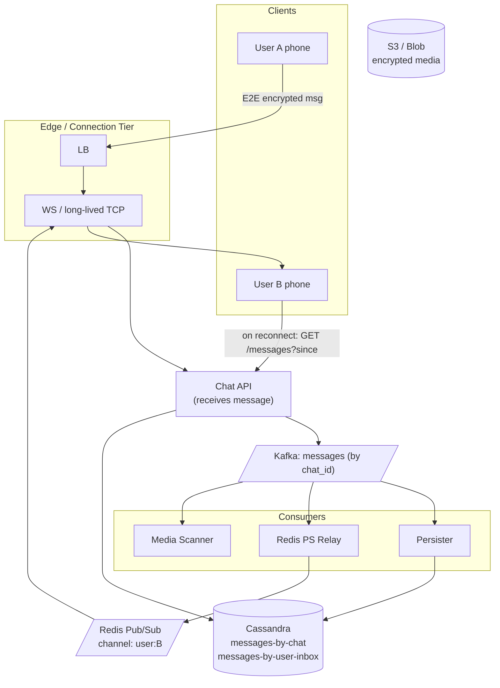
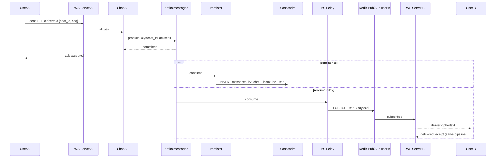
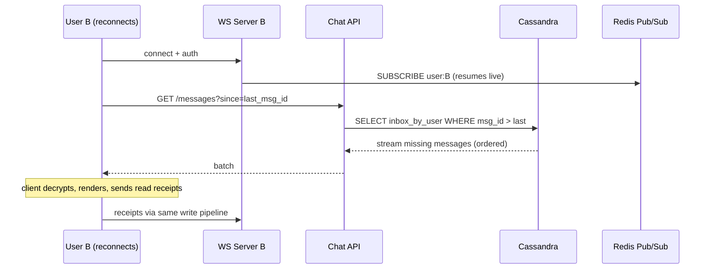

### **Classic 07: WhatsApp Chat**

> Difficulty: **Hard**. Tags: **RT, Stream**.

---

#### **The Scenario**

Build WhatsApp. 2B users, real-time text/media messaging, 1-on-1 and group chats up to 1024 members, delivered/read receipts, end-to-end encryption, works on flaky mobile connections, messages persisted for history.

---

#### **1. Requirements**

| Functional | Non-functional |
|---|---|
| 1:1 and group messaging | 100B messages/day |
| Delivery + read receipts | < 200ms end-to-end for online users |
| Offline → online message catch-up | 99.99% durability per message |
| Media (image, video, voice) | Works with intermittent mobile networks |
| E2E encryption | Battery-efficient clients |

---

#### **2. Estimation**

- 100B messages/day ≈ 1.15M/sec avg, 10M/sec peak.
- 2B users × ~100 live WS connections per server = 20M WS servers? Actually ~200k WS servers at ~10k conns each (WhatsApp famously pushed Erlang to 2M per server). Round numbers.
- Storage: 1KB avg × 100B/day = 100TB/day of raw messages.

---

#### **3. Architecture**

---

#### **4. Request Flow (Sequence)**

**Flow A: Online delivery (B is connected)**

**Flow B: Offline catch-up on reconnect**

---

#### **5. Deep Dives**

**4a. The connection tier**

- Users hold a long-lived TLS connection to a WS/TCP server. WhatsApp historically used XMPP-ish custom protocol over a persistent TCP socket; modern equivalents use WebSocket over TLS.
- One server holds ~1M sockets (Erlang/Go/Rust with epoll).
- Mobile networks drop connections often. Client auto-reconnects with exponential backoff.

**4b. Producer → Kafka for durability**

- Message arrives at Chat API, validated (signature, session).
- Produced to Kafka topic `messages`, keyed by `chat_id` (per-chat ordering). `acks=all`.
- Chat API acks the client with "message accepted" only after Kafka commit.

**4c. Three parallel consumers**

- **Persister:** writes to Cassandra `messages_by_chat(chat_id, message_id, sender, body_encrypted, ts)` and to `inbox_by_user(user_id, ...)`. Enables fast history queries.
- **Redis PS Relay:** publishes to `user:B` channel. WS tier fanout (see [Bonus 3](../../Week1-Fundamentals_and_Synchronous_communication/bonus3-websocket_architecture_patterns.md)) delivers to B if online.
- **Media Scanner:** for media messages, queues virus scan, thumbnail generation.

**4d. Receipts**

- Recipient device acknowledges on delivery and on read. These are themselves messages: `{type: delivered, ref: msg_id}`, following the same pipeline.
- Sender sees receipts update in UI via the same Kafka/Redis flow.

**4e. E2E encryption (Signal protocol)**

- Each client has an identity key pair. Messages are encrypted with per-chat session keys.
- **Server never sees plaintext.** It routes ciphertext only.
- Group messages: sender-keys protocol — sender encrypts once with a group session key; distributes that key pairwise to members via double ratchet.

**4f. Offline catch-up**

- While B is offline, messages accumulate in Cassandra only (Redis PS was ephemeral).
- On reconnect, client sends `GET /messages?since=<last_msg_id>`. Server streams missing messages. Client decrypts and renders.

---

#### **6. Failure Modes**

- **WS server crash:** clients auto-reconnect to another server. Redis PS subs are re-established. During the gap (seconds), messages accumulate in Kafka; catch-up query fills them in.
- **Kafka cluster outage (rare):** Chat API rejects new messages; clients retry via their own outbox. No loss.
- **Thundering herd after outage:** clients use exponential backoff + jitter on reconnect.

---

### **Revision Question**

User A sends message M1 and immediately sends M2. User B receives them. They must arrive in order M1 then M2, even though they flow through multiple services. How is ordering guaranteed?

**Answer:**

1. Client's send library numbers outgoing messages within a chat (client-side monotonic sequence).
2. Chat API produces to Kafka with `key = chat_id`. Kafka guarantees per-partition ordering; all messages for this chat land on the same partition in the order received.
3. Persister reads in offset order, writes to Cassandra with the message_id (a time-ordered UUID).
4. Redis PS Relay reads in offset order, publishes to `user:B`. Redis Pub/Sub preserves order to a single subscriber on a single connection.
5. The WS server consumes Redis PS and writes frames on B's socket in receive order.
6. B's client renders in arrival order. If client detects a gap (seq=5 then seq=7), it waits briefly or fetches from history to fill.

**Ordering invariants at each hop:**
- Kafka partition: strict.
- Single-consumer reading the partition: strict.
- Redis PS single channel, single subscription on one server: strict.
- WS frames on one TCP socket: strict (TCP is ordered).

The **only** place ordering can break is if A sends from two devices simultaneously — then logical "client seq" is per-device and the server must reconcile. Or if the receiver reconnects to a different WS server mid-flow — but the catch-up query returns in Cassandra's ordered key, preserving it.

This cascade of ordered hops is the architectural discipline that makes "the chat feels right" possible at 100B messages/day.
