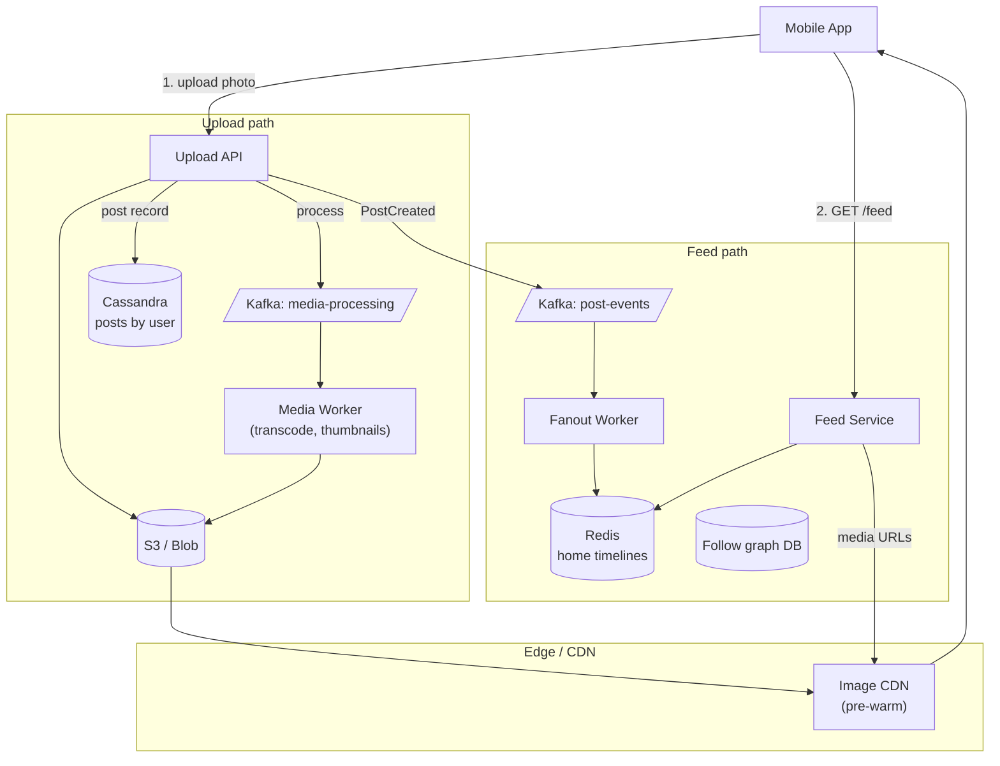
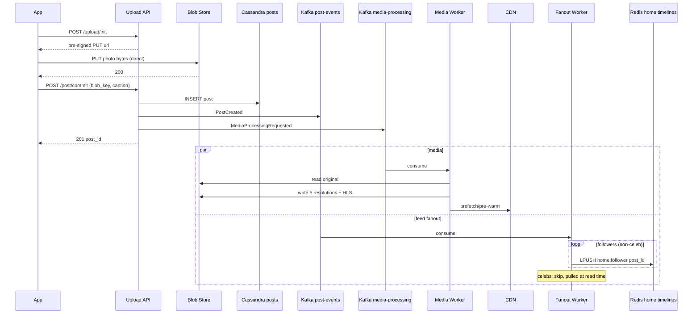

### **Classic 08: Instagram — Feed + Media**

> Difficulty: **Hard**. Tags: **Stream, Sync**.

---

#### **The Scenario**

Build Instagram. Users upload photos/videos, see a feed of followed accounts' posts, like, comment, discover via explore. 2B users, 95M photos/day uploaded. Most reads; heavy media pipeline.

---

#### **1. Requirements**

| Functional | Non-functional |
|---|---|
| Upload photo/video | Upload in < 3s |
| Home feed of followed accounts | Feed load < 400ms |
| Explore / trending | Billions of media objects |
| Stories (24h ephemeral) | Variable quality streaming |
| Likes, comments, follows | High read:write ratio |

---

#### **2. Estimation**

- 2B users, 500M DAU × 10 feed loads/day = 5B feed loads/day.
- 95M photos/day × average 5MB = 475TB/day ingested. CDN bandwidth is the dominant cost.

---

#### **3. Architecture**



---

#### **4. Request Flow (Sequence)**

**Flow A: Upload + async media processing**



**Flow B: Feed read**

```mermaid
sequenceDiagram
    participant C as App
    participant FS as Feed Service
    participant H as Redis home:U
    participant DB as Cassandra
    participant CDN as CDN

    C->>FS: GET /feed
    FS->>H: LRANGE home:U 0 50
    H-->>FS: [post_ids]
    FS->>DB: MGET post metadata
    DB-->>FS: posts {media_keys, caption, ...}
    Note over FS: rank via ML; compose media URLs (CDN hostnames)
    FS-->>C: 200 feed
    C->>CDN: GET media (thumbnail first, HD on tap)
    CDN-->>C: bytes (edge hit expected)
```

---

#### **5. Deep Dives**

**4a. Upload path: direct-to-blob**

- Client requests a pre-signed S3 PUT URL from Upload API.
- Client uploads directly to S3 — **bypassing the API server**. Saves bandwidth on the service tier.
- Client notifies API when upload completes. API creates the post record.
- Kafka event triggers async media processing (transcoding, multiple resolutions).

**4b. Media processing**

- One photo → 5 resolutions (thumbnail, mobile, hd, feed, explore-grid).
- Videos: HLS/DASH segments at multiple bitrates.
- CDN pre-warms popular content by scanning post-creation events. Cold media lazy-loads on first fetch.

**4c. Feed — similar to Twitter**

- Push-based fanout for normal users, pull-based for celebrity accounts (see [cl-06](06-twitter_news_feed.md)).
- Home timeline stored in Redis per user as list of `post_id`s.
- Feed Service reads list, bulk-fetches post metadata from Cassandra, emits media URLs (pointing to CDN).

**4d. Ranking**

- Chronological is the baseline. Modern Instagram ranks by a ML model.
- Features: affinity (past interactions), recency, predicted engagement, diversity.
- Feature store populated from Kafka event stream.

**4e. Stories (24h ephemeral)**

- Stored with TTL = 24h in Cassandra.
- Separate Redis cache for "who has unseen stories."
- Story views captured as events; they inform ranking.

---

#### **6. Failure Modes**

- **CDN origin miss storm** after regional outage: `stale-while-revalidate` serves last-good; graceful.
- **Transcoder backlog:** queue grows, lower-priority resolutions lag. Feed shows the best available.
- **Feed fanout lag:** acceptable; new posts may take a few seconds to appear for followers.

---

### **Revision Question**

An influencer posts a photo. Within 5 minutes it has 2 million views. Where is the hot spot, and how does the architecture handle it?

**Answer:**

The hot spot is the **CDN edge serving that single photo**. 2M views in 5 minutes = ~7k GET/sec for one object. The mitigations:

1. **CDN natively handles this.** A single object on a modern CDN (CloudFront, Cloudflare) is cached at hundreds of edge PoPs. 2M requests split geographically across all PoPs → each PoP sees thousands, not millions.
2. **Origin protection:** `Cache-Control: public, max-age=86400, s-maxage=604800`. Even on cache miss, the CDN collapses concurrent misses ("cache coalescing") so origin sees only 1 request.
3. **Origin pre-warm:** PostCreated event triggers explicit CDN prefetch for influencer content.
4. **Multiple resolutions:** mobile devices pull the small thumbnail first; HD only after tap. Reduces bandwidth 10×.
5. **Feed backend impact is minimal:** feed rendering needs metadata, not the image bytes; metadata is in Redis/Cassandra, not CDN.

The principle: **push the hot path to the edge, keep origin quiet.** Designing for influencer/celeb traffic is a pattern match to cl-06 (celebrity fanout) at the media layer instead of the metadata layer.
