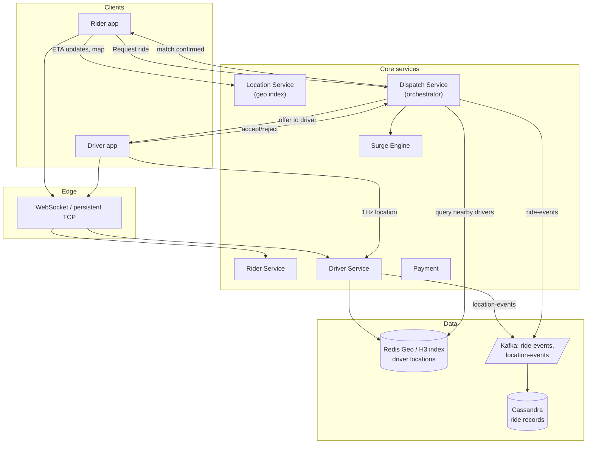

### **Classic 09: Uber — Ride Matching**

> Difficulty: **Expert**. Tags: **RT, Stream, Resil**.

---

#### **The Scenario**

Build Uber's core ride-dispatch. A rider requests a ride; the system must find a nearby available driver within 2 seconds, match them, route both to the pickup point, and stream live locations. 15M rides/day, drivers scattered geographically, ETA estimates must be accurate, surges during spikes.

---

#### **1. Requirements**

| Functional | Non-functional |
|---|---|
| Rider requests → matched driver in < 2s | 15M rides/day, 100k concurrent active matches |
| Live driver location 1Hz updates | Tolerate spiky geographic demand |
| Rider sees driver on map moving | Graceful degradation during surge |
| Fare calc, payment, rating | Strict ordering of ride state changes |
| Dynamic surge pricing | Multi-region, low-latency to driver/rider |

---

#### **2. Estimation**

- 1M active drivers sending 1 location ping/sec = 1M writes/sec just for location.
- 15M rides/day ≈ 175/sec avg, 2k/sec peak.
- Per-ride lifecycle: ~30 state transitions.

---

#### **3. Architecture**

---

#### **4. Deep Dives**

**4a. Driver location tracking — geo index at scale**

- 1M drivers × 1 ping/sec = 1M writes/sec. Cannot go to normal DB.
- **Redis GEO** (or H3 hex-based sharded in-memory store): spatial index keyed by geohash/H3 cell.
- Client sends `{driver_id, lat, lng}`; service writes to the corresponding Redis Cluster shard.
- Query: `GEORADIUS` or H3 "find drivers in cells within 5 km."
- Alternative: **Uber's H3** (open-source) breaks the world into hexagonal cells at multiple resolutions. Drivers registered under their current H3 cell. Lookup = query cell + ring-1 neighbors.

**4b. Dispatch — the hard one**

- Rider request arrives. Dispatch Service queries Location Service for drivers within radius R.
- Rank candidates by ETA (not straight-line; must account for road network — graph DB or OSRM routing).
- Offer to best driver. If declined / timeout, try next.
- Concurrent rider requests in same area race for the same drivers. Lock: when offered, mark driver as "pending" in a distributed lock with 10s TTL. Prevents double-booking.

**4c. Ride state machine via Kafka**

- States: REQUESTED → MATCHED → DRIVER_ARRIVING → RIDER_PICKED_UP → IN_PROGRESS → COMPLETED → PAID.
- Each transition = Kafka event, keyed by `ride_id`. Strict per-ride ordering.
- Multiple consumer groups: Payment, ETA updater, Analytics, Customer Support.

**4d. Surge pricing**

- Surge Engine consumes `location-events` (demand and supply signals per H3 cell).
- For each cell, computes `surge = demand / supply`. If > threshold, multiplier applied.
- Surge multiplier published to Redis, cached by Dispatch Service, quoted to the rider at request time.

**4e. Live location streaming to rider**

- After match, rider needs to see the driver's car moving on the map.
- Driver's location publishes pushed through Kafka → Location Service → Redis PS channel `ride:<ride_id>`.
- Rider's WebSocket subscribed to that channel; frames forwarded. 1Hz updates.

---

#### **5. Failure Modes**

- **Dispatch service crash mid-offer:** driver times out the offer; next driver is tried. Rider sees "finding driver..." continue.
- **Location Service lag:** matches may use stale locations. Mitigate with short TTL (5s) on location data.
- **Regional surge lockout:** Dispatch may fail to find drivers. UI shows "no drivers available" + offer to try nearby areas.
- **Ride state drift:** consumers disagree on ride state due to out-of-order events. Kafka per-key ordering prevents this at the topic level.
- **Driver network flaps:** WS disconnects don't cancel rides; state transitions continue on backend, driver rejoins and catches up.

---

### **Revision Question**

A rider requests a ride at Times Square at 7 PM during a concert. There are 5 drivers nearby and 50 simultaneous ride requests. Walk through what prevents the same driver from being offered to multiple riders at once.

**Answer:**

The key mechanism is a **distributed pessimistic lock on driver availability during offer phase**:

1. 50 requests hit Dispatch Service. Each queries Location Service for nearby drivers.
2. All 50 potentially see the same 5 drivers.
3. Dispatch applies a ranking (ETA, rating, recency) and picks a top candidate per request.
4. Before issuing the offer, Dispatch does `SET nx driver:status:<driver_id> "pending:<ride_id>" EX 10` in Redis — a SETNX with expiry.
5. Only one of the 50 requests succeeds. The others see "driver pending" and move on to the next candidate.
6. Offered driver either accepts (lock converts to "matched") or rejects/timeouts (lock expires, driver becomes available).

Without this lock:
- Same driver gets 10 simultaneous offers. Accepts the one that reaches them first. Other 9 "matches" fail.
- Riders see cascading failures and retry, compounding the surge.

Additional mechanisms:
- **Retry with backoff** if no driver available.
- **Surge multiplier** rises when supply < demand, attracting more drivers.
- **Cross-cell matching** expands radius if local pool exhausted.
- **Fairness:** long-waiting riders get priority.

The engineering lesson: in **high-contention matching systems**, claim-before-offer is non-negotiable. The lock duration (10s) must exceed normal offer-response time but be short enough to recover quickly from unresponsive drivers. This is a real-time auction, and coordination is the whole game.
