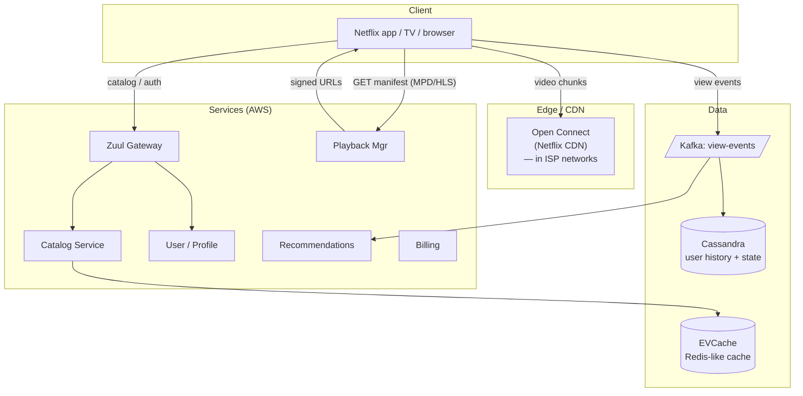

### **Classic 10: Netflix Streaming**

> Difficulty: **Hard**. Tags: **Sync, Stream**.

---

#### **The Scenario**

Build Netflix's streaming service. Users browse a catalog, click play, video streams adaptively based on bandwidth, progress is saved, recommendations are personalized. 230M subscribers, peak concurrent viewers in millions, 15% of global internet traffic.

---

#### **1. Requirements**

| Functional | Non-functional |
|---|---|
| Browse catalog + personalize | Metadata load < 500ms |
| Play video with adaptive bitrate | Video start < 2s, stall rate < 0.1% |
| Resume playback across devices | 230M subscribers, millions concurrent |
| Subtitles, audio tracks | Global reach, low bandwidth cost |
| Offline downloads | Scale during prime-time spikes |

---

#### **2. Estimation**

- 200M concurrent streams peak × 5 Mbps = 1 Pbps. Only feasible via massive CDN.
- Catalog: 20K titles × multiple encodings × regions.

---

#### **3. Architecture**

---

#### **4. Deep Dives**

**4a. Open Connect — the CDN inside ISPs**

- Netflix ships hardware caches to ISPs. Content is pre-positioned based on regional popularity.
- When a user hits play, the bytes flow from a box sitting in their ISP's data center, not from AWS.
- Massive cost advantage over generic CDN: bandwidth is ~free once pre-positioned.

**4b. Adaptive bitrate streaming (ABR)**

- Client requests an HLS/DASH **manifest** (list of segment URLs at each bitrate).
- Starts with a low bitrate, plays first segment in < 1s.
- After buffering, measures throughput, upgrades to higher bitrate.
- If network degrades, steps down. No rebuffering visible to user.
- Each bitrate is pre-encoded and stored on CDN (5-10 variants per title).

**4c. Playback session management**

- Each stream has a session: `{user, title, current_position, bitrate, device}`.
- Periodic heartbeat (~every 10s) writes position to Cassandra. Enables cross-device resume.
- Heartbeat doubles as concurrency enforcement (Netflix limits devices per plan).

**4d. Personalization**

- View events → Kafka → real-time feature store.
- Ranking model: for each user × candidate title, predict engagement.
- Home page rows ("Because you watched X") are pre-ranked batches refreshed hourly; "Trending Now" real-time; personal choices cached per user.

**4e. Global resilience**

- Multi-region active-active (see [cd-10](../curriculum-drills/10-multi_region_active_active.md)).
- Chaos engineering: Chaos Monkey, Simian Army intentionally kill services to prove resilience.
- Circuit breakers + fallbacks everywhere. If a service is down, the app degrades (e.g. show a generic row instead of personalized).

---

#### **5. Failure Modes**

- **Region outage:** Traffic shifts to healthy region, catalog and user state available from cross-region replica.
- **CDN cache miss:** Falls through to origin; rare but possible for unpopular long-tail titles.
- **Spike during prime time:** pre-scaled capacity, but also rely on CDN being already warm.

---

### **Revision Question**

Why does Netflix build Open Connect when third-party CDNs (Akamai, CloudFront) already exist?

**Answer:**

Three reasons, in descending order of importance:

1. **Cost at their scale.** Netflix is ~15% of global internet traffic. Buying bandwidth from a third-party CDN at that volume costs billions. Shipping caches to ISPs converts that cost into a one-time hardware expense that amortizes massively.
2. **ISP partnership.** ISPs want Netflix traffic served locally — it reduces their own peering costs. Netflix gives them free boxes; everyone wins.
3. **Control.** Netflix can push encodings, pre-warm content, and test new protocols (e.g. custom DASH extensions) without waiting for a CDN vendor.

The strategic lesson: **at extreme scale, commodity services become custom infrastructure.** AWS for compute; Open Connect for bandwidth; Titus for containers. Building your own stops being insane and starts being cheaper. Most companies never reach that scale — which is why "don't build your own CDN" is still good advice for 99.9% of teams.
