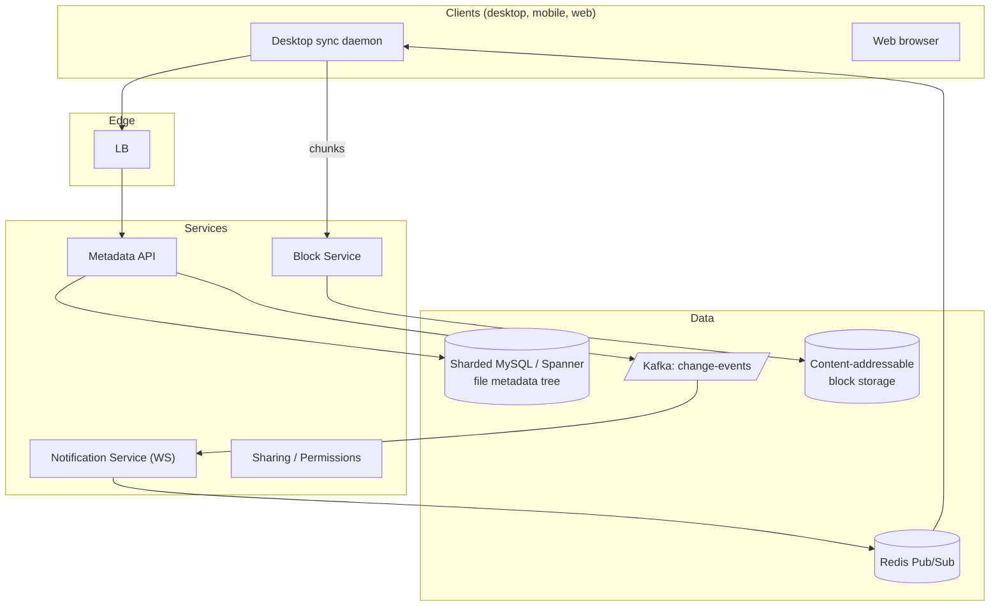
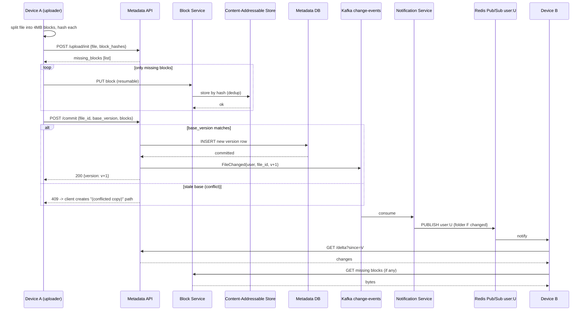

### **Classic 11: Google Drive / Dropbox**

> Difficulty: **Hard**. Tags: **Sync, Stream**.

---

#### **The Scenario**

Build Dropbox/Google Drive. Users sync folders across devices, share files/folders, handle files up to TB size, deduplication saves storage, offline edits merge on reconnect.

---

#### **1. Requirements**

| Functional | Non-functional |
|---|---|
| Upload/download files any size | Handle 100M users |
| Sync across devices | Dedup storage |
| Share with permissions | Conflict resolution for offline edits |
| Version history | Metadata ops p99 < 200ms |
| Offline capable | Resume interrupted uploads |

---

#### **2. Estimation**

- 100M users × avg 10GB = 1EB storage. Dedup reduces to maybe 200PB (many shared files).
- Metadata ops: 500k/sec peak.

---

#### **3. Architecture**

---

#### **4. Request Flow (Sequence)**

---

#### **5. Deep Dives**

**4a. Chunked, content-addressable blocks**

- Files split into **4 MB blocks**. Each block hashed (SHA-256). Block ID = hash.
- Before uploading a block, client asks "do you already have this block?" If yes, skip. Massive dedup: same cat video shared 10M times = one copy.
- Blob store is key-value: `block_id → bytes`. S3-compatible.

**4b. Metadata tree**

- `files(file_id, name, parent_id, owner, blocks[], size, version, modified_at)`.
- `folders(folder_id, ...)`. Path is derived by walking parent chain.
- Metadata DB is sharded by `owner_id` — all of one user's files on one shard; queries mostly per-user.

**4c. Sync algorithm (the hard one)**

- Each client keeps a local journal of changes since last sync.
- On sync, client sends: "I'm at version V for folder F; what's new?"
- Server replies with list of changes since V: added/modified/deleted files.
- Client downloads missing blocks, applies changes, updates local version.
- Conflict: both client and server modified same file → rename one "filename (conflict).txt" and keep both. Let humans resolve.

**4d. Real-time notification of changes**

- When any device writes, server emits event to Kafka.
- Notification Service consumes, publishes to Redis Pub/Sub `user:U`.
- Other devices of user U have a WebSocket open; receive "sync needed for folder F" message; initiate pull.
- Push notification replaces polling — power and bandwidth efficient.

**4e. Sharing and permissions**

- Permission rows: `permissions(resource_id, principal_id, role)`.
- Check on every metadata/block op.
- Permissions cache in Redis with short TTL (30s) to absorb read-heavy access.

**4f. Large file uploads**

- Client sends a multipart upload to Block Service.
- Each chunk uploaded independently; resumable via chunk IDs.
- Interrupted upload → client resumes from last successful chunk. No re-upload from zero.

---

#### **6. Failure Modes**

- **Block store down:** uploads fail, but reads of already-cached blocks continue.
- **Metadata replication lag:** user may not see a file their other device just uploaded for a few seconds.
- **Conflict resolution:** automated rename + keep-both; user chooses manually.
- **Quota:** stored per user; checked on metadata write; reject with clear error.

---

### **Revision Question**

A user edits a 50MB photo on their laptop while offline and on their phone while online. Both come online simultaneously and try to sync. What prevents data loss?

**Answer:**

Three mechanisms layer together:

1. **Version numbers on every file.** Server has file at version 10. Phone edit → version 11. Laptop, still thinking it's at version 10, tries to upload its version. Server sees "you're based on v10 but current is v11" → refuses.
2. **Conflict materialization.** Rather than silently dropping either edit, the server creates `photo.jpg (Laptop's conflicted copy 2025-01-15).jpg` alongside the canonical one. Both blocks are uploaded; nothing is lost. The user manually reconciles.
3. **Client-side journals.** The laptop's local journal records "I modified photo.jpg at offset X." Before pushing, it knows its version base; on conflict, it creates the copy locally and tells the server about both. The merge state is visible.

Google Docs-style approach (see [cl-12](12-google_docs_realtime_collab.md)) uses operational transforms or CRDTs to merge edits character-by-character. For binary files like photos, that isn't possible — so the only safe policy is "keep both, let the human decide."

The general principle: **in distributed filesystems, "last write wins" loses data**. Every real-world sync system uses versioning + conflict-materialization. The UX difference between this and "your file just disappeared" is the whole product.
