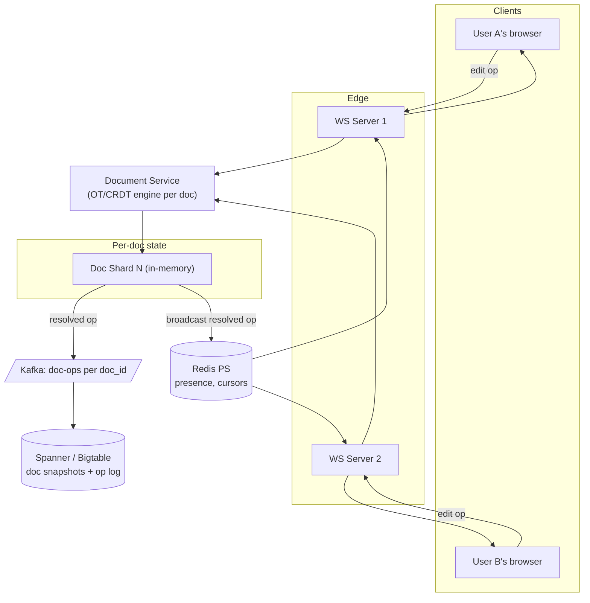

### **Classic 12: Google Docs — Realtime Collaboration**

> Difficulty: **Expert**. Tags: **RT, Stream**.

---

#### **The Scenario**

Build Google Docs. Multiple users edit the same document simultaneously, see each other's cursors and edits character-by-character within 100ms, without conflicts or lost characters. Works over flaky networks; offline edits merge on reconnect.

---

#### **1. Requirements**

| Functional | Non-functional |
|---|---|
| Concurrent multi-user editing | Edit-to-peer latency < 100ms |
| Character-level granularity | 50+ concurrent editors per doc |
| Cursor + selection presence | Offline edits reconcile correctly |
| Comments, suggestions, version history | No edit ever lost |
| Formatting (bold, heading, etc.) | Docs up to 50MB |

---

#### **2. Estimation**

- 500M users, 100M concurrent editors, avg 2 docs open each.
- Edits: ~10 ops/sec per active editor.

---

#### **3. Architecture**

---

#### **4. Deep Dives**

**4a. The hard part: merging concurrent edits**

Two editors, same doc, simultaneous edits. No conflict flag; both edits must converge.

Two primary algorithm families:

- **Operational Transform (OT)** — Google Docs' approach. Each edit is an operation (insert, delete). When two ops are concurrent, you **transform** one against the other to produce equivalent ops applied serially.
  - Requires a central authority to linearize. Scales by sharding by doc_id.
- **CRDTs (Conflict-free Replicated Data Types)** — Figma's approach. Edits are commutative by design (each insert has a unique ID). No transform needed; apply in any order, converge to the same state.
  - Can be peer-to-peer or centralized.
  - Yjs, Automerge are popular libraries.

**4b. Centralized doc shard (OT)**

- Each document has a "home" server owning its current state.
- All ops for doc X route to server X (consistent hashing).
- Server applies ops in arrival order (transforms as needed), emits the resolved op stream.
- Server broadcasts the resolved op to all connected editors via Redis PS.

**4c. Client-side prediction**

- User presses a key; client immediately shows the edit (instant feedback).
- Client sends op to server.
- Server may transform and rebroadcast a slightly different version.
- Client rebases its local doc against the server's canonical stream. If server's op doesn't match what client applied, client replays from the mismatch point.

**4d. Persistence**

- Kafka topic `doc-ops-{doc_id}` holds the operation log.
- Periodic snapshotting to Spanner compacts old ops.
- Version history: scroll through snapshots or replay op log up to a past timestamp.

**4e. Presence (cursors)**

- Cursor positions don't need durability. Broadcast via Redis PS only — ephemeral.
- User A sees User B's cursor move smoothly. On disconnect, cursor fades.

**4f. Offline editing**

- Client keeps local op log while offline.
- On reconnect, sends its op log. Server rebases it against the current doc state, transforms, integrates.
- If user deleted paragraph 5 while someone else was editing it offline, result depends on OT's transform rules. Usually intuitive; edge cases annoying.

---

#### **5. Failure Modes**

- **Doc shard crash:** ops in-flight may be lost (buffered ones in Kafka are safe). Clients reconnect to the new shard after recovery; any lost ops are re-sent from client.
- **Network partition:** client queues ops; server continues with other editors. On reunion, queued ops are merged.
- **Malicious op:** auth + per-op validation (user must have edit permission, op must be well-formed).

---

### **Revision Question**

User A types "the" at position 0. Simultaneously, User B types "a" at position 0. Both are at doc version 10. What does the doc look like after both ops land, and what guarantees make sense?

**Answer:**

The doc must end up in **the same final state for everyone**, regardless of which op arrived at the server first.

Possible outcomes after transformation:

- Server sees A's `insert("the", 0)` first. Applied: doc = "the".
- Then server sees B's op. B was based on v10 (empty), but doc is now v11 ("the"). Server transforms B's op: "insert 'a' at position 0, taking into account that 3 chars were just inserted before" → doc = "athe" or "thea" (depending on tie-break rule).
- All clients eventually see the same result, because the server's broadcast is the canonical order.

Key guarantees:

- **Convergence:** all clients, after seeing the full op stream, have identical state.
- **Causality preservation:** if op X was produced after op Y was observed, X comes after Y in the linearized stream.
- **Intention preservation:** each user's original intent is respected as much as possible (B wanted "a" first; A wanted "the" first — both texts are in the doc).

In OT, tie-breaking (same position, same version) uses client ID as tie-breaker. That's a deterministic choice — every server transforms the same way, so every client converges.

This is the fundamental magic of realtime collab: **turning concurrent edits into a serialized, commutative, idempotent stream**. OT and CRDTs are two mathematical approaches to the same end. Pick one and the rest of the system falls into place.
