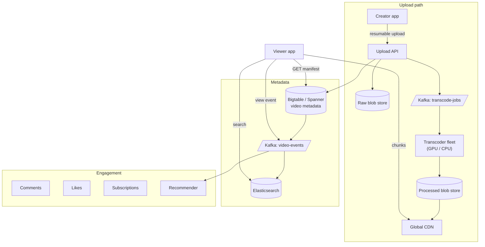
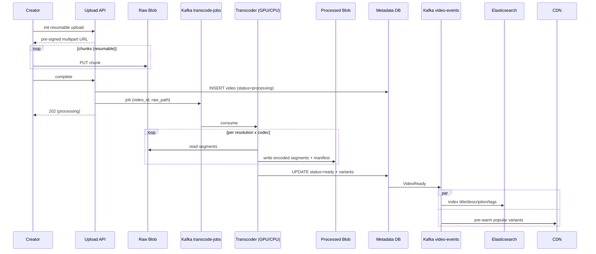
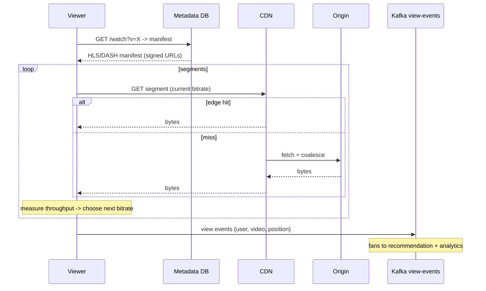

### **Classic 13: YouTube — Upload & Playback**

> Difficulty: **Hard**. Tags: **Async, Sync**.

---

#### **The Scenario**

Build YouTube. Creators upload videos up to 12h long; the system transcodes to multiple qualities; viewers stream adaptively; comments, likes, subscriptions, recommendations. 500 hours of video uploaded per minute, 1 billion hours watched per day.

---

#### **1. Requirements**

| Functional | Non-functional |
|---|---|
| Upload video | Upload resumable, durable |
| Transcode to multiple resolutions | Process 500 hours/min |
| Adaptive streaming (DASH/HLS) | Playback start < 2s |
| Comments, likes, subs, rec | Globally scalable |
| Video search | Storage: exabytes |

---

#### **2. Estimation**

- 500 hrs/min × 1 GB/hr = 500 GB/min ingested = 720 TB/day raw.
- Transcoded to 5 resolutions × 3 codecs = storage × 10 → 7 PB/day.
- Playback: 2B users × 30 min/day × 3 Mbps = ~70 Pbps peak.

---

#### **3. Architecture**

---

#### **4. Request Flow (Sequence)**

**Flow A: Upload + transcode**

**Flow B: Playback with ABR**

---

#### **5. Deep Dives**

**4a. Upload — resumable, chunked, pre-signed**

- Creator's app requests an upload session. Upload API returns a pre-signed multipart URL (S3/GCS).
- Client uploads chunks directly to blob storage. Service is out of the byte path.
- On failure, client resumes from last successful chunk.
- On complete, client notifies API → triggers processing.

**4b. Transcoding pipeline**

- Kafka job: `{video_id, raw_blob_path}`.
- Transcoder workers (GPU for H.264/H.265, CPU for VP9/AV1) consume jobs.
- Each produces multiple outputs per video: 144p, 360p, 720p, 1080p, 4K × 2-3 codecs.
- Output uploaded to processed blob store; metadata DB updated.
- Takes 1-5× video length. Long videos take hours.

**4c. Adaptive playback (HLS/DASH)**

- Player downloads a **manifest** listing segment URLs per resolution.
- Start with lowest bitrate → first segment in < 1s.
- Measure actual throughput, step up as permitted.
- Segments are small (2-10s). Request granularity matches cache granularity.

**4d. CDN strategy**

- Popular content: aggressively cached at edge worldwide.
- Long-tail (80% of titles, 20% of views): cached regionally, pulled from origin on miss.
- Cold: only in origin; first viewer in a region waits longer.

**4e. View events and recommendations**

- Each playback emits events: `{user, video, position, device, timestamp}`.
- Events → Kafka → feature store.
- Recommender model scores candidate videos for each user's home page.

**4f. Live streaming (extension)**

- Input is a live RTMP stream from OBS.
- Ingest server segments into 2-5s HLS chunks, pushes to CDN as they complete.
- Viewers see ~10-30s lag from live.

---

#### **6. Failure Modes**

- **Transcoder fleet backlog:** new uploads processed slowly. Users see "processing..." state. Long-tail acceptable.
- **CDN origin miss storm:** cache coalescing collapses misses; brief spike survivable.
- **Poison video (malformed upload):** DLQ; manual inspection.

---

### **Revision Question**

Why does YouTube transcode into 5+ resolutions instead of just one high-quality original and letting the client downsample?

**Answer:**

Client-side downsampling would:

1. **Force each viewer to download full-quality bytes even on mobile** — wasteful of bandwidth and battery. A 4K stream is ~25 Mbps; on LTE that's unusable.
2. **Require client-side decoding of the highest resolution**, which older devices and low-end phones physically cannot do. A 10-year-old phone cannot play 4K H.265.
3. **Eliminate adaptive bitrate switching** — the whole value prop of HLS/DASH is "downshift when network degrades." Without pre-encoded variants, the client would need to transcode on the fly, impossible on-device.

Pre-transcoding is a massive storage and compute cost, but it pushes the cost from **each of 2B viewers** (bandwidth + compute repeatedly) to **one-time at upload** (compute once, store, reuse). Economically it's a no-brainer above a tiny scale.

The general principle: **encode once per format, serve many times.** This is the inverse of the catalog/typeahead principle — same pattern, different layer. Precomputation wins whenever the output is reused many orders of magnitude more times than it's produced.
