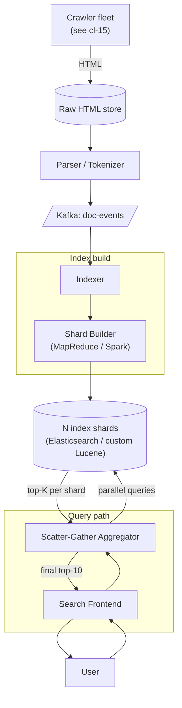
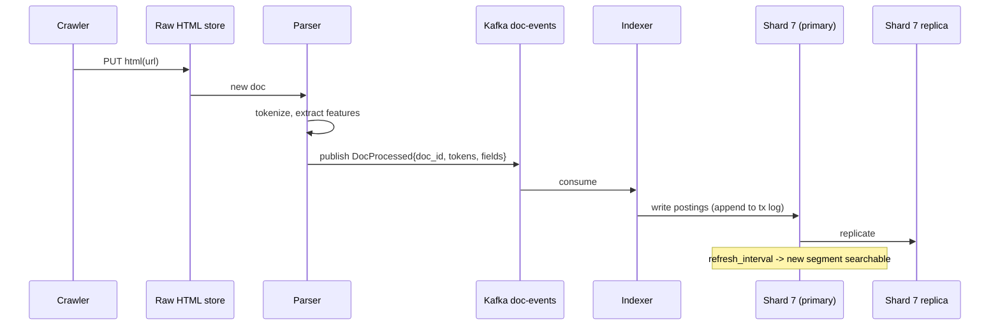
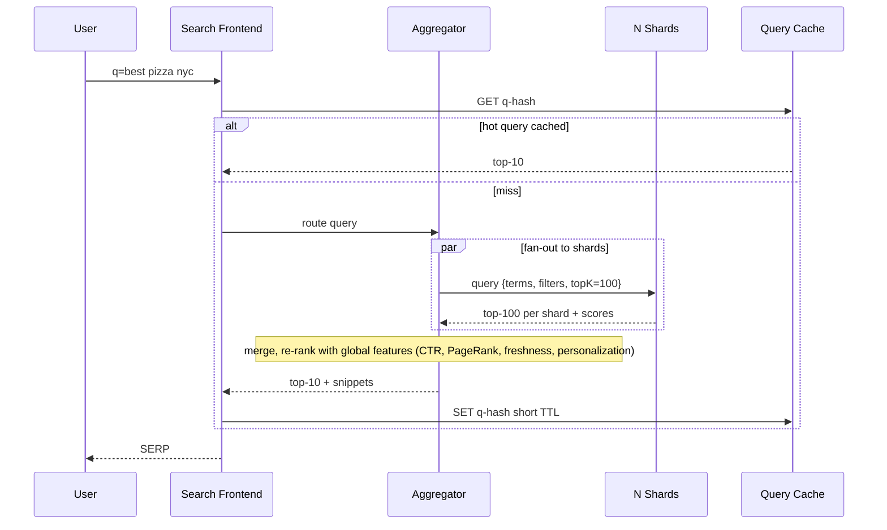

### **Classic 14: Distributed Search Engine**

> Difficulty: **Hard**. Tags: **Stream, Sync**.

---

#### **The Scenario**

Build a general-purpose search engine (Google-lite): given a query like "best pizza nyc", return the top 10 most relevant web pages in < 200ms. Index size is billions of documents. Crawl and re-index continuously.

---

#### **1. Requirements**

| Functional | Non-functional |
|---|---|
| Keyword + phrase queries | Query p99 < 200ms |
| Ranking by relevance | 10B+ documents indexed |
| Faceting + filters | 50k QPS |
| Snippets + highlighting | Index freshness < 1h for hot pages |

---

#### **2. Estimation**

- 10B docs × 5KB (indexed fields) = 50TB raw. Inverted index ~5-10x smaller.
- 50k QPS × ~10 shards queried per QPS = 500k shard-queries/sec.

---

#### **3. Architecture**

---

#### **4. Request Flow (Sequence)**

**Flow A: Indexing (write path)**

**Flow B: Query (scatter-gather)**

---

#### **5. Deep Dives**

**4a. Sharding the index**

- Index split across N shards (e.g. 1000 shards × 10 GB each).
- Each shard is a complete mini-inverted-index (like Lucene segment).
- Sharding strategy: document-based (random docs to each shard) vs term-based (one shard per term range).
- Document-based wins for general search — queries scatter-gather across all shards in parallel.

**4b. Query flow — scatter-gather**

1. Frontend parses query.
2. Aggregator issues parallel queries to all shards (or a curated subset based on query features).
3. Each shard returns its top 100 results with scores.
4. Aggregator merges shards' results and re-ranks using global features (click-through rate, freshness).
5. Returns top 10 with snippets.

Target: all this in < 200ms. Each shard responds in ~20ms; parallel execution hides it.

**4c. Ranking (simplified)**

- **BM25** (textual relevance) from inverted index.
- **PageRank**-style authority score.
- **Click-through-rate** from prior queries (learned).
- **Freshness** boost for recent docs.
- **Personalization** (history, location) at the Aggregator layer.

Production ranking is a learned model combining hundreds of features. Scores from shards are local; final sort uses global features.

**4d. Index freshness — batch + near-real-time**

- **Batch rebuild:** Spark job reads all docs from Kafka history (7+ day retention), rebuilds shards in parallel. Runs daily.
- **NRT (near-real-time):** incremental updates to existing shards. New/updated doc → write to shard's transaction log → refresh in ~1-5 min.

**4e. Snippets**

- Shards store full doc text alongside index.
- At query time, for top-K docs, extract snippets containing query terms with highlighting.

---

#### **6. Failure Modes**

- **Shard down:** Aggregator fails over to replica; results still returned. Or, if no replica, returns partial results with a "some results may be missing" flag.
- **Indexer lag:** stale results. Monitor freshness per-index.
- **Hot query (viral):** cache query → top-10 mapping at frontend for popular queries.

---

### **Revision Question**

A new doc is added to Shard 7. A user searches for a term in that doc 2 minutes later but doesn't see it. What design decision is this and how would you change it if instant visibility mattered?

**Answer:**

This is the **refresh interval** trade-off. In Elasticsearch (and similar), "refresh" is the moment a written doc becomes searchable. Default is 1s, but large indexes bump to 30s or 60s for write throughput. Your 2 min is within the normal NRT window.

Tradeoffs:

- **Faster refresh** = more CPU overhead (building searchable segments frequently), more disk I/O, less write throughput.
- **Slower refresh** = higher write throughput, lower search freshness.

To make it faster:

1. **Lower refresh_interval** to 1s or manual on critical indexes (at the cost of indexing throughput).
2. **Write-through cache:** add a "recently written" overlay that serves docs inline until they appear in the shard.
3. **Denormalize:** for truly instant updates, put the doc in a fast side store (Redis/Dynamo) AND the slow-but-complete search index. Query both, merge.

For general web search, 1-min freshness is fine. For "live news search," you'd layer a separate real-time index (Kafka → in-memory) on top of the slower batch index. **Freshness vs throughput** is a knob, not a yes/no.
