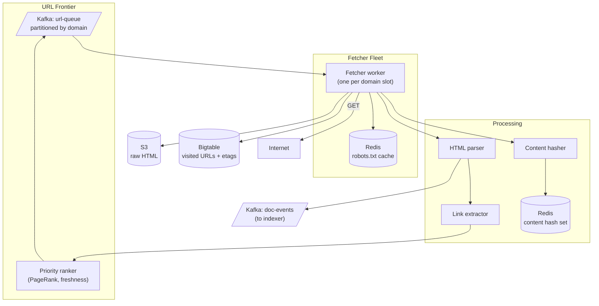

### **Classic 15: Web Crawler**

> Difficulty: **Hard**. Tags: **Async, Stream**.

---

#### **The Scenario**

Build a polite, distributed web crawler that visits billions of URLs, obeys robots.txt, avoids re-fetching unchanged content, extracts links, and feeds documents into the search indexer. Must handle spam traps and duplicate content gracefully.

---

#### **1. Requirements**

| Functional | Non-functional |
|---|---|
| Crawl billions of URLs | 10k pages/sec sustained |
| Respect robots.txt, crawl-delay | Politeness per domain |
| Detect content changes efficiently | Resume from interruption |
| Deduplicate content | Handle malicious sites |
| Feed docs to indexer | Prioritize important sites |

---

#### **2. Estimation**

- 10k pages/sec × avg 100KB = 1 GB/sec = 86 TB/day bandwidth.
- URL frontier: 1B URLs discovered but not yet visited.

---

#### **3. Architecture**

---

#### **4. Deep Dives**

**4a. The URL frontier**

- Central queue of URLs to visit.
- **Partition by domain** — all URLs for `example.com` go to the same partition → same worker slot → enforces per-domain crawl-delay.
- Prioritization: unvisited high-PageRank URLs first; re-visit high-change-rate URLs on schedule.

**4b. Politeness — per-domain rate limiting**

- Each worker slot handles exactly one domain at a time. Crawl-delay between requests to the same domain (default 1-2s, or as robots.txt dictates).
- Without this, crawling at 10k pages/sec would DDoS small sites.

**4c. robots.txt**

- Before fetching any URL on `example.com`, fetch and cache `example.com/robots.txt`.
- Respect Allow/Disallow rules, Crawl-delay.
- Cache for hours; refetch periodically.

**4d. Content dedup**

- Hash the cleaned content (MD5/SHA of normalized text).
- If hash exists in Redis set → don't re-process; mark URL as duplicate.
- Saves indexer from processing mirrors and aggregators.

**4e. Change detection — conditional GET**

- Store `etag` and `last_modified` per URL.
- On re-visit: `GET` with `If-None-Match` header.
- Server returns **304 Not Modified** if unchanged → skip parsing and indexing.
- Massively reduces work for frequently-crawled sites.

**4f. Extracting links and feedback loop**

- Parser extracts `<a href>` links.
- Extractor normalizes, dedups against visited set, emits new URLs.
- Priority ranker assigns priority (PageRank from link graph, URL depth, estimated change rate).
- Back into the frontier.

---

#### **5. Failure Modes**

- **Spam trap (infinite parameter space):** limit path depth, limit parameter explosion, detect and blacklist domains.
- **Giant site (wikipedia):** capped at fair share; don't crawl 100M pages from one site in a day.
- **Fetcher crash:** URL returns to queue (Kafka retains). Resumable.
- **Malicious content (XSS, malware):** parser runs in isolated sandbox; blob store scanned for threats.
- **Redirect loops:** track redirect chain depth, break at 5.

---

### **Revision Question**

Two URLs `example.com/article?ref=twitter` and `example.com/article?ref=facebook` point to the same content. The naive crawler treats them as different, wasting bandwidth. How does the architecture prevent this?

**Answer:**

Two layers of defense:

1. **URL canonicalization.** Before enqueueing, normalize the URL:
   - Strip tracking parameters (`utm_*`, `ref`, `fbclid`, `gclid`, etc.).
   - Lowercase the scheme and host.
   - Remove trailing slashes.
   - Sort remaining query params.

   Result: both become `example.com/article`. Only the canonical form goes to the frontier. The duplicate is detected by URL identity at the frontier layer, so it's never fetched twice.

2. **Content hash dedup.** Even with perfect URL normalization, different URLs can legitimately serve the same content (mirrors, aggregators). After fetch, hash the cleaned body; if it's already in the dedup set, mark this URL as a duplicate of the one that was indexed first.

Both layers are needed:
- URL normalization saves bandwidth (don't fetch).
- Content hashing saves indexer work and prevents duplicate search results.

Real crawlers (Googlebot, Bingbot) also use `<link rel="canonical">` from the page itself when provided — site operators tell the crawler "this page's canonical URL is X." This is the third layer, and it's why every SEO tutorial says "set your canonical tags."

The lesson: **dedup is multi-layered**, and each layer catches different classes of duplicates. No single layer is sufficient.
