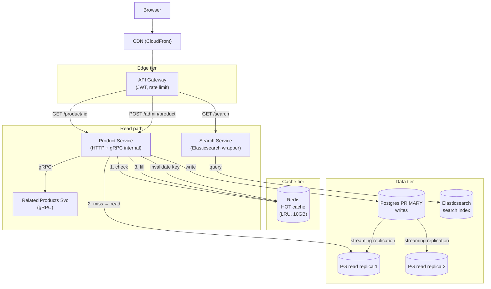
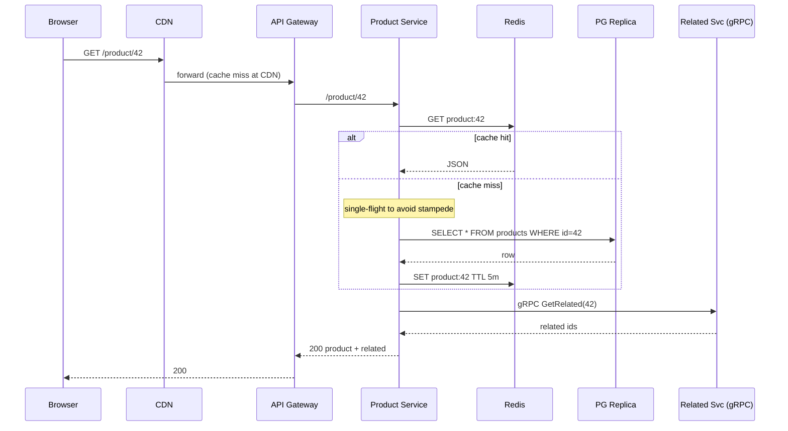
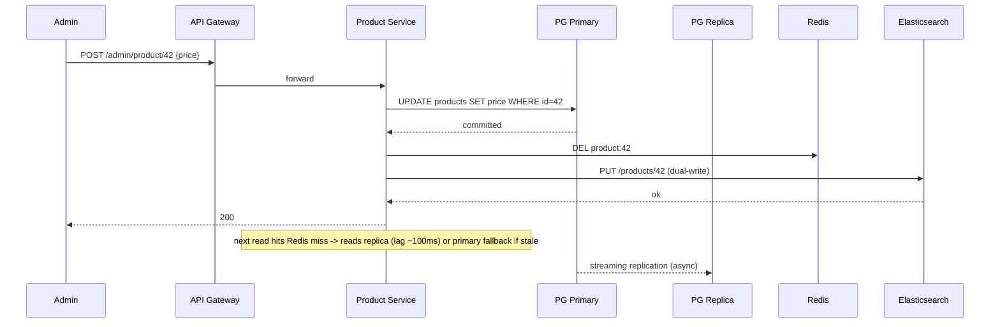

### **Curriculum Drill 01: Sync Stack — Read-Heavy Product Catalog**

> Pattern focus: **Week 1 sync stack** — HTTP, gRPC, gateway, caching. No async. No streams.
>
> Difficulty: **Medium**. Tags: **Sync**.

---

#### **The Scenario**

You run an e-commerce site with **50 million products**. The frontend hits your backend ~**200,000 requests per second** — 95% reads (product detail page, search results, recommendations), 5% writes (admin updates, inventory).

The business says: "We do not need eventual consistency. When an admin updates a price, the next customer must see it. No Kafka, no queues. Just make sync work at scale."

You can use REST, gRPC, caching, databases, and a gateway — nothing else.

---

#### **1. Requirements**

| Functional | Non-functional |
|---|---|
| GET product by ID | p99 latency < 100ms |
| GET product list (category, filter, sort) | 200k QPS total |
| Search by text | 99.95% availability |
| Admin updates price / stock / description | Read-after-write consistency on product updates |
| Show related products | Global users (3 continents) |

---

#### **2. Back-of-Envelope Estimation**

- 50M products × 2KB avg JSON = **100 GB** hot data.
- 200k QPS × 95% reads = 190k read QPS.
- 190k read QPS × 2KB = **380 MB/sec** outbound = 3 Gbps. Non-trivial; caching is mandatory.
- Write QPS = 10k, of which most are inventory-decrement writes from checkout.

---

#### **3. High-Level Architecture**

---

#### **4. Request Flow (Sequence)**

**Flow A: Product read (cache hit, then miss)**

**Flow B: Admin write (read-after-write guaranteed)**

---

#### **5. Deep Dives**

**4a. Cache strategy — look-aside with explicit invalidation**

- Read path: Product Service checks Redis. On miss, reads from a PG replica, fills Redis with TTL = 5 minutes.
- Write path: writes to PG primary, then **explicitly deletes the Redis key** for that product.
- Why delete, not set? If two writers race, "delete" converges to the correct next read (which will re-fetch from PG). "Set the new value" can clobber with a stale one under concurrency.
- Why not write-through? The read-heavy workload hits Redis 19× more than PG. You want PG as the truth and Redis as the velocity layer, not the other way around.

**4b. Read-after-write consistency despite replicas**

- Problem: admin writes to primary, but replica lag might serve the old value to the next customer.
- Solution: the admin's service uses a **sticky read-your-write session**. After a write, the Product Service reads from **primary** (not replica) for a short window (e.g. 2 seconds) for that product ID. Public users never have read-your-write expectations; they read from replicas.
- Cache invalidation is synchronous with the write, so even the 2-second window is not visible to public users.

**4c. Gateway and gRPC internals**

- Browser → Gateway: HTTPS + JSON.
- Gateway → Services: HTTP/1.1 + JSON (REST) for request-shaped endpoints. Internal service-to-service: **gRPC** for related-products, recommendations, pricing — because they sit in the request path and every millisecond counts.
- gRPC gives ~30-50% smaller payloads and uses one multiplexed TCP connection per peer. On the hot path this is huge.

**4d. Search**

- Elasticsearch holds a copy of each product document. Updates: when admin writes to PG, the service writes the same doc to ES synchronously. This is a **dual-write** — acceptable here because we already said "no async." You accept the risk that PG-ES can diverge if ES is down during a write, and build an audit reconciliation job to fix drift.
- At scale, you'd upgrade this to outbox + CDC (Week 4), but that violates the problem constraints.

---

#### **6. Data Model**

- Postgres: `products(id, sku, name, description, price, stock, updated_at)` + related tables.
- Elasticsearch: flattened denormalized doc per product.
- Redis: key = `product:{id}`, value = JSON, TTL 5min.

---

#### **7. Communication Pattern Rationale**

- **REST at the edge** because clients are browsers (no Protobuf there).
- **gRPC internally** because inter-service calls are in the user's request path, typed contracts protect against schema drift, and Protobuf payloads save bytes.
- **No Kafka, no RabbitMQ.** Every operation is a request-response. The cost is tighter temporal coupling; the benefit is absolute simplicity.

---

#### **8. Failure Modes and Tradeoffs**

- **Redis down** — every read falls through to PG replicas. PG load jumps ~20×. Mitigation: run Redis in cluster mode with replicas; have a circuit breaker between service and Redis so the fallback path works.
- **PG primary down** — writes fail entirely until failover. Reads continue via replicas. Mitigation: automated failover (patroni, RDS multi-AZ).
- **ES dual-write failure** — PG has the new price, ES has the old. Reconciliation job re-syncs from PG → ES every 10 minutes.
- **Cache stampede on hot product** — when "Nakroth skin" key expires and 10k clients race to refill: use **single-flight** in the Product Service (one goroutine fills, others wait).
- **Replica lag** — normally < 100ms, but under load can spike. Admin flows use primary; public flows tolerate the lag.

Tradeoffs:
- All-sync keeps the architecture dead simple and easy to reason about.
- The cost: you cannot absorb traffic spikes the way a queue would. Every spike hits your services directly.
- Inventory decrements at Black Friday would not survive this design — see [dm-01 Ecommerce Black Friday](../domains/01-ecommerce_black_friday_checkout.md) for the async upgrade.

---

### **Design Exercise**

Sketch the same system but add **"customers in the EU must have < 50ms p99."** What changes? (Hint: multi-region read replicas, per-region Redis, geo-routing at the CDN or DNS level. Writes still go to a single primary — accept cross-region write latency for admins.)

---

### **Revision Question**

An admin updates a product price. Three seconds later, a customer on a different server loads that product. Walk through every hop and prove they see the new price.

**Answer:**

1. Admin `POST /admin/product/42` → Gateway → Product Service.
2. Product Service writes to PG primary. Transaction commits.
3. Product Service issues `DEL product:42` against Redis. Redis deletes the key.
4. Product Service responds 200 OK to the admin.
5. Three seconds later, customer requests `GET /product/42`.
6. Gateway → Product Service (maybe a different pod).
7. Product Service checks Redis `product:42` — miss (we deleted it).
8. Product Service reads from PG replica. Replica lag is ~100ms, so it has the new row.
9. Service fills Redis with new value, TTL 5min.
10. Service returns new price to customer.

The key trick: **cache invalidation happens at step 3, before the response to the admin**, so even an instant next read sees the correct value. If the replica hasn't caught up yet (lag > 3s), the service detects `updated_at < admin_write_time` and reads from primary as a fallback. You have read-your-write consistency without giving up on replicas.
