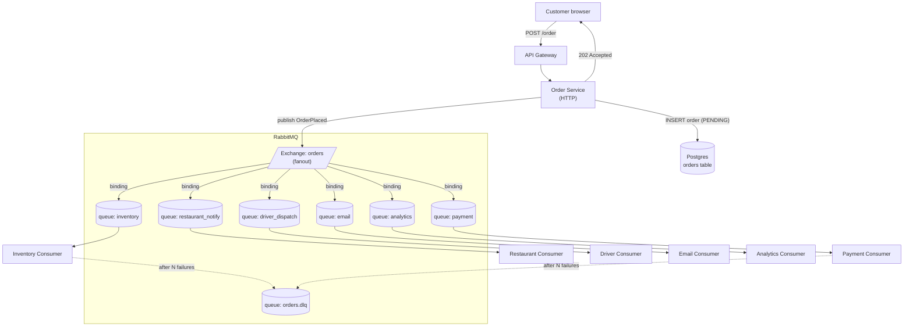

### **Curriculum Drill 02: Work Queue — Order Ingestion at 1M/day**

> Pattern focus: **Week 2 work queue** — RabbitMQ, manual ACKs, DLQs, consumer scaling. Async decoupling.
>
> Difficulty: **Medium**. Tags: **Async**.

---

#### **The Scenario**

You run a restaurant-delivery platform. Customers place **1,000,000 orders per day** with heavy spikes at lunch (12:00) and dinner (19:00) — 10x spike for 30 minutes. Each order requires 6 downstream actions: reserve inventory, notify the restaurant, schedule a driver, charge the card, send email, log to analytics. Any one of them might be slow or temporarily down.

The checkout API must respond to the customer in **< 300ms** regardless of how slow the downstream is.

---

#### **1. Requirements**

| Functional | Non-functional |
|---|---|
| Customer places order | p99 < 300ms to acknowledge |
| Order reliably processed by all 6 downstreams | Zero order loss |
| If a downstream is slow, others proceed | Graceful backlog processing |
| If a downstream fails repeatedly, quarantine | Observability of stuck orders |

---

#### **2. Estimation**

- 1M orders/day = 11.5 orders/sec average.
- 10× lunch spike = ~115 orders/sec peak. Not huge, but the downstream actions multiply: 115 × 6 = 690 ops/sec just from one spike.
- Each order is ~2KB → ~2.3MB/sec at peak. Trivial.
- The real engineering problem is **decoupling slow consumers from the checkout hot path**.

---

#### **3. Architecture**

---

#### **4. Deep Dives**

**4a. Why a fanout exchange, not six separate publishes**

- One publish, six bindings → RabbitMQ copies the message into all six queues atomically from the producer's view.
- If you published 6 times, you could succeed for queues 1-4, fail on 5, and now you have split-brain state across consumers. Fanout is the atomic unit.

**4b. Consumer scaling and fair dispatch**

- Each consumer service runs N replicas, all consuming from the same queue with **round-robin fair dispatch**.
- Set `basic.qos(prefetch=10)` — each consumer holds at most 10 unacked messages. Without this, one slow consumer would hoard 10,000 messages while its peers idle.
- Manual ACK only after the work is fully done (DB committed, external call succeeded). On crash, the unacked message returns to the queue.

**4c. Retry and DLQ strategy**

- Consumer fails → NACK with requeue. RabbitMQ re-delivers.
- After 5 retries (tracked in message header `x-retry-count`), move to `orders.dlq`.
- A DLQ monitor dashboard surfaces stuck orders. Humans or a repair job replay them after the underlying issue is fixed.

**4d. What the customer actually sees**

- 202 Accepted + `order_id` after Order Service has committed the PENDING row and published to the exchange.
- The customer's app polls `GET /order/:id` (or subscribes via WebSocket, see [Bonus 3](../../Week1-Fundamentals_and_Synchronous_communication/bonus3-websocket_architecture_patterns.md)) to watch the status transition from PENDING → PAID → DISPATCHED → DELIVERED.

---

#### **5. Data Model**

- `orders(id, customer_id, items, total, status, created_at, updated_at)`
- Each consumer service has its own state, keyed by `order_id`.
- Idempotency: consumers check `processed_orders(order_id)` before doing work.

---

#### **6. Pattern Rationale**

- **Why RabbitMQ, not Kafka?** Work queues = one consumer per message. Kafka is for broadcast replay where every consumer group sees every message. Here we want 6 *independent* queues, each with competing consumers. AMQP exchanges + queues model this natively.
- **Why not sync fanout?** If Order Service called all 6 downstreams synchronously, the slowest one would set the user's latency. Plus: if email is down, does the order fail? No. Email is eventual. RabbitMQ captures that intent.

---

#### **7. Failure Modes**

- **RabbitMQ down.** Orders back up in the Order Service's outbox (if you have one — see [cd-08](08-outbox_inventory_to_many_consumers.md)) or fail closed. Most real setups run Rabbit in a cluster with mirrored queues.
- **One consumer stuck.** Only its queue grows. Others keep processing. This is the point of the design.
- **Poison message.** Message that crashes the consumer on every attempt. DLQ rescues after 5 retries.
- **Duplicate publish.** If Order Service publishes, then crashes before committing the DB row: no problem, the consumers will idempotent-skip.
- **At-least-once delivery.** Consumers MUST be idempotent. Every consumer keeps a `seen(order_id)` table.

Tradeoffs:
- Simplicity: RabbitMQ is easier to operate than Kafka for work-queue-shaped problems at this scale.
- Limit: if one of the 6 consumers needs to replay history (e.g. analytics backfill), Rabbit cannot do it — messages are gone after ACK. That's where Kafka starts earning its keep ([cd-04](04-event_streaming_activity_log.md)).

---

### **Design Exercise**

The business adds a 7th downstream: a loyalty-points service. How do you add it without touching any existing code?

(Hint: add a queue bound to the `orders` fanout exchange, deploy the new consumer. That's the entire change. This is the decoupling win of pub/sub work queues.)

---

### **Revision Question**

At 12:05 PM on a Friday, payment processor is returning 500 errors for 8 minutes. Walk through what happens to orders placed during that window.

**Answer:**

1. Customers `POST /order`. Order Service responds 202 immediately — they don't even notice.
2. Order Service publishes `OrderPlaced` to the fanout exchange.
3. Inventory, Restaurant, Driver, Email, Analytics consumers all process normally.
4. **Payment consumer** calls the payment API, gets 500, NACKs with requeue.
5. The `payment` queue starts to grow. RabbitMQ holds the messages durably on disk.
6. After 5 retries per message, poison messages move to DLQ. Most messages will still be in the main queue (fewer than 5 attempts) because the outage hasn't lasted long enough per-message.
7. At 12:13 PM, payment provider recovers. Payment consumer drains the queue in a few minutes.
8. Downstream effects (DRIVER dispatch waiting for payment) are also delayed. The Driver Service's state machine tolerates a delayed `PaymentSucceeded` event.
9. No order is lost. No customer sees the outage. The delivery is just ~10 minutes late for a few orders.

This is the **shock absorber** effect of a work queue: the backlog becomes invisible to the caller and gives the failing system time to heal.
