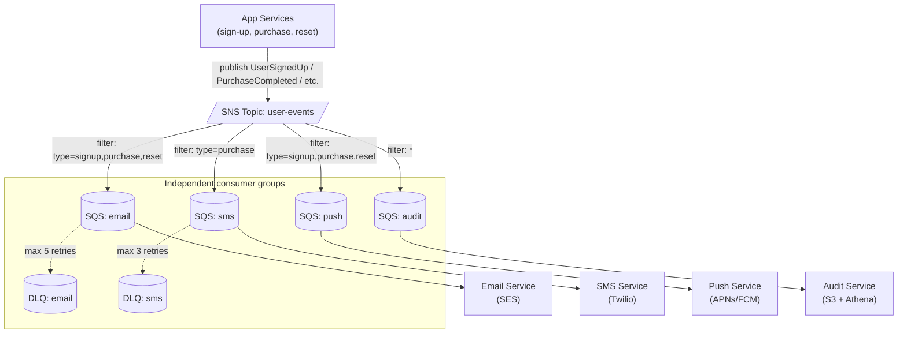
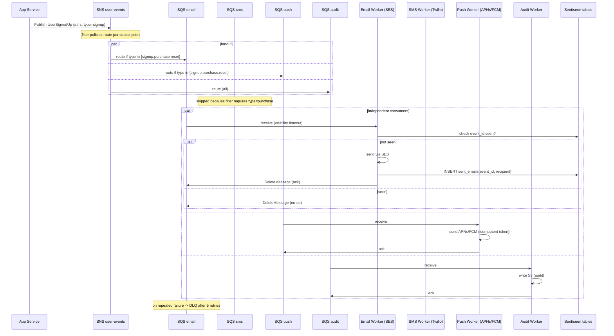

### **Curriculum Drill 03: Fanout — Multichannel Notifications**

> Pattern focus: **Week 2 pub/sub fanout** — SNS + SQS, independent consumers, no coupling between publisher and subscribers.
>
> Difficulty: **Medium**. Tags: **Async**.

---

#### **The Scenario**

When a user signs up, completes a purchase, or gets a password reset, your system must deliver the event to four independent channels: **email**, **SMS**, **push notification**, and **audit log**. Each channel is run by a different team with different SLAs. The publisher must not care how many channels exist.

---

#### **1. Requirements**

| Functional | Non-functional |
|---|---|
| Publisher emits one event per user action | Publisher adds < 20ms to request path |
| All 4 subscribers receive every event | No subscriber can block another |
| Add a 5th subscriber later without code change in publisher | At-least-once delivery |
| Subscribers can opt-in to subsets of events | Independent scaling per subscriber |

---

#### **2. Estimation**

- 5M users, average 3 notification-worthy events per day = 15M events/day = ~170/sec.
- Peak (marketing campaign): 100k events in 60 seconds = 1,666/sec.
- Message size ~1KB.

---

#### **3. Architecture**

---

#### **4. Request Flow (Sequence)**

---

#### **5. Deep Dives**

**4a. Why SNS → SQS and not SNS → Lambda directly**

- SNS alone = fire-and-forget. If the Lambda subscriber is throttled, messages are dropped.
- SNS → **SQS** gives you a **durable buffer** per subscriber. If the email service is down for an hour, emails accumulate in the email SQS queue and drain when it comes back.
- Each subscriber has its own queue, own DLQ, own retry policy. Complete isolation.

**4b. Message filtering**

- SNS supports **subscription filter policies** (JSON attributes). The SMS queue only subscribes to `type: purchase` because users don't want SMS for sign-ups.
- This moves filter logic out of subscriber code and into the broker — saves compute and bandwidth.

**4c. Subscriber idempotency**

- SNS → SQS gives **at-least-once**. Duplicates happen at failover boundaries.
- Email service keeps a `sent_emails(event_id, recipient)` table with unique index. Second attempt no-ops.
- SMS is expensive — idempotency matters for money, not just correctness.

**4d. Per-channel backpressure**

- SES (email) rate-limits at 100 msgs/sec. Worker pulls from SQS with that cap.
- Twilio (SMS) is slower. Worker processes 10/sec, lets queue accumulate.
- Push can burst to 10,000/sec — scale workers horizontally.
- The **queue absorbs the mismatch between event rate and delivery rate** for each channel independently.

---

#### **6. Data Model**

- Event: `{event_id, user_id, type, timestamp, payload}`.
- Each subscriber maintains its own state: sent-table, failure counts, per-event status.

---

#### **7. Pattern Rationale**

- **Publish once, many subscribers.** The SNS topic is the fanout primitive; SQS queues provide per-subscriber durability.
- **vs Kafka:** Kafka would also work. SNS+SQS is simpler for "N independent sinks with filters," easier to operate on AWS, and per-queue retry/DLQ is built in. Kafka shines when you need replay or ordered per-key streams (see [cd-04](04-event_streaming_activity_log.md)).
- **vs RabbitMQ fanout:** Functionally equivalent to RabbitMQ's fanout exchange pattern. Choose by ops preference — SNS/SQS if you're on AWS, RabbitMQ if you're self-hosted.

---

#### **8. Failure Modes**

- **SES outage** — email queue grows. Once SES is back, the queue drains. User might get the confirmation email 10 minutes late; they will not miss it.
- **Poison message** — one event has malformed payload. After 5 retries, moves to DLQ. Manual intervention or a repair job replays after fix.
- **Publisher publishes but topic is down** — publisher catches the error. Options: (a) retry with backoff, (b) write to local disk and a sidecar ships later, (c) write to the [outbox pattern](08-outbox_inventory_to_many_consumers.md).
- **Regional failure** — SNS is regional. Multi-region: publish to topics in each region, each region has its own subscribers. Cross-region replication via dedicated consumer if needed.

Tradeoffs:
- Add a 5th channel (Slack, say)? Create an SQS queue, subscribe it to the SNS topic with the right filter, deploy the consumer. **Zero publisher changes.** This is the decoupling win.
- Cost: SNS + SQS are per-message-priced. At 15M/day × 4 subscribers = 60M SQS msgs/day = ~$24/day at current rates. Cheap.

---

### **Design Exercise**

The compliance team asks: "We need to rebuild the audit log from scratch, 6 months back." Your SQS queue retention is 14 days. How do you comply?

(Hint: SQS is not a replayable log. Either (a) keep a parallel Kafka topic for the same events with long retention, (b) have the audit subscriber write to S3 and "replay" means re-read the S3 dump. Most teams do both. This is why [cd-04](04-event_streaming_activity_log.md) exists as a separate scenario.)

---

### **Revision Question**

Your publisher currently writes the event by calling `sns.Publish()` from within the request handler. Under load, SNS latency spikes to 500ms. The user-facing API is now slow. What is wrong and how do you fix it?

**Answer:**

The sync `sns.Publish()` in the request path **couples user latency to broker latency** — exactly what async was supposed to avoid.

Fix options:

1. **Transactional outbox + relay.** Within the DB transaction that created the user/order, also insert an outbox row. A background relay reads outbox rows and publishes to SNS. The user's request completes as soon as the DB commit completes, independent of SNS latency. See [cd-08](08-outbox_inventory_to_many_consumers.md).
2. **Local in-memory queue + async publisher goroutine.** Faster but less durable — if the app crashes between enqueue and publish, the event is lost.
3. **Write to a local, persistent "event.log" file, sidecar ships it.** Common in large-scale systems; essentially outbox on the file system.

The outbox is the production answer: you get atomic user+event creation and zero user-visible latency impact from the broker.
