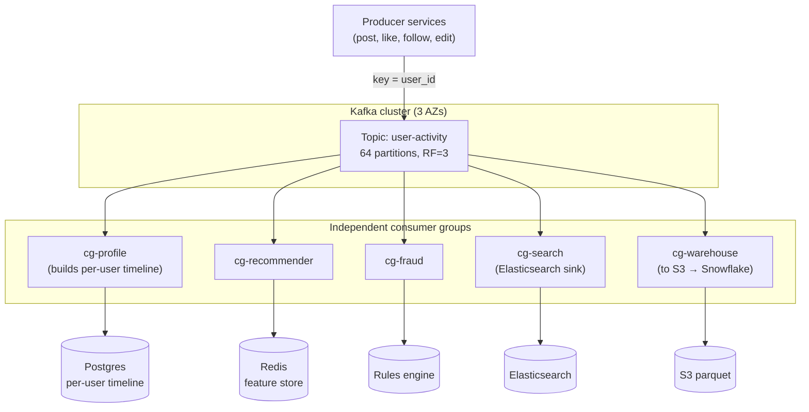

### **Curriculum Drill 04: Event Streaming — Activity Log**

> Pattern focus: **Week 3 Kafka** — append-only log, partitions, consumer groups, replay. Durable ordered fanout.
>
> Difficulty: **Hard**. Tags: **Stream**.

---

#### **The Scenario**

A social network has 200 million users. Every user action — post, like, comment, follow, profile edit — must be recorded in an **activity log** that powers: (1) the user-facing profile page, (2) the recommendation engine, (3) fraud detection, (4) the search index, (5) the analytics warehouse. Each consumer processes at a different rate. Some need to replay history. Ordering per user matters.

RabbitMQ can't do this. Welcome to Kafka.

---

#### **1. Requirements**

| Functional | Non-functional |
|---|---|
| Append every action to a durable log | 500k writes/sec peak |
| 5+ independent consumer groups | 100% message durability |
| Per-user ordering | Tolerate broker node failure |
| Replay from 7 days ago | Retention: 7 days hot, S3 forever |
| New consumer → starts from offset 0 or latest | Partition rebalance < 10s |

---

#### **2. Estimation**

- 200M users × 10 actions/day = 2B events/day = ~23k/sec avg.
- Peak 20× = 460k/sec.
- Avg event ~500 bytes → 230 MB/sec = 1.8 Gbps inbound.
- 7 day retention × 230 MB/sec × 86400 × 7 = ~140 TB hot storage across the cluster.

---

#### **3. Architecture**



---

#### **4. Request Flow (Sequence)**

```mermaid
sequenceDiagram
    participant P as Producer Service
    participant L as Partition Leader (broker)
    participant F1 as Follower ISR 1
    participant F2 as Follower ISR 2
    participant G1 as cg-profile consumer
    participant G2 as cg-recs consumer
    participant G5 as cg-warehouse consumer
    participant Off as __consumer_offsets

    P->>L: produce {key=user_id, payload} acks=all, idempotent
    L->>F1: replicate
    L->>F2: replicate
    F1-->>L: ack
    F2-->>L: ack
    Note over L: min.insync.replicas=2 satisfied
    L-->>P: ack offset=N

    par independent consumer groups (read same log)
        L-->>G1: poll batch [offset M..]
        G1->>G1: build per-user timeline row
        G1->>Off: commit offset=M+batch (cg-profile)
    and
        L-->>G2: poll batch
        G2->>G2: update feature store (Redis)
        G2->>Off: commit (cg-recs, different offset)
    and
        L-->>G5: poll batch (may lag hours)
        G5->>G5: write S3 parquet
        G5->>Off: commit (cg-warehouse)
    end

    Note over P,L: replay: new group starts with auto.offset.reset=earliest or seek_to_timestamp; brokers serve from on-disk segments, tiered from S3 if older
```

---

#### **5. Deep Dives**

**4a. Partitioning by user_id**

- `key = user_id` → Kafka hashes to a partition. All events for one user land on one partition and are **strictly ordered**.
- Cross-user ordering is not preserved; that's fine because users are independent.
- 64 partitions = parallelism ceiling. With 64 consumer replicas per group, each gets one partition. More replicas idle. Choose partition count ≥ highest-scale consumer group's worker count, with headroom.

**4b. Replication and durability**

- `acks=all`, `min.insync.replicas=2`, `replication.factor=3`.
- Producer waits for leader + at least one follower to ack before considering the write durable. Survives one broker death with zero loss.
- `enable.idempotence=true` on producer — duplicate sends (on retry) are deduplicated by the broker using producer ID + sequence number. Effectively-once on the producer side.

**4c. Consumer group semantics**

- Each consumer group maintains its own `__consumer_offsets` record. Group A and Group B read the same events independently.
- Within a group, each partition is owned by exactly one consumer. 64 partitions + 10 consumer replicas → most own 6-7 partitions each; rebalance happens on replica churn.
- **Cooperative rebalance** (KIP-429) moves only the impacted partitions — no "stop the world" pause like the old protocol.

**4d. Replay**

- To replay last 7 days into a new consumer group: create the group, set `auto.offset.reset=earliest`, start. It reads from the earliest offset still retained.
- For "replay from 2 days ago": use `seek_to_timestamp()` — the broker resolves timestamp → offset via the `.timeindex` file.
- For > 7 days: the data lives in S3 (via a connector like MirrorMaker or a dedicated "tiered storage" consumer). Replay reads from S3.

**4e. Backpressure**

- Slow consumer simply falls behind. Its "lag" metric climbs. Kafka doesn't care — the log keeps being written.
- Alert on `consumer-lag > threshold`. Scale replicas or optimize the consumer.
- Producer is never blocked by a slow consumer. This is the biggest mental shift coming from RabbitMQ.

---

#### **6. Data Model**

```text
event = {
    event_id: uuid,
    user_id: int64,
    type: enum (post, like, comment, follow, edit),
    target_id: int64,
    payload: json,
    occurred_at: timestamp,
}
```

Stored on disk as record batches; compressed with snappy; read via `sendfile(2)` zero-copy.

---

#### **7. Pattern Rationale**

- **Kafka, not RabbitMQ.** RabbitMQ is ephemeral-after-ack. Kafka keeps everything for `retention.ms`. Multiple independent consumer groups without double-sending requires the log semantics.
- **Kafka, not SNS+SQS.** SQS retention is 14 days max and not replayable to a new subscriber from offset 0. Also, partition-level ordering per user is a Kafka-native feature.
- **Kafka, not Redis Streams.** Redis Streams is great, but at 230MB/sec sustained you want disk-first (Kafka) not memory-first (Redis).

---

#### **8. Failure Modes**

- **Broker crash.** Partition leader fails over to a follower (ISR). Milliseconds of blip. Producers with `acks=all` have already seen the write on the follower.
- **Whole AZ lost.** RF=3 spread across AZs → we lose at most 1 replica per partition. Still above `min.insync.replicas=2`.
- **Consumer rebalance storm.** Rolling restart of 100 consumer pods can cause constant rebalances. Mitigation: cooperative rebalance, static group membership, `group.instance.id`.
- **Poison event.** One event crashes Consumer X. Consumer X stops advancing its offset, lag grows. DLQ topic: after N retries, the consumer produces the event to `user-activity-dlq` and advances. Operator investigates the DLQ asynchronously.
- **Schema evolution.** Use Schema Registry (Avro or Protobuf). Producers and consumers negotiate forward/backward-compatible schema changes. Add a field = safe; remove or rename = breaking.

Tradeoffs:
- Kafka's power comes with operational weight: ZooKeeper/KRaft, partition sizing, retention tuning, tiered storage, monitoring. Worth it above ~50k events/sec or when replay matters.
- Ordering is only per-partition. Cross-partition global order doesn't exist. If you need it, you have one partition → no parallelism → bottleneck.

---

### **Design Exercise**

A new "Trust & Safety" team wants to process only `comment` events, in near-real-time, with their own retention of 30 days. Do you (a) create a new consumer group on the existing topic, (b) create a new topic filtered by `comment`, or (c) something else?

(Answer: usually (a) — a new consumer group with a filter inside the consumer. Option (b) requires a new topic and a forwarding consumer, doubling storage. But if T&S needs 30-day retention and the main topic is 7 days, (b) becomes necessary. Real-world answer: use Kafka Streams / ksqlDB to build a filtered topic with longer retention, best of both.)

---

### **Revision Question**

Two users — Alice and Bob — each post a photo at the exact same instant. Three consumer groups consume from the topic. Explain what ordering guarantees exist and what does not.

**Answer:**

- Alice's event is keyed by `alice_id`, hashed to partition 7.
- Bob's event is keyed by `bob_id`, hashed to partition 12.
- **Within partition 7**, Alice's next action will always be read after this photo. Same for Bob on partition 12.
- **Across partitions**, there is **no ordering guarantee**. Consumer group A might process Bob's event first; consumer group B might process Alice's first. Even within one group, two consumer replicas handle the two partitions independently.
- Each consumer group maintains independent offsets. If `cg-profile` has processed through offset 10,000 on partition 7 and `cg-recs` is at 8,000, that is fine — the log remembers everything for 7 days.

This is the Kafka deal: **per-key ordering, cross-key no ordering, independent consumer progress**. You choose partition key to make ordering align with business meaning — almost always "entity_id" so one entity's events are strictly ordered.
