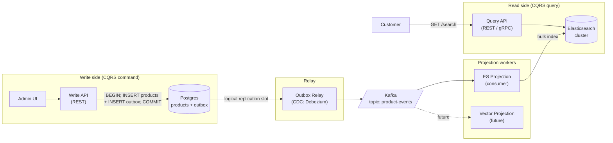
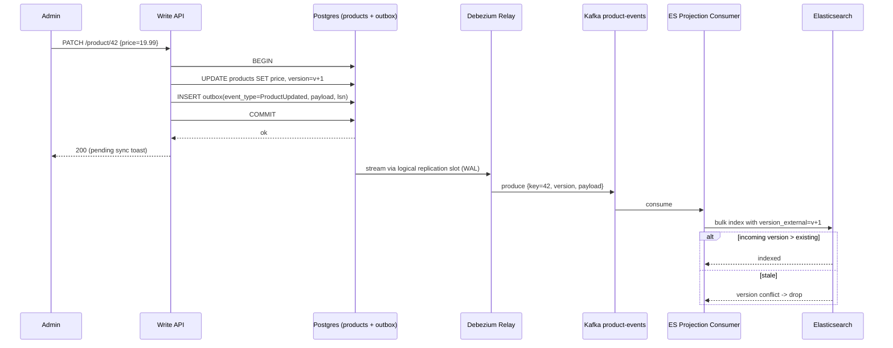
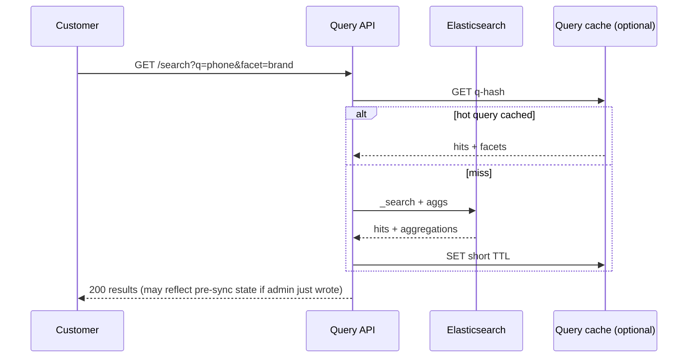

### **Curriculum Drill 05: CQRS — Product Search**

> Pattern focus: **Week 3 CQRS** — separate write model (Postgres) from read model (Elasticsearch), synced via Kafka.
>
> Difficulty: **Hard**. Tags: **Stream, Sync**.

---

#### **The Scenario**

Your e-commerce catalog has 50M products. Admins write structured data to Postgres (for correctness, relations, audit). Customers search freely with fuzzy text, facets, filters, sort — Elasticsearch is the only database that can serve this at 50k QPS with < 50ms p99.

How do you keep them in sync without a fragile dual-write?

---

#### **1. Requirements**

| Functional | Non-functional |
|---|---|
| Admin writes products to Postgres | Write side is strictly consistent |
| Customer searches products via Elasticsearch | Search p99 < 50ms |
| ES lags write side by at most 5 seconds under normal load | 50k read QPS |
| Rebuild ES from scratch in < 6 hours | Tolerate ES cluster restart |
| Add a 2nd read model (e.g. recommendation vectors) later | Without changing the write side |

---

#### **2. Estimation**

- 50M products, 2KB each = 100 GB in Postgres.
- Writes: 10k/sec peak (admin bulk imports, inventory updates).
- Reads: 50k search QPS.
- Sync lag target: < 5s.

---

#### **3. Architecture**

---

#### **4. Request Flow (Sequence)**

**Flow A: Write (command)**

**Flow B: Read (query)**

---

#### **5. Deep Dives**

**4a. Why outbox + CDC instead of dual-write**

- Naive: `INSERT products; sns.Publish();` — dual-write problem. If the second call fails, PG has the row but Kafka doesn't.
- Fix: inside one DB transaction, also write to an `outbox` table. Commit atomically. A separate relay reads `outbox` and publishes to Kafka.
- **Debezium** reads Postgres's WAL (write-ahead log) via logical replication — no polling, no application changes. Every committed row is replayed to Kafka with ordering guarantees from Postgres LSN.

**4b. Projection idempotency**

- Consumer sees `{product_id: 42, version: 15}`. It writes to ES using `op_type=index` with `version_external` = 15. ES refuses the write if a newer version already exists.
- Duplicate messages (at-least-once) are harmless because the version column is monotonic.

**4c. Rebuild from scratch**

- A new ES cluster starts empty. Create a new consumer group `cg-es-rebuild`, `auto.offset.reset=earliest`.
- Consumer reads entire topic from offset 0 (Kafka retention must be ≥ "all products ever touched" — typically this means the topic is keyed+compacted, see below).
- Use **log compaction**: `cleanup.policy=compact, key=product_id`. Kafka keeps only the latest event per key. Rebuild time is O(unique products) not O(history).

**4d. Eventually consistent UX**

- Admin writes price → UI immediately shows a "syncing..." toast.
- Write API returns the PG row (strongly consistent).
- ES lags 2-5s. The admin UI polls the read API until the new version appears, then clears the toast.
- Or: use a WebSocket to push "ES sync complete for product 42" from a confirmation consumer, closing the loop (see [cd-19 CQRS in Day 19](../../Week3-Event_Streaming_and_Advanced_Patterns/day19-CQRS.md)).

---

#### **6. Data Model**

- Postgres: `products(id, sku, ...everything...)` + `product_outbox(id, event_type, payload, created_at)`.
- Kafka topic: `{product_id, version, event_type, payload}`, key = `product_id`, log-compacted.
- Elasticsearch: one document per product, denormalized with category path, attributes, computed fields.

---

#### **7. Pattern Rationale**

- **Write and read are optimized independently.** The write side cares about ACID and relations. The read side cares about inverted indexes, facets, fuzzy matching. Forcing both into one DB always compromises one side.
- **Outbox + CDC** is the rigorous solution to dual-write. Versus manual publish-in-handler: safe against process crash, doesn't require distributed transactions.
- **Kafka, not a direct PG → ES pipe.** Kafka is the durable intermediate: if ES is down, the queue holds. Also lets you add future projections (vectors, recommendations, caches) without touching the write side.

---

#### **8. Failure Modes**

- **ES down.** Consumer lags. Kafka retention covers the outage. ES comes back, consumer drains.
- **Debezium relay crashes.** It resumes from last confirmed offset. At-least-once guaranteed by PG WAL positions.
- **Schema mismatch.** ES mapping rejects a field. Use a DLQ topic for poison events. Operator fixes mapping, replays DLQ.
- **Write + read not consistent** (the whole point of eventual consistency). UX must be designed around it — never let the admin screen claim "done" until the read model confirms (or show it as "pending sync" explicitly).

Tradeoffs:
- CQRS is more machinery than a single DB. Justify it only when the read and write requirements genuinely diverge.
- Admins and customers see different consistency guarantees. That has to be surfaced in the UI honestly.

---

### **Design Exercise**

Your SRE wants to reduce Kafka retention from 7 days to 24 hours for cost. Can you still rebuild ES from scratch? Under what condition?

(Answer: only if you use **log compaction** on the topic — which keeps the latest event per key forever, regardless of time retention. Rebuild works because every product has at least one retained event. Without compaction, you'd be missing products that were updated > 24h ago. This is the critical subtlety.)

---

### **Revision Question**

An admin updates a product at 10:00:00. At 10:00:02, a customer searches and the old price is returned. At 10:00:04, the new price appears. Is this a bug?

**Answer:**

**No — this is the designed behavior of an eventually-consistent CQRS system.**

The write side (Postgres) is strongly consistent and returns success instantly to the admin.
The read side (Elasticsearch) lags because the full path is: PG commit → Debezium reads WAL → Kafka → ES consumer → ES bulk indexer → ES refresh interval (default 1s). Total: 2-5 seconds in normal operation.

The correct response depends on the UX contract:

- If you told the user "price is instantly live everywhere" → yes, it's a bug; you need synchronous dual-write (and pay the correctness price) or wait for ES confirmation before returning success.
- If you told the user "updates propagate within ~5 seconds" (e.g. a "syncing" toast) → it's working as designed.

The architectural discipline is: **name the consistency model explicitly in the UI and in the API contract.** Never pretend eventual is instant.
