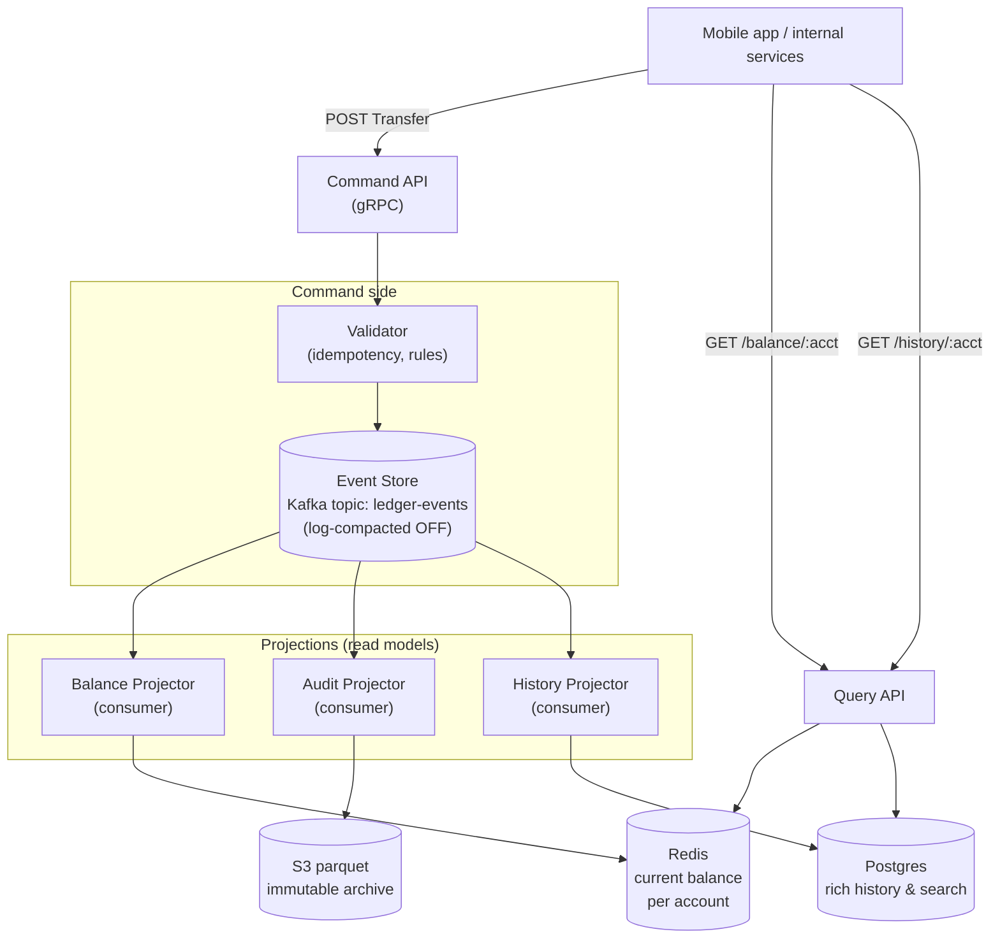

### **Curriculum Drill 06: Event Sourcing — Bank Ledger**

> Pattern focus: **Week 3 Event Sourcing** — the event log IS the system of record; current state is a derivative.
>
> Difficulty: **Hard**. Tags: **Stream, Resil**.

---

#### **The Scenario**

Design the core ledger for a digital bank. Every cent movement must be auditable forever. Regulators demand a provable history. Any "current balance" must be reconstructable from the ledger — you can't just trust the mutable balance column. This is the canonical use case for **event sourcing**.

---

#### **1. Requirements**

| Functional | Non-functional |
|---|---|
| Record every transaction as an immutable event | 100% durability, zero loss |
| Compute current balance for any account | Audit history forever |
| Reconstruct state at any historical timestamp | p99 balance query < 50ms |
| Correct mistakes via compensating events (never update/delete) | Replay tolerant — rebuild any view |
| Support thousands of account types | Ordering strict per account |

---

#### **2. Estimation**

- 50M accounts × 30 transactions/month avg = 1.5B events/month ≈ 580/sec sustained, 5k/sec peak.
- Event size ~300 bytes → 170 GB/month of raw events.
- 7-year retention legal requirement → ~14 TB compressed.
- Reads (balance queries) 50k/sec.

---

#### **3. Architecture**



---

#### **4. Deep Dives**

**4a. Events, not state, are the truth**

Event types:

```text
AccountOpened(account_id, owner_id, opened_at)
DepositMade(account_id, amount, currency, source, event_id, occurred_at)
WithdrawalMade(account_id, amount, currency, destination, event_id, occurred_at)
TransferInitiated(from_account, to_account, amount, transfer_id, ...)
TransferCompleted(transfer_id, ...)
TransferReversed(transfer_id, reason, ...)
```

**No event is ever modified or deleted.** Mistakes get a compensating event (`TransferReversed`). The append-only property is what makes audit trivial.

**4b. Projections**

- **Balance projector** consumes the event log and maintains `balance[account_id] = running_sum`. Stored in Redis for fast lookup.
- **Audit projector** writes raw events to S3 in parquet, daily partitioned.
- **History projector** writes to Postgres for rich queries ("show me all transfers from account X to charity Y last year").
- Any number of projections can be added later — they're derivable from the log.

**4c. Snapshots to bound replay time**

- Naive: to compute balance, replay all events from account opening. For a 5-year-old account with 1800 events, this is slow.
- Snapshot: every 100 events or every night, persist `{account_id, balance, last_event_offset}`. Balance projector rebuilds from snapshot + events-since-snapshot.
- Snapshots are *derived*, so they can be deleted and rebuilt. They are a cache, not truth.

**4d. Per-account ordering**

- Kafka topic keyed by `account_id`. All events for one account land on one partition → strict order.
- Transfer between accounts A and B spans two partitions. Handled with a two-step protocol (a saga — see [cd-07](07-saga_travel_booking.md)):
  - `TransferInitiated(A→B, $100)` on A's partition.
  - Transfer orchestrator sees it, emits `WithdrawalMade(A, $100)` and `DepositMade(B, $100)`.
  - `TransferCompleted(transfer_id)` on A's partition.
- Each projector must handle transfers atomically: if A is decremented and B fails, a compensating `TransferReversed` restores A.

**4e. Rebuilding balances after a bug**

- Scenario: a bug in the balance projector misapplied currency conversion for 2 weeks.
- Fix: deploy the corrected projector. Create a fresh consumer group. Consume from offset 0 (or from the snapshot before the bug). Write to a new Redis keyspace. Cut over. Old Redis can be deleted.
- **You can do this because events are truth.** With state-sourced systems, you'd need to reverse-engineer mutations, which is hell.

---

#### **5. Data Model**

- Kafka topic `ledger-events`, partitioned by account_id, **long retention (infinite — or backed by S3 tiered storage)**.
- Event envelope: `{event_id (UUID), account_id, type, payload, schema_version, occurred_at, recorded_at}`.
- Snapshots: `{account_id, balance, currency, at_offset, taken_at}` in Postgres.

---

#### **6. Pattern Rationale**

- **Event sourcing vs state sourcing.** A normal "balances table" is fastest to query but loses history. ES keeps perfect history at the cost of projection complexity.
- **In finance, the regulatory, audit, and "explainability" requirements make ES almost mandatory** for ledgers.
- **Kafka as event store** is one choice. Purpose-built event stores (EventStoreDB, Marten) exist; Kafka is popular because teams often already have it.

---

#### **7. Failure Modes**

- **Command succeeds but projection lags.** User sees their balance update 2s late. Acceptable for a bank app that says "balance updated". Critical flows (can I withdraw $100?) must read from a freshly-up-to-date projection or block until they see the transfer's event applied.
- **Projection bug.** No panic — events are intact; rebuild the projection.
- **Out-of-order event on a partition.** Can't happen within one partition by design. Can happen across partitions (transfers) → saga logic handles.
- **Event schema evolution.** Use Avro/Protobuf with Schema Registry. Only **add** fields. Never change meaning. Keep a `schema_version` for old-event upcasting.
- **Regulatory replay.** Years later, a regulator asks "prove every step that led to balance B at date D." You replay the topic up to that offset. Build a projection snapshot. Hand it over.

Tradeoffs:
- High engineering cost: projections, snapshots, compensation logic.
- High operational reward: perfect audit, time-travel, bug-resilient data.

---

### **Design Exercise**

Account A has 1,000,000 events (wealthy day trader). Opening the app takes 4 seconds to compute balance. Fix without changing the write path.

(Answer: snapshots. Balance projector persists a snapshot every 1000 events. On query, load snapshot + events since snapshot. Reduces replay from 1M events to ~1K events → sub-millisecond.)

---

### **Revision Question**

A junior engineer proposes: "Events are slow. Let's also write to a `current_balance` table in the same transaction, so we can just read that." Tear down the proposal architecturally.

**Answer:**

Three strong arguments against:

1. **Dual-write reintroduced.** "Write the event AND update the balance atomically" requires a distributed transaction between Kafka and the balance DB, which doesn't practically exist. Any failure between the two leaves them diverged.
2. **Loss of single source of truth.** If `current_balance` disagrees with the replay of the event log, which is right? In event sourcing, the log is always right. A parallel mutable balance column muddies that invariant and makes debugging impossible.
3. **Snapshots already solve the perceived problem.** "Events are slow" is only true at the projection layer, not the query layer. The correct answer is to project events into a *derived* read model (the Redis balance), which IS fast to read. The derived model is not truth — it's a cache. You can nuke it and rebuild.

The event log is non-negotiable as the source of truth. Reads get their own data structures, derived and disposable. That's the essence of event sourcing.
