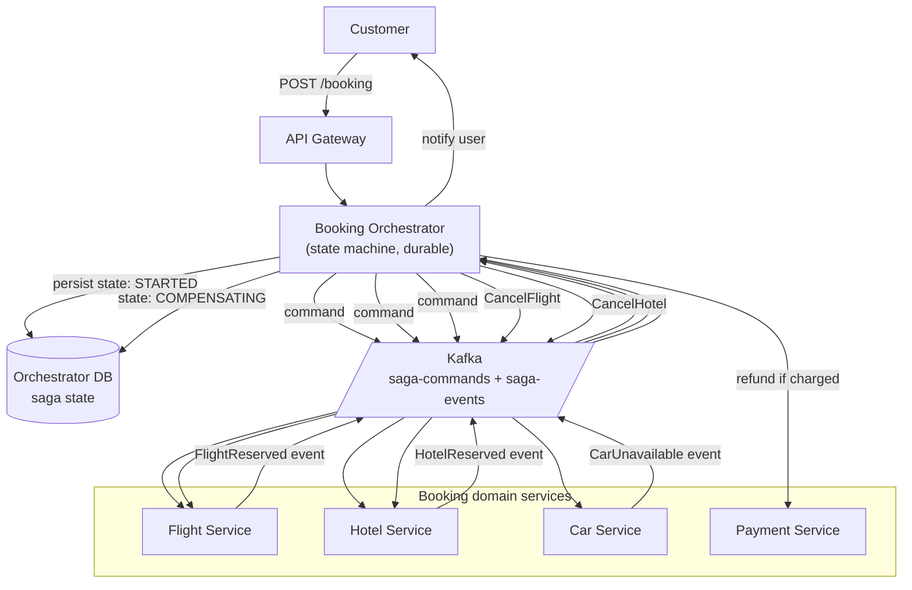

### **Curriculum Drill 07: Saga — Travel Booking**

> Pattern focus: **Week 4 Saga** — distributed transactions via compensations. Choreography vs orchestration.
>
> Difficulty: **Hard**. Tags: **Resil, Async**.

---

#### **The Scenario**

A customer books a trip: **flight + hotel + car**. Each is a separate service with its own DB. There is no distributed transaction across them. Any one step can fail after others have succeeded. How do you guarantee "all-or-nothing" semantics from the user's perspective?

---

#### **1. Requirements**

| Functional | Non-functional |
|---|---|
| Atomic-from-user-perspective: all 3 booked or 0 booked | Zero orphaned reservations |
| Handle partial failures (hotel OK, car refused) | Automatic compensation |
| Observable: user sees current saga state | Saga completes or fails within 5 minutes |
| Resumable after process crash | Idempotent per step |

---

#### **2. Estimation**

- 100k bookings/day = ~1/sec avg, 20/sec peak.
- Each booking = 3 sync API calls + retries + compensations → 10-50 internal operations worst case.
- Scale is tiny; the challenge is correctness, not throughput.

---

#### **3. Architecture — Orchestration**

---

#### **4. Deep Dives**

**4a. Orchestration vs Choreography**

- **Orchestration (shown above):** a single Orchestrator service owns the saga, issues commands, handles replies, runs the compensation path. Logic is in one place, easy to trace.
- **Choreography:** each service reacts to events from others. Flight publishes `FlightReserved`, Hotel listens and tries. Car listens and tries. No central brain. Logic distributed, harder to reason about after ~3 steps.
- **Rule of thumb:** choreography for 2-3 simple steps in one bounded context, orchestration beyond that. Travel booking is clearly orchestration territory.

**4b. The state machine**

```mermaid
stateDiagram-v2
    [*] --> STARTED
    STARTED --> FLIGHT_OK : FlightReserved
    FLIGHT_OK --> HOTEL_OK : HotelReserved
    HOTEL_OK --> CAR_OK : CarReserved
    CAR_OK --> PAID : PaymentSucceeded
    PAID --> DONE

    STARTED --> FAILED : FlightRefused
    FLIGHT_OK --> COMP_FLIGHT : HotelRefused
    HOTEL_OK --> COMP_HOTEL : CarRefused
    COMP_HOTEL --> COMP_FLIGHT : HotelCancelled
    COMP_FLIGHT --> FAILED : FlightCancelled
```

- Every transition is persisted to the orchestrator's DB before proceeding.
- On orchestrator crash, a supervisor loads "in-flight" sagas and resumes them from their last state.

**4c. Compensating actions, not rollbacks**

- Reserving a flight is often a real-world commitment with real costs. You can't "rollback" — you **cancel**, which is a new, separate, business-meaningful action.
- Cancellations must be idempotent: `CancelFlight(reservation_id)` is safe to call any number of times.
- Some steps are **pivot points** — past this point, the saga can no longer compensate (e.g. payment captured > 30 days ago). The state machine must know its compensation boundaries.

**4d. Idempotency at every hop**

- Command: `ReserveFlight(saga_id, passenger, ...)`. Flight service stores `saga_id` → reservation_id mapping. Second attempt returns the existing reservation.
- Events: `FlightReserved(saga_id, reservation_id)`. Orchestrator stores `(saga_id, step) → applied`. Duplicate events ignored.

**4e. Timeout and escalation**

- Each step has a deadline (e.g. "Hotel responds within 30s"). Orchestrator sets a timer when issuing the command.
- Timer fires → orchestrator assumes failure → begins compensation.
- False positive (slow hotel): `HotelReserved` arrives after we cancelled it. Orchestrator issues `CancelHotel(res_id)` — idempotent — and cleans up.

---

#### **5. Data Model**

- Orchestrator: `sagas(saga_id, current_state, payload, created_at, updated_at, timeout_at)`.
- Each domain service: `reservations(reservation_id, saga_id UNIQUE, status, ...)`.

---

#### **6. Pattern Rationale**

- **No 2PC.** Practical distributed transactions don't exist at internet scale across heterogeneous services. Sagas are the business-visible, compensation-based alternative.
- **Orchestration over choreography** because the flow has clear stages, many compensation paths, and we want central observability.
- **Kafka for command/event bus** because we want durability on both sides of every hop. Orchestrator crashes? The command was already accepted by Kafka; the service will process it.

---

#### **7. Failure Modes**

- **Orchestrator crashes mid-saga.** On restart, scan `sagas WHERE current_state NOT IN (DONE, FAILED) AND updated_at > ...`, re-run from the last persisted state.
- **Compensation fails repeatedly.** Automated retries, then **manual queue for human operator**. Never silently drop a compensation — that leaves orphan reservations.
- **Duplicate events.** Handled by idempotent event processor in the orchestrator.
- **Service down during compensation.** Command sits in Kafka, processed when the service recovers. Orchestrator waits (with its timer) and retries.
- **Eventual consistency visible to user.** After the UI says "booked!", can the user still lose the booking due to an async compensation? Only if we moved to "booked" before all pivot commits. Design the state machine so "booked" means "past last compensation boundary."

Tradeoffs:
- Sagas are complex. 4 steps × 2-3 paths per step = many transitions to test.
- The alternative — 2PC across services — is not really an option. Sagas are the lesser evil for any workflow crossing transactional boundaries.

---

### **Design Exercise**

A 4th service is added: **travel insurance**, always the last step. Insurance is non-critical — if it fails, the trip should still proceed. Draw the new state machine. (Hint: make insurance optional with its own pass/fail terminal state. Do NOT run compensation on insurance failure.)

---

### **Revision Question**

The car rental service successfully reserves a car, publishes `CarReserved`, then crashes before responding to the orchestrator. Thirty seconds later the orchestrator's timeout fires and it starts compensation. What happens, and is it safe?

**Answer:**

**It is safe, by construction.**

1. Timeout fires. Orchestrator transitions to `COMPENSATING`, issues `CancelCar(saga_id)`.
2. Car service comes back. It reads the command `CancelCar(saga_id=XYZ)`.
3. It looks up `reservations WHERE saga_id = XYZ` → finds one. Status = RESERVED.
4. It cancels the car reservation and publishes `CarCancelled`.
5. Meanwhile the orchestrator, in parallel, is also processing the late-arriving `CarReserved` event that was produced just before the crash. Orchestrator checks its state: it's in `COMPENSATING`, not `CAR_OK`. It logs "late CarReserved ignored; already compensating" and moves on.
6. Orchestrator receives `CarCancelled` later (from step 4). Saga proceeds to cancel Flight and Hotel in order.

Safe because:
- **Cancellation is idempotent** (the command carries `saga_id`, and CancelCar reconciles with existing reservations rather than creating new ones).
- **The orchestrator's state machine is authoritative**, and late-arriving events from before the timeout are reconciled against the current state, not blindly applied.
- **All steps persist before transition**, so the orchestrator never forgets a commitment — restart-safe.

The cost is a small real-world waste: the car got reserved briefly. Business accepts it.
