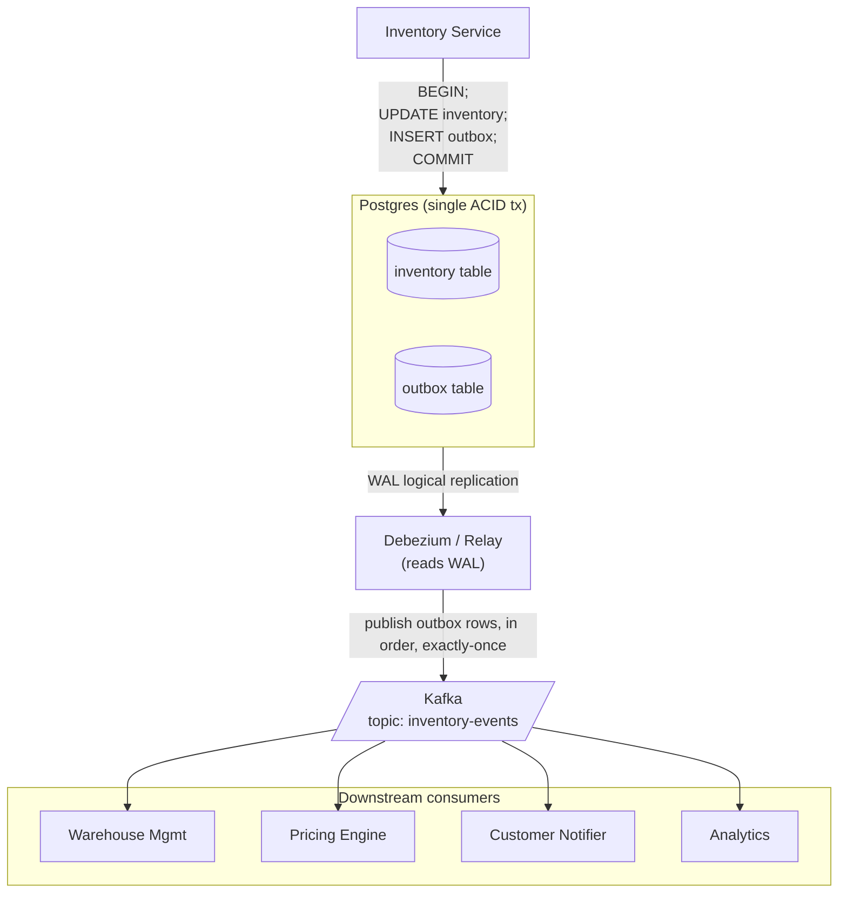

### **Curriculum Drill 08: Outbox — Inventory Updates to Many Consumers**

> Pattern focus: **Week 4 Outbox pattern** — atomically commit DB state AND publish events without dual-write.
>
> Difficulty: **Hard**. Tags: **Resil, Stream**.

---

#### **The Scenario**

Inventory Service writes stock changes to Postgres. Four downstream systems need to hear about every change: warehouse management, pricing engine, customer notification, analytics. The naive "INSERT then publish" has a dual-write problem. Solve it rigorously.

---

#### **1. Requirements**

| Functional | Non-functional |
|---|---|
| Every DB change produces exactly one event | Zero lost events |
| Multiple downstream consumers | Exactly-one effective publication per change |
| Tolerate service crashes between DB and broker | At-most-once duplication (idempotent consumers) |
| No distributed transactions | < 1s publish lag |

---

#### **2. Estimation**

- 10k SKUs, each changing ~5 times/sec peak (restocks, sales) = 50k events/sec.
- Event size 500 bytes.
- Retention: 7 days.

---

#### **3. Architecture**



---

#### **4. Deep Dives**

**4a. The outbox table**

```sql
CREATE TABLE outbox (
    id BIGSERIAL PRIMARY KEY,
    aggregate_id TEXT NOT NULL,
    event_type TEXT NOT NULL,
    payload JSONB NOT NULL,
    created_at TIMESTAMPTZ DEFAULT now()
);
```

Every business transaction that changes `inventory` also inserts a row into `outbox` **within the same transaction**:

```sql
BEGIN;
UPDATE inventory SET stock = stock - 1 WHERE sku = 'SKU-42';
INSERT INTO outbox (aggregate_id, event_type, payload)
    VALUES ('SKU-42', 'StockDecremented', '{"sku":"SKU-42","delta":-1}');
COMMIT;
```

The commit is atomic: either both write or neither. No dual-write problem.

**4b. The relay: polling vs CDC**

Two relay approaches:

- **Polling:** a worker does `SELECT * FROM outbox WHERE published_at IS NULL ORDER BY id LIMIT 1000` every 100ms, publishes, marks as published.
  - Simple, framework-free.
  - Adds load to PG, needs a cleanup job for old rows.
- **CDC (Debezium):** reads PG's write-ahead log via logical replication. No polling, near-zero latency.
  - Requires `wal_level=logical` and a replication slot.
  - Best for production.

Both give **at-least-once delivery** to Kafka (Debezium tracks LSN checkpoints).

**4c. Why not publish directly from the app**

```go
tx.Commit()
kafka.Publish(event)   // <-- app crashes here
```

Process dies between commit and publish. DB has the change; Kafka doesn't. On recovery, there's no way to know that event needed to be published. This is the dual-write problem in its simplest form.

The outbox makes the "I owe a publish" durable in the same DB transaction as the business data. The relay guarantees the publish happens, eventually.

**4d. Ordering guarantees**

- Within one aggregate (e.g. `SKU-42`): outbox `id` is monotonic, relay publishes in order, Kafka key is `sku` → per-key partition ordering. Perfect.
- Across aggregates: no order preserved (which is fine — unrelated SKUs don't need ordering).

**4e. Exactly-once effective semantics**

- Relay may publish the same event twice if it crashes between publish and checkpoint commit.
- Kafka producer with `enable.idempotence=true` deduplicates on broker side via producer_id + sequence.
- Consumers must still be idempotent for the double-failure case.
- Net effect: **effectively-once** for well-designed consumers. Full "exactly-once" is a myth.

---

#### **5. Data Model**

- `inventory(sku, stock, updated_at)` — business truth.
- `outbox(id, aggregate_id, event_type, payload, created_at)` — the transactional publication record.
- Kafka topic `inventory-events`, key = sku, 64 partitions.
- Each consumer: `processed_events(event_id)` table with unique index for idempotency.

---

#### **6. Pattern Rationale**

- **Outbox solves the dual-write problem cleanly** — the single commit is a DB commit, which every RDBMS gives you for free.
- **Alternative: 2PC between DB and Kafka.** Exists in theory, catastrophically impractical.
- **Alternative: accept the rare loss.** OK for some analytics pipelines; never OK for inventory, money, or anything business-critical.

---

#### **7. Failure Modes**

- **App crashes after COMMIT.** Next transaction commits, outbox row remains. Relay picks it up later. No loss.
- **Relay crashes mid-publish.** Next relay restart reads its last checkpoint. May re-publish last batch. Kafka idempotent producer + consumer idempotency handles it.
- **Kafka down.** Relay accumulates backlog on next WAL positions; catches up when Kafka returns.
- **Outbox table growth.** Janitor job deletes rows older than N days (or ones marked published). Or use Postgres table partitioning by day.
- **Consumer crash mid-process.** Handled by standard Kafka consumer offset management; plus consumer-side idempotency.

Tradeoffs:
- ~1.5× write amplification (business row + outbox row).
- Requires Debezium/replication infra if you want near-zero lag.
- Cross-aggregate global ordering is still not guaranteed — consistent with Kafka's per-partition model.

---

### **Design Exercise**

The 5th downstream team arrives: "We want price change events, not stock events." They only care about a subset. Do you (a) give them their own filtered topic, (b) subscribe to the existing topic and filter, or (c) add an additional outbox/topic pair?

(Answer: depends on volume ratio. If price events are 1% of total, filtering in-consumer costs bandwidth; a filtered topic via Kafka Streams is cleaner. If price events are 50%, just subscribe and filter. Outbox logic in the Inventory Service shouldn't change — events are semantic, consumers choose.)

---

### **Revision Question**

Your outbox relay is running. An engineer sees the outbox table has grown to 50 million rows over a week. They propose: "Let's delete everything older than 1 hour to keep the table small." What can go wrong?

**Answer:**

**Deleting outbox rows before they're confirmed-published is a silent data-loss bug.**

1. If the relay is lagging (Kafka down, network partition, whatever) and the row hasn't been published yet, deleting it means that event never reaches Kafka. Downstream consumers will silently miss it.
2. Worse: the downstream might end up with inconsistent state (DB says stock=5, warehouse still thinks stock=10).

Correct approach:

- Only delete outbox rows that are **confirmed published**, i.e. the relay has successfully committed them to Kafka AND the checkpoint has advanced past them.
- Retention: delete rows where `id < committed_checkpoint - N` — give a safety buffer.
- Or use a "dequeue on publish" pattern where the relay hard-deletes after Kafka acks.
- The table growth is also trivially solved with **monthly partitioning**: drop whole old partitions instead of scanning and deleting.

Outbox is truth. Delete only what's been delivered. Cleanup policy must preserve the invariant — which is: **every committed business change must eventually be published exactly once**.
