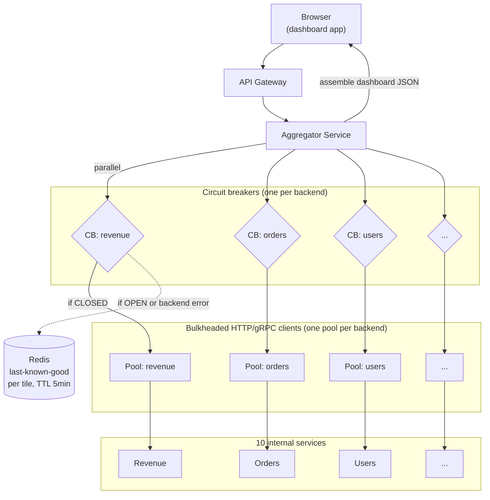

### **Curriculum Drill 09: Circuit Breaker — Dashboard Aggregator**

> Pattern focus: **Week 4 circuit breaker + bulkheads + hedging** — a sync service that depends on many flaky backends.
>
> Difficulty: **Medium**. Tags: **Resil, Sync**.

---

#### **The Scenario**

Your exec dashboard loads in one request and aggregates data from **10 internal microservices**: revenue, orders, users, inventory, logistics, support tickets, NPS, errors, deployments, infrastructure. Any one of them might be slow or briefly down. The dashboard should always load in < 2 seconds, even if three backends are unhealthy.

---

#### **1. Requirements**

| Functional | Non-functional |
|---|---|
| Aggregate 10 independent data sources | p99 load time < 2s |
| Show partial data if a source is down | No cascading failure to the aggregator |
| Fail gracefully (greyed-out tile) rather than error out | Tolerate up to 3 concurrent backend outages |
| Periodic refresh every 30s | No retry storms |

---

#### **2. Estimation**

- 1,000 internal users. Dashboard refresh = 10 sync calls × 30s cadence.
- Peak ~30 dashboard loads/sec = 300 backend calls/sec.
- Per-tile budget: 1s.

---

#### **3. Architecture**



---

#### **4. Deep Dives**

**4a. Parallel fan-out with per-call deadlines**

```go
ctx, cancel := context.WithTimeout(r.Context(), 1500*time.Millisecond)
defer cancel()

results := make(chan TileResult, 10)
for _, tile := range tiles {
    go func(t Tile) {
        subCtx, sub := context.WithTimeout(ctx, 800*time.Millisecond)
        defer sub()
        results <- fetchTile(subCtx, t)
    }(tile)
}

var dash Dashboard
for i := 0; i < 10; i++ {
    select {
    case r := <-results:
        dash.Add(r)
    case <-ctx.Done():
        break
    }
}
```

Each tile has 800ms. The whole aggregation has 1500ms. Slow backends are cut off, their tiles show "loading..." or last-known-good.

**4b. Circuit breakers — per backend**

One breaker per backend, not one global. States:
- **CLOSED** — calls pass through. Track success/failure ratio over a rolling window.
- **OPEN** — calls short-circuit immediately (return cached value or error). Triggered when failure ratio > threshold (e.g. 50% over last 20 calls).
- **HALF-OPEN** — after cool-down (30s), allow a few probe calls. If they succeed, close the breaker.

This prevents:
- **Cascading failures:** one slow backend exhausts aggregator threads if no breaker.
- **Thundering herd on recovery:** the breaker rate-limits traffic during the "healing" phase.

**4c. Bulkheads — isolated resource pools**

Each backend has its own HTTP/gRPC client with its own connection pool size (e.g. 20 connections). If `revenue` is stuck, its 20 connections are blocked — but the `orders` pool is untouched.

Without bulkheads, a single Go HTTP client pool (say, 200 connections) gets exhausted by one slow backend and every tile suffers.

**4d. Fallback: last-known-good**

When a breaker is open or a call fails, the aggregator serves the cached value from Redis (populated by previous successful calls). Tile UI shows "as of 2m ago" stale indicator. Honest, not broken.

**4e. Hedged requests (optional, for the ultra-latency-sensitive)**

For a tile that must come back fast: fire two requests to two backend replicas, take whichever responds first. Doubles backend load (mitigated by cancellation). Great for p99 crushing when latency > correctness.

---

#### **5. Data Model**

- Redis: `dashboard:tile:{name}` → `{value, fetched_at}`, TTL 5 minutes.
- Aggregator state: breaker counters (in-memory with Prometheus export).

---

#### **6. Pattern Rationale**

- **Per-service circuit breaker + bulkheads** is textbook resilience for sync fanout. This is almost exactly the Netflix Hystrix pattern (now implemented in Resilience4j, Envoy, Istio, `gobreaker`, etc.).
- **Sync fanout is the hard case.** If the dashboard could be async (email me the dashboard), you'd use a pre-computed CQRS read model. But real-time dashboards need sync — and sync needs CBs.

---

#### **7. Failure Modes**

- **One backend slow.** Its breaker opens. Dashboard shows cached tile for that backend. Others unaffected.
- **Three backends down.** Three tiles cached, seven live. Dashboard still renders < 2s.
- **All backends down.** Full dashboard from cache. If cache is empty: error with per-tile detail.
- **Breaker never opens** (close to threshold but not past). Aggregator accumulates timeouts. Timeouts are bounded per-tile, so worst case is 800ms × (unhealthy tiles) — still within budget.
- **Thundering herd on recovery.** HALF-OPEN state admits only 1-2 probe calls. If they succeed, CLOSED. If not, back to OPEN.

Tradeoffs:
- CBs are tuning-heavy. Thresholds, windows, cool-downs — needs iteration with real traffic.
- The "last-known-good" cache requires thoughtful UI ("as of 2m ago") to avoid misleading execs.
- Deadlines cascade: gateway deadline must be ≥ aggregator deadline ≥ per-tile deadline.

---

### **Design Exercise**

Your product team says: "Add a 'Live refresh' WebSocket feed — executives want numbers updating every second without page refresh." Redesign the architecture. What changes about breakers and fanout?

(Answer: don't fan out every second — that DoSes your backends. Move to a **push model**: each backend service publishes a summary to Kafka or Redis Pub/Sub on change. An "aggregator-projection" service consumes all streams and maintains a Redis-backed aggregate. The dashboard holds a WebSocket to the aggregator, receiving diffs. Breakers are now on the projection → backend side only, at much lower per-backend rate.)

---

### **Revision Question**

One of your backends — the Users service — has degraded to 2s p99 latency (was 50ms). Before you add a circuit breaker, what actually happens to the dashboard under this condition? Trace the cascade.

**Answer:**

Without a breaker or bulkhead:

1. Dashboard requests arrive at the aggregator (30/sec).
2. Each request fans out 10 parallel calls, including one to Users.
3. The Users call takes 2s instead of 50ms.
4. The aggregator's HTTP client pool (say 100 total connections) has 30/sec × 2s = 60 in-flight calls to Users alone — and they stack up.
5. Within seconds, the pool is 60% saturated by Users calls. Calls to other backends block waiting for a connection.
6. Aggregator goroutines pile up. Memory climbs. GC pauses.
7. p99 for *all* tiles degrades. Dashboard loads in 5-10s.
8. Users see dashboard as broken. They hit refresh repeatedly. Retries multiply.
9. Eventually the aggregator OOMs or its upstream (gateway) times out and returns 504s.

**One slow backend took down the entire dashboard.** This is the **cascading failure** — the thing CBs and bulkheads prevent.

With CB + bulkhead:
- Users pool has its own 20 connections. Others have their own. No cross-contamination.
- After ~20 slow calls, Users breaker opens. Its tile starts showing cached last-known-good.
- Dashboard continues loading in < 2s. One tile marked "stale."
- 30s later, half-open probes either succeed (CLOSE) or fail (stay OPEN).
- Users are notified by ops. Fix happens. Dashboard fully recovers.

The breaker converted a system-wide outage into a single-tile degradation. That is the entire value proposition.
