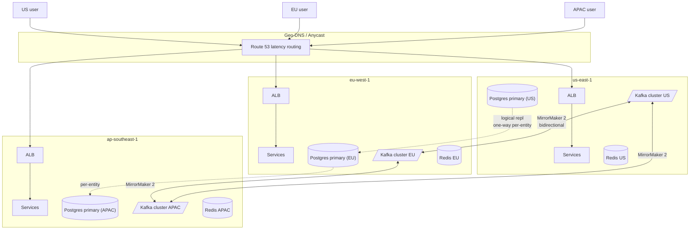
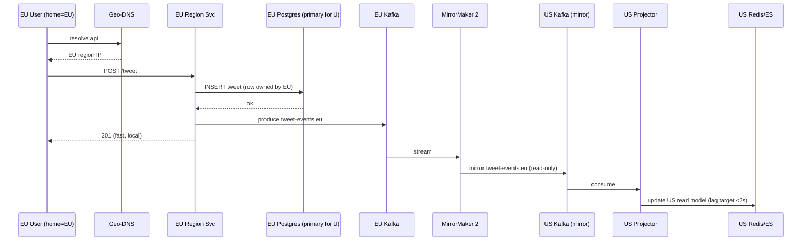

### **Curriculum Drill 10: Multi-Region Active-Active**

> Pattern focus: **Week 4 resilience at geographic scale** — geo-routing, multi-primary writes, conflict resolution.
>
> Difficulty: **Expert**. Tags: **Resil, Sec**.

---

#### **The Scenario**

Your product has users on three continents. Current architecture: everything in us-east-1. EU users experience 120ms latency per request; Asian users 200ms. An AWS regional outage last quarter took the whole product down for 3 hours. The CEO wants: **sub-50ms from every continent**, and **zero-downtime region failover**.

---

#### **1. Requirements**

| Functional | Non-functional |
|---|---|
| Full service in US-East, EU-West, AP-Southeast | p50 < 50ms, p99 < 200ms per-region |
| Zero-downtime region failover | Survive full region loss with < 5min recovery |
| Cross-region data consistency (eventually) | Max cross-region sync lag: 10s |
| Users see their own writes instantly | Admin writes propagate globally in < 30s |

---

#### **2. Estimation**

- 100M monthly users, split 40% US, 35% EU, 25% APAC.
- Writes per region: ~10k/sec peak.
- Cross-region replication bandwidth: ~100 Mbps per region pair.

---

#### **3. Architecture**



---

#### **4. Request Flow (Sequence)**

**Flow A: Local write with cross-region replication**



**Flow B: Cross-region read + read-your-write stickiness**

```mermaid
sequenceDiagram
    participant US as US Friend
    participant DNS as Geo-DNS
    participant USSvc as US Region Svc
    participant USR as US Redis/ES
    participant EU as EU Region (home for U)
    participant EUPG as EU Postgres

    US->>DNS: resolve
    DNS-->>US: US region
    US->>USSvc: GET /user/U/timeline
    USSvc->>USR: lookup replicated tweets
    alt data present (replication caught up)
        USR-->>USSvc: timeline
        USSvc-->>US: 200
    else miss / strong-read requested
        USSvc->>EU: proxy read (higher latency)
        EU->>EUPG: SELECT
        EUPG-->>EU: rows
        EU-->>USSvc: data
        USSvc-->>US: 200 (marked fresh)
    end

    Note over U,USSvc: if U wrote from EU and re-reads via US, sticky cookie pins next 30s reads to EU; or version cookie forces US to wait/fallback until replicated
    Note over DNS,USSvc: on EU region failure, geo-DNS reroutes U to nearest healthy region; reads served from replicated model, writes to home may be read-only until recovery
```

---

#### **5. Deep Dives**

**4a. Routing — where do users land**

- **Geo-DNS** (Route 53 latency / geolocation routing): US user gets IP in us-east-1, EU user in eu-west-1.
- **Anycast + BGP** (CloudFront/Cloudflare): single IP, routed to nearest PoP. Edge proxies terminate TLS, hit regional origin.
- **Failover:** if a region's health check fails, DNS / anycast re-routes to the nearest healthy region. Cold-start latency for users re-routed to a distant region is accepted during outage.

**4b. Data model — "owner region" per entity**

The cleanest multi-region pattern: **each entity has a home region**. User's data lives in the region they signed up in. Writes for user `U` always go to `U.home_region`'s primary.

```text
user U created in EU → U's primary DB is EU.
US user opens U's profile → read goes to EU (100ms) OR local read replica (0ms, stale)
EU user writes on U → write goes to EU primary (0ms)
```

This sidesteps multi-master write conflicts. Each entity has one primary.

**4c. Cross-region replication via Kafka**

Every write produces an event to the local Kafka. **MirrorMaker 2** replicates Kafka topics bidirectionally.

- `user-events.us` → mirrored to EU and APAC as `user-events.us` (source-prefixed, read-only copies).
- Each region's projectors consume all `user-events.*` topics to build a read model of all users worldwide.
- Eventual consistency: writes in one region visible everywhere within seconds.

Why not direct DB replication? Because Kafka gives you:
- Single ordered stream per partition.
- Replay for rebuild.
- Isolation (a bad DB migration in US doesn't poison EU's DB directly).

**4d. Conflict resolution for the multi-master edge case**

If you can't pin every entity to a home region (e.g. global shared resources like a shared folder), you need a conflict strategy:

- **Last-write-wins (LWW)** using a hybrid logical clock or a trusted timestamp. Simple, sometimes loses concurrent updates.
- **CRDTs** (Conflict-free Replicated Data Types): operational transforms, G-counters, LWW-sets, OR-sets. Merges deterministically without coordination. Used by Riak, Redis Enterprise, Figma, Automerge.
- **Application-level resolution:** "I saw version V when writing" + server checks; conflict returns 409 and client resolves.

**4e. Stickiness for read-your-write**

When a US user writes via the EU region (unusual, e.g. traveling), the write goes to EU primary. Immediately after, they read: if routed back to US, they see stale data. Fix:

- **Sticky session for the user:** their next few reads (30s) also go to EU.
- **Or**: embed last-write-version in a cookie; each region refuses to serve reads older than that version (falls back to origin).

**4f. Security**

- **mTLS between regions** on every inter-region link. Use SPIFFE/SVIDs that know their region identity.
- **JWTs carry region claim.** Service mesh enforces "this JWT was issued by region X" policy.
- **Cross-region admin ops** require additional auth layers (break-glass RBAC).

---

#### **6. Data Model**

- `users(id, home_region, ...)` — home region is immutable post-signup.
- Partitioning: `users_partition_by_region` in each region's PG.
- Kafka topics per entity: `user-events.<region>` — region-local production, cross-region consumption.

---

#### **7. Pattern Rationale**

- **Active-active** = each region serves reads AND writes locally. Contrast with active-passive (hot standby), which has simpler consistency but wasted capacity and slower failover.
- **Entity-home-region** strategy gives strong consistency locally and eventual globally, with no multi-master hellscape.
- **Kafka MirrorMaker** is the standard cross-region streaming replication. Alternative: Confluent Cluster Linking, AWS MSK cross-region replication.

---

#### **8. Failure Modes**

- **Region loss (full AWS region outage).**
  - Geo-DNS re-routes users to nearest healthy region.
  - They still see *their* data (from Kafka-replicated read models in the surviving region).
  - They **cannot write** against their original home region until it recovers — unless you implement read-only mode OR promote a different region as temporary primary (complex).
- **Split brain** between regions during network partition.
  - Entity-home-region prevents concurrent writes to the same entity.
  - For shared resources, CRDTs or LWW absorb the conflict.
- **MirrorMaker lag.** Normally < 2s; under network pressure, up to tens of seconds. Alert on lag; fall back to region-local reads with "as of 30s ago" disclaimer.
- **Regional Kafka cluster loss.** The region is effectively down until Kafka recovers. Spread Kafka across multiple AZs within the region.

Tradeoffs:
- Massive ops complexity. Only justified when you actually have global users and downtime is expensive.
- Eventual consistency visible to users for shared resources.
- Cost ~3× vs single-region (three full replicas of everything).

---

### **Design Exercise**

Your product has a global leaderboard. Scores are submitted in any region. The leaderboard must reflect all scores worldwide in near-real-time. Design this piece.

(Hint: scores go to local Kafka `scores.<region>`. MirrorMaker replicates. A global leaderboard projection — one per region — consumes all regions' topics, maintains a local Redis sorted set `leaderboard:global`. Each region reads from its own local Redis. Sync lag of < 2s is acceptable for leaderboards. If a region is cut off, its own leaderboard is a few seconds stale.)

---

### **Revision Question**

An EU user tweets. Three seconds later, their US friend (via a US-region read path) fetches their timeline and doesn't see the tweet. Is this a bug, and how does the architecture make this visible to the product team?

**Answer:**

**Not a bug — it's the design**, but the product must own it explicitly.

The path:
1. EU user writes → EU primary writes row, EU service publishes event to `tweets.eu`.
2. EU Kafka → MirrorMaker → US Kafka topic `tweets.eu` (mirror). Normally < 2s lag.
3. US consumer reads `tweets.eu`, updates US read model (Redis + local ES).
4. US friend's query hits US read model. If step 2-3 hasn't completed yet → miss.

How to make this visible / manageable:

- **Emit `replication-lag` metrics** per topic pair. Alert if > 10s.
- **UI disclaimer on cross-region reads:** "Latest worldwide updates may take a few seconds."
- **Fallback:** US service can issue a "did we miss it" check by reading the originating Kafka (direct, skipping mirror) — expensive but a safety net for critical flows.
- **Strong-read path:** for "I want the source of truth RIGHT NOW," route the query to the entity's home region (100ms latency instead of 2s staleness). Expose this as an advanced API parameter, not the default.

The lesson: **consistency is a product decision, not just a technical one.** Global active-active buys speed at the cost of visibility into replication lag. The architecture's job is to surface that honestly.
