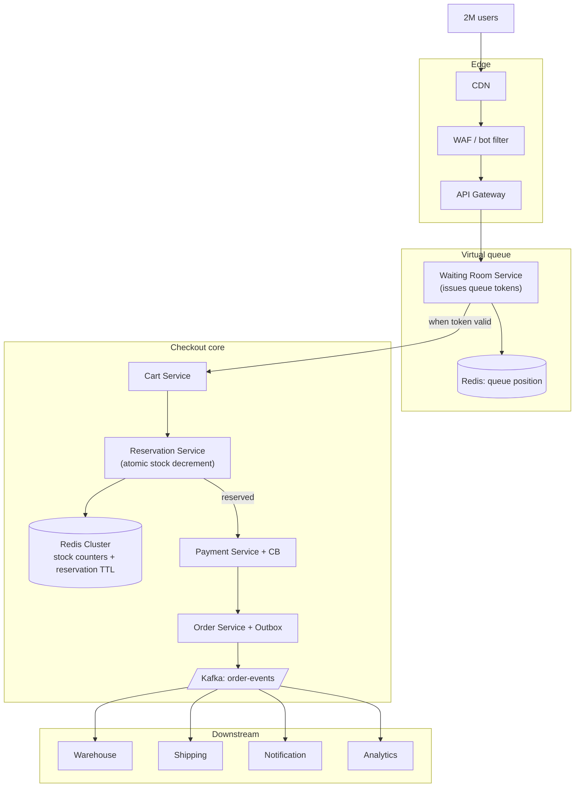

### **Domain 01: E-commerce — Black Friday Checkout**

> Difficulty: **Expert**. Tags: **Resil, Async, Stream**.

---

#### **The Scenario**

It's Black Friday. Your e-commerce platform normally handles 500 checkouts/min. At 9:00 AM sharp, 2 million users attempt to buy a limited-stock 80%-off gaming console simultaneously. Only 50,000 units exist. Oversell by one = catastrophic refund + PR nightmare. Undersell = leave money on the table. System must stay up for regular customers too.

---

#### **1. Requirements**

| Functional | Non-functional |
|---|---|
| Handle 2M concurrent checkout attempts | Zero oversell on limited stock |
| Process 50k actual orders in minutes | p99 for non-sale traffic unchanged |
| Queue + update users ("you're 1,432nd in line") | Survive payment provider degradation |
| Reliable payment + inventory | Survive inventory DB spike |
| Abandoned carts released back | Fair ordering (FIFO within tier) |

---

#### **2. Estimation**

- Peak: 2M requests in first 60 seconds = 33k/sec burst.
- Payment provider throughput: typically 1k-5k/sec per merchant account.
- Inventory decrement: must be strongly consistent; naive "SELECT-then-UPDATE" will oversell.

---

#### **3. Architecture**



---

#### **4. Deep Dives**

**4a. The virtual waiting room**

- On entering the sale, user gets a queue token with position and ETA.
- Only the first N=5,000 tokens (== payment provider capacity) are "active." Others wait.
- Every second, active tokens expire, new batch admitted.
- UX: "You're #1,432 in line. Estimated wait: 3 min."
- This protects every downstream service from the 2M spike — they only see the 5,000 active at any moment.

**4b. Atomic stock decrement**

Classic bug: two users both see "1 unit left" and both complete checkout → sell 2.

Fix with **Redis atomic decrement**:

```lua
-- KEYS[1] = stock:console42, ARGV[1] = user_id
local remaining = redis.call("DECR", KEYS[1])
if remaining < 0 then
    redis.call("INCR", KEYS[1])  -- restore
    return -1  -- out of stock
end
redis.call("SETEX", "reserve:" .. ARGV[1], 300, "1")  -- 5 min reservation
return remaining
```

- DECR is atomic: only one winner per unit.
- Reservation TTL: if user doesn't complete in 5 min, cron releases the unit back.
- Redis handles 100k+ DECRs/sec on one shard. Spread SKUs across shards for higher throughput.

**4c. Payment bulkheading and retries**

- Payment Service has a per-provider circuit breaker.
- If primary provider degrades, breaker opens, traffic shifts to secondary.
- Each payment attempt uses `Idempotency-Key = order_id` — duplicates at retry time don't charge twice.

**4d. Saga for order finalization**

- On payment success: publish `OrderPlaced` via outbox (see [cd-08](../curriculum-drills/08-outbox_inventory_to_many_consumers.md)).
- Consumers (warehouse, shipping, notification) react asynchronously.
- If payment fails after reservation: compensating `ReleaseStock` event → Redis INCR restores the unit.

**4e. Rate limits and abuse protection**

- WAF blocks known bots, residential proxy networks.
- Per-user limits: 1 console per account.
- Per-IP limits: 5 attempts/min across accounts (discourages botnets).
- Cookie + JWT enforcement for queue tokens (can't share position with friends).

---

#### **5. Failure Modes**

- **Redis stock counter node down.** Stock decrements stop for that SKU's shard. Queue pauses for those items. Automatic failover to replica (seconds).
- **Payment provider outage.** Circuit breaker opens. Either shift to secondary or pause checkout with honest "temporarily unavailable" message.
- **Queue spoofing.** Signed tokens with short TTL prevent cheating.
- **Thundering herd on reopening after outage.** Gradual ramp-up of admitted tokens per second prevents re-overload.

---

### **Revision Question**

A customer was #427 in the queue. They got admitted, loaded the checkout page, but got distracted for 8 minutes. Someone else got their unit. Is this fair, and how is it implemented?

**Answer:**

Fair by design. The architecture enforces fairness through **bounded reservations**:

1. When admitted, user clicks "Buy" → Reservation Service does DECR, success → their reservation row has `expires_at = now + 5 min`.
2. User can complete checkout any time in that window.
3. At the 5-minute mark, a janitor job (or the Redis TTL + background cron) detects the expired reservation and restores the unit with an atomic INCR.
4. The next user in queue (position #5,428 or whoever) gets the freshly-released unit.

From the architecture perspective:
- **TTL is the SLA**. It's communicated in the UI ("complete your purchase within 5 minutes").
- **INCR on expiry is idempotent with reservation tracking** — janitor checks "did user complete?" before restoring, so completed orders don't get their stock mistakenly restored.
- **FIFO within queue tier** — Redis sorted set by enqueue-time, so "next admitted" is deterministic.

This is the classic concert-ticket architecture. The lesson: **at high demand, 'hold' and 'transfer' are primitives that must be bounded in time**. Unbounded reservations let one slow user starve thousands.
