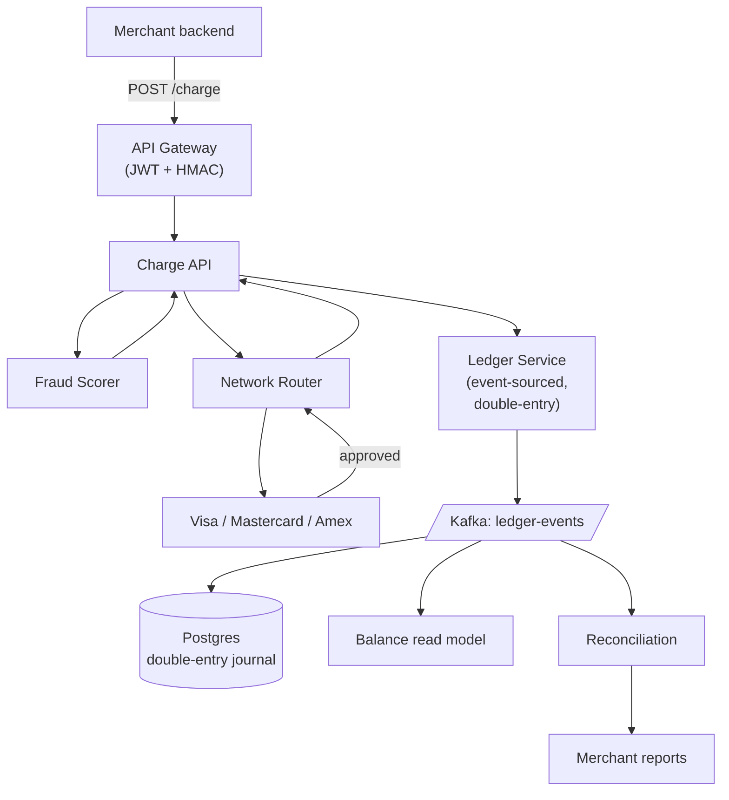

### **Domain 02: Fintech — Payment Processor**

> Difficulty: **Expert**. Tags: **Resil, Sec**.

---

#### **The Scenario**

Build a payment processor (Stripe-lite). Merchants submit card charges via API; you route to the correct card network (Visa, Mastercard), return approval/decline, handle chargebacks, produce perfectly reconciled reports for merchants and banks. Every cent must be accounted for.

---

#### **1. Requirements**

| Functional | Non-functional |
|---|---|
| Charge / authorize / capture / refund | Zero money lost or double-charged |
| Route to correct network | Strict audit: who, what, when, why |
| Handle chargebacks | PCI-DSS compliance |
| Reconciliation reports | High availability across regions |
| Fraud scoring | Per-transaction idempotency |

---

#### **2. Estimation**

- 100M merchants, avg 100 tx/day = 10B tx/day ≈ 115k/sec avg, 500k/sec peak.

---

#### **3. Architecture**

---

#### **4. Deep Dives**

**4a. Double-entry bookkeeping as event-sourced ledger**

- Every monetary transfer involves **two journal entries**: credit one account, debit another.
- Example: `Charge $100`:
  - Debit merchant_receivable +$100
  - Credit card_network_clearing -$100
- Entries written as immutable Kafka events. Source of truth.
- See [cd-06 Bank Ledger](../curriculum-drills/06-event_sourcing_bank_ledger.md) for the event sourcing pattern in depth.

**4b. Idempotency on every write**

- `POST /charge` requires `Idempotency-Key` header.
- Merchant can safely retry; Payment Processor detects duplicate via unique key → returns the original response.
- Essential because networks are unreliable and merchants retry.

**4c. Saga across network + ledger**

- ChargeAPI authorizes with network → writes `ChargeAuthorized` event.
- Later, capture step writes `ChargeCaptured`.
- Chargeback: network notifies → `ChargebackReceived` event → reverses the original via compensating entries.
- Ledger is append-only; "corrections" are always new events, never updates.

**4d. Reconciliation**

- Daily batch: compare our ledger to network settlement files.
- Differences must be < $0.01 (float rounding). Larger diffs alert engineering + finance.
- The whole ledger can be rebuilt from Kafka → if reconciliation finds a projection bug, fix and re-derive.

**4e. Security**

- Card data never touches our general compute. A PCI-isolated vault stores tokenized cards. API calls use tokens, not PANs.
- mTLS between vault and everything.
- JWTs carry merchant identity + scope.
- Audit log appended for every read and write, tamper-evident.

**4f. Multi-region active-active with partitioned merchant ownership**

- Each merchant has a home region. Charges for merchant M go to M's region.
- Cross-region replication for DR, not for primary writes.
- Same pattern as [cd-10](../curriculum-drills/10-multi_region_active_active.md).

---

#### **5. Failure Modes**

- **Card network timeout.** Retry up to N times. Mark charge as `UNKNOWN` — status query later reconciles.
- **Ledger DB corruption.** Rebuild projections from Kafka.
- **Region loss.** Traffic shifts; merchants in that region see read-only mode until recovery (writes require their home region up).
- **Double-submit by merchant.** Idempotency key catches.
- **Partial network ACK then crash.** Status query endpoints let merchants ask "is this charge still pending?"

---

### **Revision Question**

A merchant calls `POST /charge` with $100. Network replies 200 OK, but our API server crashes before it can write the ledger event. The merchant retries with the same idempotency key. What happens?

**Answer:**

The merchant's retry **must** produce the same response as the first call, and the customer **must** be charged exactly once. Here is the sequence:

1. First attempt: ChargeAPI receives request, writes `ChargeInitiated` event to Kafka (including idempotency_key), calls network. Network debits the card, returns 200. Before ChargeAPI can write `ChargeAuthorized` back, process dies.
2. Merchant retries with same idempotency_key.
3. ChargeAPI receives request. Looks up idempotency_key in Redis/Kafka state → sees `ChargeInitiated` already exists. Does NOT re-call network.
4. ChargeAPI checks network status (status query API or async reconciliation): card was debited.
5. ChargeAPI writes `ChargeAuthorized` (resuming the saga), returns 200 to merchant.

Without idempotency + status query:
- Step 3 would re-hit the network → **double charge** to the cardholder.
- Or merchant sees transient error → calls support → manual cleanup. Doesn't scale.

Key architecture primitives:

- **Idempotency key** is the token. Always honored.
- **Status query** to upstream networks (banks expose this) resolves "was the external side effect applied?"
- **Event-sourced ledger** means every step is recoverable. `ChargeInitiated` alone tells us "we need to finish this saga."

The general lesson: in payments, **at-least-once + idempotent processing + status reconciliation** is the only safe pattern. Never assume the network said yes or no — always ask explicitly.
