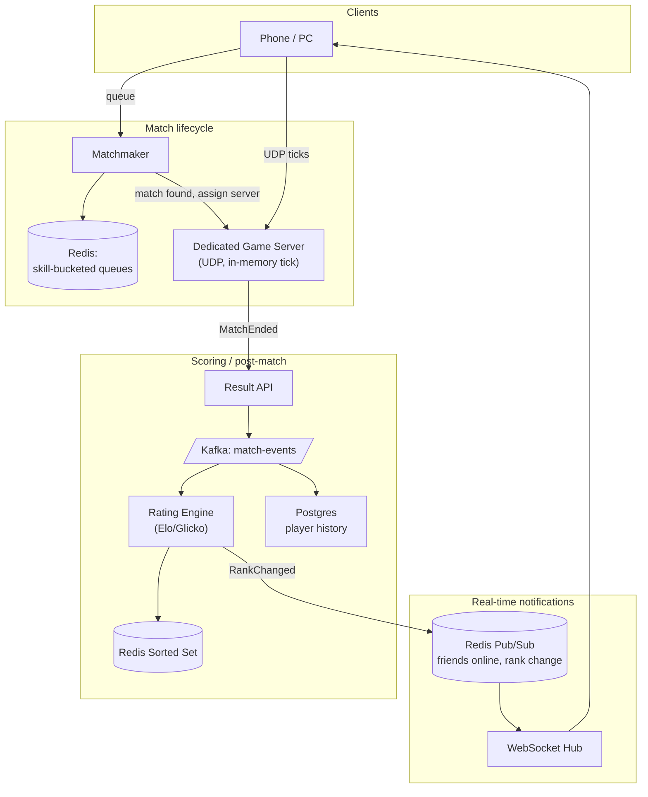
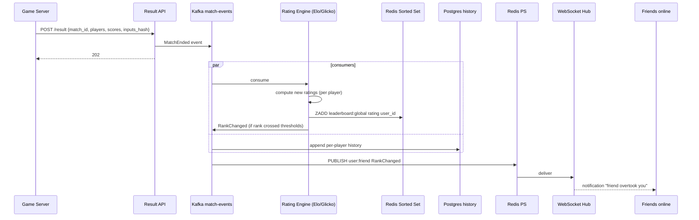
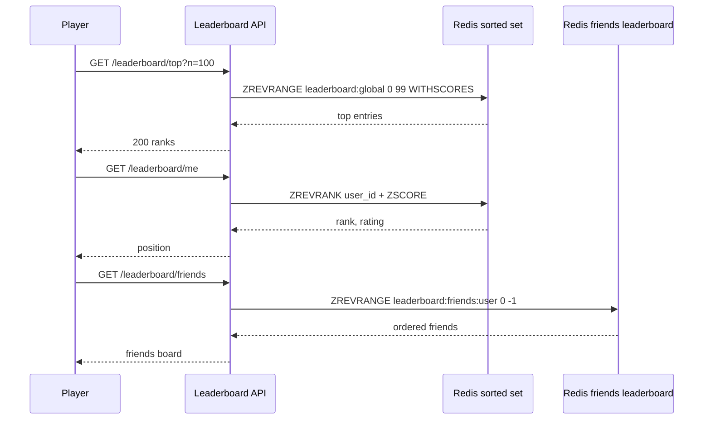

### **Domain 03: Gaming — Leaderboard + Matchmaking**

> Difficulty: **Hard**. Tags: **RT, Stream**.

---

#### **The Scenario**

A competitive mobile game. 50M DAU play ~5 matches each. After every match, the leaderboard updates globally. Matchmaking pairs players of similar skill within seconds. Game state syncs at 20-60 Hz while playing.

---

#### **1. Requirements**

| Functional | Non-functional |
|---|---|
| Global + friends leaderboards | Leaderboard update < 2s |
| Skill-based matchmaking | Matchmaking < 30s |
| In-match state sync | < 100ms game tick latency |
| Anti-cheat checks | Surge handling during events |
| Post-match rewards | Fraud-proof ratings |

---

#### **2. Estimation**

- 50M DAU × 5 matches/day = 250M matches/day ≈ 3k/sec avg, 30k/sec peak.
- Each match 4-10 players × 20Hz state updates → 200-600k UDP packets/sec per match × live matches.

---

#### **3. Architecture**

---

#### **4. Request Flow (Sequence)**

**Flow A: Score submit (match end)**

**Flow B: Leaderboard read (and friends)**

---

#### **5. Deep Dives**

**4a. Matchmaking**

- Player enters queue with current rating R.
- Matchmaker places them in a skill bucket (e.g. Redis list `queue:bucket:1400-1450`).
- Every tick, matchmaker scans buckets for enough players, widening range if wait time grows.
- Target: match within 30s. Fairness: wait penalty tightens constraints.

**4b. Dedicated game servers**

- When match forms, matchmaker allocates a server from a pool (Kubernetes GameServer CRD, Agones).
- Server runs the authoritative simulation at fixed tick rate (20-60 Hz).
- Clients send inputs; server responds with state diffs.
- UDP, not WS/TCP, because packet loss is preferable to retransmit delay in real-time games.

**4c. Post-match scoring**

- Server writes `{match_id, players, scores, durations, events}` to ResultAPI.
- ResultAPI produces to Kafka.
- Rating Engine consumes, computes new Elo/Glicko, updates Redis ZADD leaderboard.

**4d. Leaderboard in Redis**

- `ZADD leaderboard:global <rating> <user_id>`.
- `ZREVRANGE leaderboard:global 0 99 WITHSCORES` → top 100.
- `ZREVRANK leaderboard:global <user_id>` → current rank for a user (sub-ms).
- For friends leaderboard: `ZADD leaderboard:friends:<user_id>` with only friend ratings, maintained via event stream (friend add/remove + rating update).

**4e. Anti-cheat**

- Server is authoritative; clients send inputs, not results.
- Server-side sanity checks (impossible positions, impossible speed).
- Replay system: server logs inputs, any match can be re-simulated to verify.
- ML model over player event stream flags anomalies for review.

**4f. Real-time friend rank notifications**

- Player cares when a friend overtakes them. Rating engine emits `RankChanged` event.
- Redis PS → WS → notification to friend's app.
- See [Bonus 3 WebSocket Architecture](../../Week1-Fundamentals_and_Synchronous_communication/bonus3-websocket_architecture_patterns.md) for the underlying pattern.

---

#### **6. Failure Modes**

- **Game server crash mid-match.** Match aborted; rating not updated; players refunded entry fee (if ranked mode).
- **Matchmaker starvation at high rating.** Few opponents exist; widen search or use bots.
- **Rating engine lag.** Leaderboard stale by seconds; cosmetic, no gameplay impact.
- **Cheaters evade detection.** Anomaly model retrains continuously; manual reports feedback loop.

---

### **Revision Question**

Your game launches a new tournament mode. 500k players enter the queue in the same minute. The matchmaker bogs down and nobody gets matched. What is the architectural fix?

**Answer:**

The matchmaker becomes the bottleneck under uniform skill distribution and burst demand. Two-pronged fix:

1. **Shard matchmaker by skill bucket.** Instead of one matchmaker scanning all queues, run 20 matchmakers each owning a range of skill buckets. 500k / 20 = 25k per shard. Each shard matches independently.
2. **Use a pull model instead of central scan.** Each game server "pulls" a match from the queue when ready (via Redis BRPOP or similar). Game servers act as consumers of the match queue. This decouples match formation from a central scheduler.

Additional mitigations:

- **Virtual queue / waiting room.** Players in excess capacity see "joining tournament in 2 min" rather than unbounded wait.
- **Dynamic matchmaker scaling.** Autoscale matchmaker pods based on queue depth.
- **Relax match quality under load.** Widen skill range faster; match within 45s instead of 30s. Trade quality for throughput.

The principle: **when a central coordinator is the bottleneck, shard by the natural partition key (skill) and let workers pull work**. This is the same pattern as Kafka consumer groups — the coordinator just hands out assignments, doesn't do the work. Same insight across every high-throughput coordination problem.
