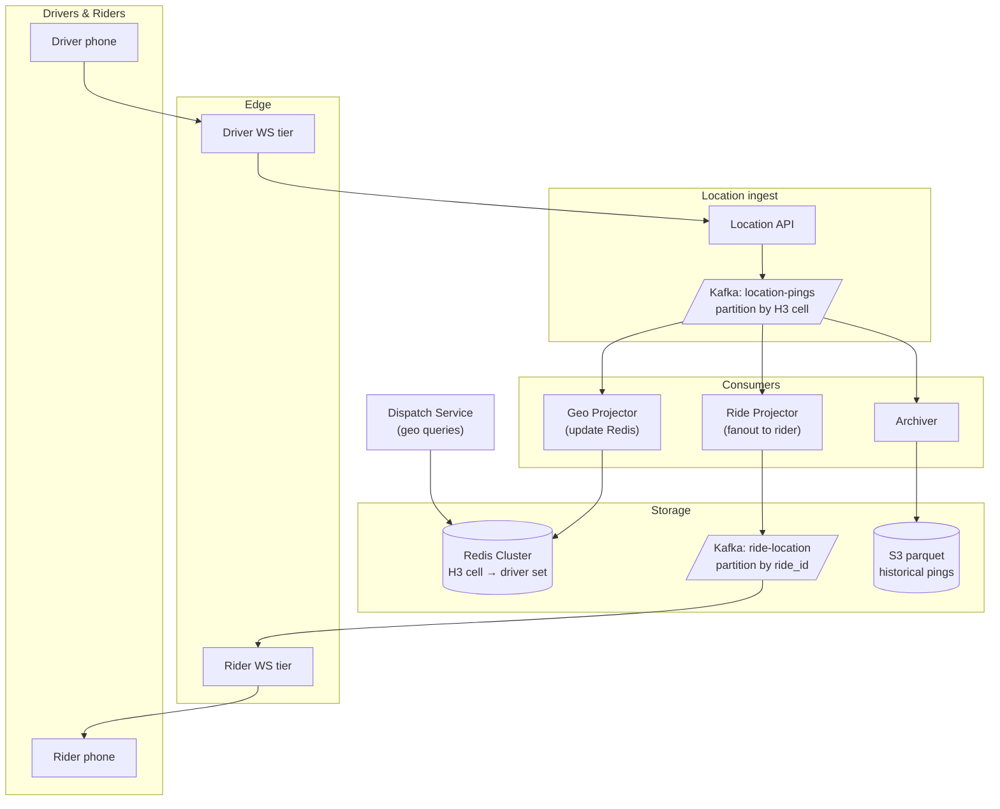

### **Domain 04: Ride-Sharing — Live Location**

> Difficulty: **Expert**. Tags: **RT, Stream**.

---

#### **The Scenario**

A deep dive on the **live location + dispatch** subsystem of a ride-sharing platform (extends [cl-09 Uber](../classics/09-uber_ride_matching.md)). Focus: how 1M drivers send pings 1Hz, riders see driver car smoothly on the map, and match decisions use fresh geo data — all without collapsing under load.

---

#### **1. Requirements**

| Functional | Non-functional |
|---|---|
| Driver location updates 1Hz | Handle 1M concurrent drivers |
| Rider sees driver position smoothly | p99 location-to-rider < 1s |
| Dispatch reads fresh locations | Geo queries < 50ms |
| Historical replay for audit | Tolerate mobile network jitter |
| Work offline → catch up online | Battery efficient |

---

#### **2. Estimation**

- 1M drivers × 1 ping/sec = 1M writes/sec.
- Each ping: driver_id, lat, lng, heading, speed, timestamp ≈ 50 bytes → 50 MB/sec.
- Active rides: 100k (streaming location to riders).

---

#### **3. Architecture**



---

#### **4. Request Flow (Sequence)**

```mermaid
sequenceDiagram
    participant D as Driver phone
    participant DWS as Driver WS
    participant LA as Location API
    participant K as Kafka location-pings (key=H3)
    participant GP as Geo Projector
    participant GR as Redis (cell sets, driver:loc)
    participant RP as Ride Projector
    participant RK as Kafka ride-location (key=ride_id)
    participant RWS as Rider WS
    participant R as Rider phone
    participant Di as Dispatch

    D->>DWS: ping {lat,lng,heading,speed,ts}
    DWS->>LA: forward (server-stamp ts)
    LA->>K: produce (partition by H3 cell)
    LA-->>DWS: ack

    par
        K->>GP: consume
        GP->>GR: SADD cell:H3 driver_id; SET driver:id loc TTL 30s
    and active-ride filter
        K->>RP: consume
        RP->>RP: if driver in active ride -> emit
        RP->>RK: produce keyed by ride_id
        RK->>RWS: stream
        RWS-->>R: location frame (client interpolates to 60Hz)
    end

    Note over D: offline 90s -> local ring buffer -> batch on reconnect
    D->>DWS: batch[...pings...]
    DWS->>LA: un-batch, order by ts
    Note over RP: collapse batch -> send latest + few keyframes to avoid jump

    Di->>GR: kRing(pickup_cell, 3) SMEMBERS -> candidates
    GR-->>Di: driver_ids
```

---

#### **5. Deep Dives**

**4a. H3 hexagonal geo-index**

- Uber-invented H3: world tiled into hexagons at multiple resolutions.
- Resolution 9 ≈ 150m diameter hex. Enough precision for dispatch.
- Benefits over lat/lng grids: uniform neighbors (6), no singularities at poles, easy "find all hexes within radius R" via `kRing`.
- Driver's current H3 cell computed from lat/lng: `h3.geoToH3(lat, lng, 9)`.

**4b. Ingest pipeline**

- Driver phone sends pings over WS (not HTTP POST — keep connection alive, cheaper than repeated TLS).
- LocAPI validates, stamps server-side timestamp, produces to Kafka keyed by H3 cell.
- Partitioning by H3 → geographically-colocated data; enables spatially-local processing.

**4c. Redis geo projection**

- Geo Projector consumes Kafka, maintains Redis sets:
  - `cell:<H3>` → set of driver_ids currently in that cell.
  - `driver:<id>:loc` → current {lat, lng, heading, ts}, TTL 30s.
- Dispatch query: `for each cell in kRing(pickup_cell, 3): SMEMBERS cell:<H3>` → candidate drivers within ~500m.
- Expire driver from cell if last ping > 30s ago (driver offline).

**4d. Rider live-view fanout**

- During a ride, rider must see driver moving smoothly.
- Ride Projector consumes only `location-pings` for drivers currently in active rides.
- Filters; produces to `ride-location` topic keyed by ride_id.
- Rider WS subscribes to Redis PS `ride:<ride_id>`. Receives location frames.
- Smoothing: client does interpolation between received pings (arrives at 1Hz; rendered at 60 Hz).

**4e. Historical archive**

- Archiver consumer batches pings into parquet files in S3, partitioned by day + region.
- Used for: trip reconstruction, analytics, ML model training, audits.
- Kafka retention can be short (6h); S3 is long-term.

**4f. Network jitter and ping loss**

- Driver phones have spotty connections. Pings may arrive out of order or in bursts after a dead zone.
- LocAPI orders by client-stamped timestamp; out-of-order pings dropped if server already has newer one.
- On reconnect: driver batches up to 60s of pings, sends in one WS message, LocAPI un-batches.

---

#### **6. Failure Modes**

- **Redis cluster node down.** Cell set unavailable → dispatch queries that cell return no drivers. Failover to replica (seconds).
- **Kafka partition leader loss.** Producer blocks briefly, pings queued client-side. No data loss.
- **WS tier overload.** Autoscale; shed low-priority connections (drivers not in rides) first.
- **Hot cell** (stadium event). One cell might hold 500 drivers, very spiky. H3 supports going to finer resolution in hot areas.

---

### **Revision Question**

A rider is on a ride. Driver's phone loses cell service for 90 seconds. Rider's map freezes on the last position. What does the architecture do to recover gracefully?

**Answer:**

The architecture handles this at three layers:

1. **Driver client:** during outage, pings accumulate in a local ring buffer (up to 120s). On reconnect, it batch-sends the queued pings with their original client timestamps.
2. **LocAPI / Kafka:** batch is split into individual events keyed by H3 cell. Kafka ingests them normally. Timestamps preserve ordering.
3. **Ride Projector:** sees the batch arrive. For rider-facing stream, it collapses them: instead of sending 90 historical positions at once (would cause a visual jump/rewind), it sends just the latest + maybe 5-10 keyframes for path replay.
4. **Rider client:** was showing "last known position" with a "Driver may be offline" indicator (driven by `last_ping_age > 20s`). On receiving fresh data, smoothly animates driver to new position over ~2s.
5. **Dispatch:** if the driver was mid-ride, it doesn't re-match. If the driver was available, they were dropped from Redis cell (TTL) but re-added on reconnect.

Key architectural ideas:

- **TTL on cached location** separates "we have fresh data" from "driver is permanently gone."
- **Client-stamped timestamps** survive network reordering.
- **Batching + collapsing on ingest** prevents visual glitches from bulk history arrival.
- **UI honesty** surfaces the outage without scaring the rider.

The general principle: in real-time location systems, **the network is the least reliable layer**. The data model and UX must gracefully degrade on every timescale from 100ms glitches to 2-minute dead zones. Every successful ride-share is built on this resilience.
