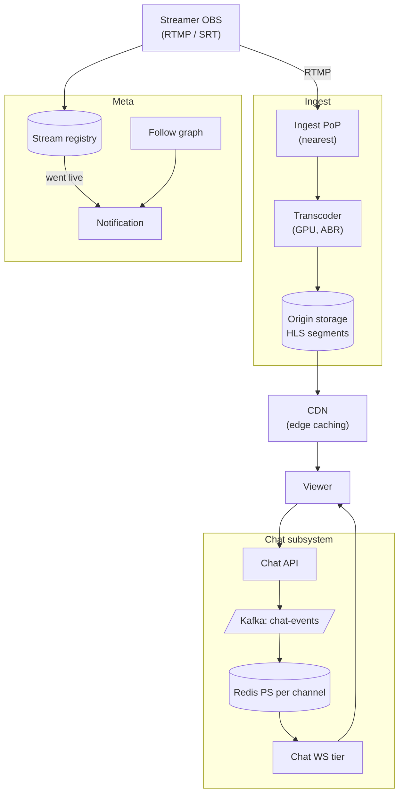

### **Domain 05: Video Streaming + CDN**

> Difficulty: **Hard**. Tags: **Sync, Async**.

---

#### **The Scenario**

Build a video streaming service (Twitch/Kick-style live + VOD). Live streamers broadcast to thousands of viewers with low latency; viewers can rewind, chat in real-time, receive notifications of followed streamers going live.

---

#### **1. Requirements**

| Functional | Non-functional |
|---|---|
| Live broadcasts (streamer → N viewers) | Live latency < 3s |
| DVR: rewind, replay last 2h | Supports 100k concurrent streams |
| Real-time chat | Chat latency < 500ms |
| VOD archive | Global reach |
| Go-live notifications | Scale peak 10M concurrent viewers |

---

#### **2. Estimation**

- 100k live streams × avg 20 viewers = 2M concurrent viewers baseline; peaks 10M.
- Ingest: 100k × 6 Mbps = 600 Gbps inbound.
- Egress: 10M × 3 Mbps = 30 Tbps.

---

#### **3. Architecture**



---

#### **4. Request Flow (Sequence)**

```mermaid
sequenceDiagram
    participant S as Streamer OBS
    participant IE as Ingest Edge
    participant T as Transcoder (ABR, GPU)
    participant O as Origin (HLS segments)
    participant CDN as CDN Edge
    participant V as Viewer
    participant SR as Stream Registry
    participant FG as Follow Graph
    participant NS as Notification Svc
    participant F as Followers
    participant CA as Chat API
    participant K as Kafka chat-events
    participant RPS as Redis PS channel:stream
    participant CWS as Chat WS tier

    S->>IE: RTMP/SRT publish
    IE->>T: forward
    T->>O: write segments + manifest (1-4s chunks per rendition)
    S->>SR: status=live
    SR->>NS: StreamerLive
    NS->>FG: get followers
    par notifications
        NS-->>F: push / email / in-app
    end

    V->>CDN: GET manifest
    CDN->>O: (if miss) fill
    CDN-->>V: manifest
    loop ABR segments
        V->>CDN: GET segment
        alt edge hit
            CDN-->>V: bytes
        else miss
            CDN->>O: fill (coalesced)
            O-->>CDN: bytes
            CDN-->>V: bytes
        end
        Note over V: throughput measured -> pick next bitrate; seek uses older cached segments for DVR
    end

    V->>CA: POST chat msg
    CA->>K: produce
    K->>RPS: relay to channel:stream
    RPS->>CWS: subscribers (one per WS server)
    CWS-->>V: fanout to local viewers (batched, with drop-on-slow)
```

---

#### **5. Deep Dives**

**4a. Ingest protocol (RTMP → SRT → WHIP)**

- **RTMP** is decades-old, TCP-based, ~3s latency — standard today.
- **SRT** is UDP-based, low-latency (~1s), lossy-network tolerant. Gaining adoption.
- **WHIP** (WebRTC-HTTP Ingestion Protocol) enables sub-500ms latency but still niche.
- Edge PoP terminates ingest, forwards to transcoder.

**4b. Adaptive bitrate transcoding**

- GPU-based transcoder produces 3-5 renditions (240p, 480p, 720p, 1080p).
- Segments every 2-4 seconds (HLS standard). Low-latency HLS: 1s.
- Manifest updated as new segments land.

**4c. Origin → CDN → viewer**

- Origin stores HLS segments in object storage.
- CDN edges cache segments; multi-viewer in same PoP shares one cache entry.
- Viewer player downloads manifest every few seconds, then latest segment.
- ABR: measures bandwidth, picks appropriate rendition.

**4d. Chat at scale**

- Each stream has a chat channel. Tens of thousands of concurrent chatters on big streams.
- Messages → Chat API → Kafka → Redis PS channel per stream → WS fanout.
- Spam filtering: rate limits per user, ML model for toxicity, streamer's moderators can ban.

**4e. Go-live notifications**

- Streamer goes live → StreamRegistry updated → emits event.
- NotifSvc joins with FollowSvc → publishes notification for each follower.
- Via push (mobile), email, in-app (WS — see [cl-04](../classics/04-notification_system.md)).

**4f. DVR / seekable live**

- Origin retains last 2h of segments.
- Viewer can seek back; player re-requests older segments.
- CDN caches older segments; seek works transparently.

---

#### **6. Failure Modes**

- **Ingest PoP down.** Streamer reconnects to a different PoP; there's usually a 3-10s reconnect gap.
- **Transcoder failure.** Redundant pool; stream hot-swaps.
- **CDN cache miss storm (popular streamer goes live).** CDN cache coalescing + pre-warm.
- **Chat flood.** Rate limits per user; slow-mode + emote-only modes.

---

### **Revision Question**

A streamer goes live with 2M concurrent viewers. Chat explodes to 50k messages/second. What parts of the architecture scale to handle it, and which parts would fail under naive design?

**Answer:**

**Video side scales horizontally at the edge** — CDN PoPs serve segments cached locally. 2M viewers distributed across hundreds of PoPs → each PoP sees ~10k. Serving 3 Mbps HLS chunks is well within PoP capacity. Origin sees zero incremental load after initial cache warm.

**Chat side is the hard part.** Naive design:

- One Redis PS channel per stream → 50k publishes/sec on one channel → 2M subscribers on one channel.
- A single Redis instance would melt trying to fan out 50k × 2M = 100 billion delivery attempts/sec.

Scalable design:

1. **Shard chat per stream across many Redis nodes.** Each stream channel lives on one Redis shard; very popular streams may be pinned to dedicated shards.
2. **Multi-tier WS fanout.**
   - Client WS servers subscribe to Redis PS once per stream channel.
   - 2M viewers might be spread across 1000 WS servers → 1000 subscribers to the Redis channel, not 2M.
   - Each WS server internally fans out to its ~2000 local viewers via memory.
   - Net: Redis publishes 50k/sec × 1000 subscribers = 50M delivery events/sec, across multiple Redis instances.
3. **Message batching.** Batch 100ms worth of chat messages into a single fanout burst. Chat still feels real-time, network traffic drops 10x.
4. **Drop-on-slow for backpressure.** Viewers can't see every message at 50k/sec anyway. WS servers drop frames to slow clients (see [Bonus 2](../../Week1-Fundamentals_and_Synchronous_communication/bonus2-websocket_in_go.md)).
5. **Rendering throttle client-side.** Chat UI renders only last N seconds, not all messages.

The key architectural idea: **hierarchical fanout** — Kafka to Redis (dozens of subscribers) to WS servers (thousands) to viewers (millions). Each layer fans out by ~100-1000×. You cannot make a single layer fan out from 1 to 2M; you need a tree.

This is the same Redis PS + WS pattern as chat in [Week 1 Bonus 3](../../Week1-Fundamentals_and_Synchronous_communication/bonus3-websocket_architecture_patterns.md), just scaled up.
