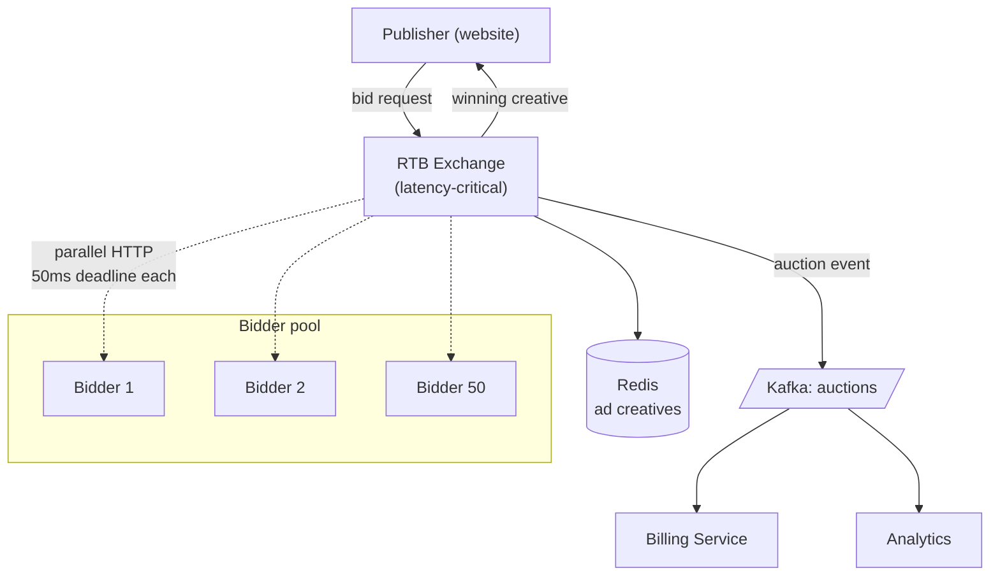

### **Domain 06: Ad-tech — Realtime Bidding (RTB)**

> Difficulty: **Expert**. Tags: **Sync, Stream**.

---

#### **The Scenario**

You're an ad exchange. When a user loads a web page, you receive a bid request. You must poll up to 50 bidders (advertisers), collect their bids, pick the winner, and return the winning ad creative — all in **under 100 milliseconds**, because the user is waiting for the page to render.

---

#### **1. Requirements**

| Functional | Non-functional |
|---|---|
| Receive bid request | p99 end-to-end < 100ms (!!) |
| Poll up to 50 bidders in parallel | 1M bid requests/sec |
| Pick highest bid | Bidders can time out without dropping request |
| Return winning ad | Strict auction correctness |
| Log impressions for billing | No lost billing events |

---

#### **2. Estimation**

- 1M requests/sec × 50 bidders = 50M bidder calls/sec.
- Each bid response ~1KB. Network: 50 GB/sec.

---

#### **3. Architecture**



---

#### **4. Deep Dives**

**4a. The 100ms budget**

- 10ms network from publisher to RTB.
- 70ms budget inside RTB (including bidder calls).
- 20ms return network.

RTB internal budget:
- 5ms request parsing + targeting.
- 50ms bidder fan-out deadline (any bidder slower is dropped from auction).
- 10ms auction resolution + creative lookup.
- 5ms response.

**4b. Parallel bidder calls with deadline**

```go
ctx, cancel := context.WithTimeout(reqCtx, 50*time.Millisecond)
defer cancel()

bids := make(chan Bid, len(bidders))
for _, b := range bidders {
    go func(b Bidder) {
        bid, err := b.Call(ctx, req)
        if err == nil {
            bids <- bid
        }
    }(b)
}

<-ctx.Done()
close(bids)
var winner Bid
for b := range bids {
    if b.CPM > winner.CPM {
        winner = b
    }
}
```

Bidders that don't respond in 50ms are cut off. Their traffic is effectively excluded from the auction — discipline through deadlines.

**4c. Keepalive connections to bidders**

- Opening a new TCP+TLS connection costs 2 RTTs ≈ 40ms. Impossible within budget.
- RTB holds persistent HTTP/2 connections to every bidder. New request = new stream on existing connection = zero-handshake.

**4d. Colocation**

- RTB and major bidders deploy in the same data center.
- Network latency to a bidder in the same rack: < 1ms.
- Cross-region RTB has fundamentally worse physics.

**4e. Creative delivery**

- Ad creatives hosted on CDN.
- Response returns a signed URL + metadata; user's browser fetches the creative from the CDN.

**4f. Billing consistency via event stream**

- Auction result → Kafka event with full context (request, bids, winner, price).
- Billing reads from Kafka: "bidder X won 500k impressions today at $Y CPM."
- Impression confirmation (when ad actually shows) is a second event; bills only confirmed impressions. Handles viewability rules.

---

#### **5. Failure Modes**

- **Bidder slow/down:** dropped from auction by deadline. Revenue impact for them, not for us.
- **RTB crash mid-auction:** publisher times out, shows fallback ad. Auction lost.
- **Kafka down:** RTB buffers auction events locally; flushes on recovery. Billing slightly delayed but not lost.
- **Fraud:** suspicious bid patterns → bidder blocklist. Continuous monitoring.

---

### **Revision Question**

A bidder runs a machine-learning model that takes 120ms to score a bid. They want to participate in your auction. What do you tell them, and what are the architectural implications?

**Answer:**

You tell them: **you cannot participate at the current deadline**. Your budget is 50ms; their model is 120ms. The options:

1. **They optimize.** Approximate models, feature caching, cheaper architectures, better hardware. This is usually what happens.
2. **They pre-score.** Instead of scoring at request time, they pre-score all user × ad combinations in batch, store in a fast lookup (Redis), and at bid time simply fetch the precomputed score. This is **the CQRS pattern applied to ad-tech**: push compute to where time is cheap.
3. **They accept a fraction of requests.** Respond to 10% of calls within 50ms, refuse the rest. They miss most auctions but can participate when they have a high-confidence pre-scored answer.
4. **They bid cold with low confidence.** Return a default bid in 20ms, accept the revenue loss.

The architectural implication across the industry: **budget discipline forces bidders toward stateful, pre-computed systems**. You can't do "heavy compute per request" at 100ms end-to-end. This is why ad-tech is dominated by feature stores, offline ML pipelines, and massive in-memory caches — the opposite of most web backends.

The general principle: **when you have a hard real-time budget, computational load must be moved temporally (pre-compute) or spatially (colocate)**. There's no amount of engineering cleverness that beats "don't do the work now."
