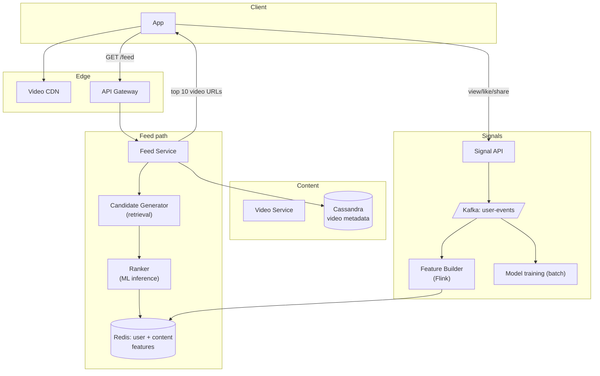

### **Domain 07: Social Media — Timeline + Stories**

> Difficulty: **Hard**. Tags: **Stream, RT**.

---

#### **The Scenario**

Build a TikTok-style social media platform. Users post short-form videos. The home feed is an infinite scroll of algorithmically ranked videos — each user sees a personalized stream. Plus Stories (24h ephemeral), DMs, notifications.

---

#### **1. Requirements**

| Functional | Non-functional |
|---|---|
| "For You" algorithmic feed | Feed load p99 < 500ms |
| Follow-based timeline | 2B MAU, 1B DAU |
| Stories (24h ephemeral) | Feed freshness < 1 min |
| DMs + notifications | Scale ML ranking |
| Like / share / save signals | Real-time signal → recommendations |

---

#### **2. Estimation**

- 1B DAU × 100 video views/day = 100B views/day.
- Feed refresh every 10 videos ≈ 10B feed fetches/day ≈ 115k/sec.
- Ranking: score ~500 candidates per feed refresh.

---

#### **3. Architecture**

---

#### **4. Deep Dives**

**4a. Candidate generation**

- Pool of videos the user could see (maybe 10k candidates) chosen by:
  - Follow graph ("people you follow").
  - Trending in your region.
  - Similar to videos you liked (embeddings + ANN search).
  - Fresh uploads in topics you engage with.
- Implemented with multiple retrieval systems joined.

**4b. Ranking**

- For each user, ~500 candidates evaluated by an ML model.
- Model inputs: user features (history, demographics), content features (creator, duration, hashtag embeddings), context (time, device, location).
- Latency constraint: must score 500 candidates in < 200ms total → inference on GPU in batches.
- Output: ranked list; top 10 returned as the feed.

**4c. Real-time signal loop**

- User watches a video for 3s → signal emitted.
- Flink job aggregates signals into features: "this user's recent topic affinity is +0.12 for cooking."
- Feature store updated within seconds.
- Next feed refresh sees updated features; ranking adapts.

**4d. Feed caching**

- Next 3 feeds precomputed and cached per active user.
- As user scrolls through feed N, feed N+1 already loaded, feed N+2 prefetched.
- Cache invalidation on strong signals (e.g. user unfollowed someone whose videos are in the cached feed).

**4e. Stories**

- Posted with TTL=24h.
- Not ranked; chronological from followed accounts.
- Separate data path (different DB with TTL), separate cache.

**4f. Video delivery**

- Upload → transcode → CDN (like [cl-13 YouTube](../classics/13-youtube_upload_and_playback.md)).
- Feed returns signed URLs to CDN.

---

#### **5. Failure Modes**

- **Ranker down.** Fallback: heuristic ranking (trending, recency). Feed quality drops but service continues.
- **Feature store stale:** previous session's features used; gradual degradation, not outage.
- **Signal Kafka lag:** features lag; acceptable for minutes.
- **Hot creator:** their new video gets pushed to millions. CDN handles; feed cache invalidations may spike.

---

### **Revision Question**

A user opens the app. Within 1 second they must see their first video. Walk through what actually loads, in what order, and where the latency budget is spent.

**Answer:**

Latency budget to render the first video: ~1000ms.

1. **TLS + HTTP/2 handshake (50-100ms)** — likely cached if app has been open recently; zero on warm connection.
2. **GET /feed (200-300ms).**
   - Gateway auth: 10ms.
   - Feed Service fetches cached precomputed feed for user, or generates live.
   - Live path: candidate generation (50ms) + feature lookup (20ms) + inference (150ms) + video metadata fetch (20ms).
   - Returns JSON with 10 video descriptors + signed CDN URLs.
3. **GET first video segment from CDN (300-500ms).**
   - DNS: cached.
   - TLS to CDN edge: ~50ms (often warmed).
   - First segment download: depends on video bitrate and segment size. For a 2s segment at 2 Mbps = 500KB: ~200-400ms on LTE.
4. **Player decode + render (50-100ms).**

Optimizations:

- **Prewarm feed during login:** backend computes the first feed while the user types password. First `/feed` call returns from cache.
- **Prefetch first segment:** when delivering `/feed` response, include first-segment-bytes inline or pre-signed URL pointing at a pop that already has the segment.
- **Edge feed cache:** top-N feed stored in edge KV (Cloudflare Workers style); hit resolves in 30ms at edge.
- **Low-quality first segment:** start with 240p for instant playback; ABR switches to high-quality on next segment.

Without these: 1.5-2s typical. With these: < 600ms is achievable.

The principle: **for consumer apps, perceived latency is the product.** Every 100ms of feed load time costs percentage points of session engagement. The architecture exists entirely to compress that budget.
