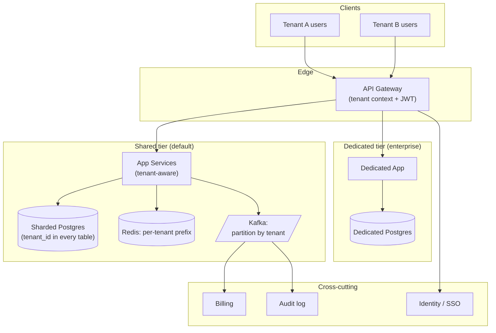

### **Domain 08: SaaS — Multi-Tenant Platform**

> Difficulty: **Hard**. Tags: **Sec, Sync**.

---

#### **The Scenario**

Build a multi-tenant SaaS (Slack, Notion, Jira-like). Thousands of customer organizations share one deployment. Tenant data must be isolated (by law and by security). Some tenants are huge (10k seats), some tiny (1 seat). Billing per tenant. Occasional noisy-neighbor problems.

---

#### **1. Requirements**

| Functional | Non-functional |
|---|---|
| Tenant isolation (data + perf) | No tenant can see another's data |
| Per-tenant billing | Noisy neighbor doesn't affect others |
| Per-tenant admin (SSO, roles) | Enterprise tier gets dedicated resources |
| Self-serve signup + onboarding | 10k tenants at launch, 1M long term |
| Data export / deletion (GDPR) | 99.95% availability per tenant |

---

#### **2. Estimation**

- 100k tenants × avg 50 users = 5M total users.
- Avg tenant: 1k events/day; heavy tenants: 1M events/day → 1000× variance.

---

#### **3. Architecture**

---

#### **4. Deep Dives**

**4a. Tenant isolation models**

Three common strategies:

1. **Shared DB, shared schema, tenant_id column.** Cheapest. Every query includes `WHERE tenant_id = $1`. Risk: missing clause = data leak. Mitigation: ORM-enforced, code review, row-level security.
2. **Shared DB, schema-per-tenant.** Each tenant has its own Postgres schema. Moderate cost. Stronger isolation.
3. **DB-per-tenant (pooled).** Each tenant has own DB; host pooled across shared infra. Max isolation. Used for enterprise tier.

Typical: small tenants on shared; large enterprise on dedicated.

**4b. Noisy neighbor mitigation**

- **Per-tenant rate limits** at gateway.
- **Resource quotas** in app tier — worker budget per tenant, bounded DB connection pool per tenant.
- **Kafka partition-by-tenant** so one heavy tenant only impacts their partition's consumer.
- **Query timeouts** prevent one tenant's bad query from holding locks.

**4c. Authentication and authorization**

- Each tenant configures SSO (Okta, Azure AD, Google Workspace).
- JWT carries `tenant_id` + `user_id` + roles.
- Every service call: extract tenant_id from JWT, apply to all DB queries.
- Admin API: tenant admins can manage their tenant only, cannot cross boundaries.

**4d. Billing**

- Events emitted for metered operations (API calls, storage, events).
- Flink aggregates per-tenant-per-day into billing records.
- Billing service issues invoices, handles payment.

**4e. Per-tenant data deletion (GDPR / SOC2)**

- Tenant offboarding: a well-defined workflow that deletes their rows from every service's DB + object storage + caches.
- Tested regularly. Audit report shows "tenant X deleted from 12 systems by timestamp Y."

**4f. Cross-tenant operations**

- Searching across tenants (for support, not users) routes through a dedicated admin API with strong audit.
- Users never have cross-tenant access paths.

---

#### **5. Failure Modes**

- **Query missing tenant_id filter** → data leak. Worst possible bug. Mitigation: static analysis, row-level security, DB policies.
- **Enterprise DB dies** → their whole product is down. Dedicated replicas.
- **Noisy neighbor** exhausts shared pool → rate limits kick in.
- **Tenant data drift across services** → periodic consistency audit.

---

### **Revision Question**

A Tenant A employee, using a legitimate API call, accidentally sees data belonging to Tenant B. Walk through the architectural possibilities for how this could happen, and the defenses against each.

**Answer:**

Five possible root causes, each with a specific defense:

1. **Missing `tenant_id` WHERE clause in a DB query.**
   Defense: Row-Level Security in Postgres — the DB itself refuses to return rows belonging to another tenant. Ships in Postgres, free to enable, bulletproof. ORMs (like SQLAlchemy, Prisma, ActiveRecord) also have tenant-scoping middleware.

2. **Cache key collision.**
   One service sets `cache:user:42 = profileJSON` for Tenant A. Tenant B has user 42 too. Next request returns the wrong profile.
   Defense: every cache key prefixed by `tenant_id`: `cache:T:<tid>:user:42`. Shared rule across all code.

3. **Cross-tenant foreign key.**
   Tenant A creates a document referring to a folder_id. The folder_id happens to exist in Tenant B. Viewing the doc reveals Tenant B's folder.
   Defense: foreign keys always carry tenant scope; integrity check on every lookup.

4. **Shared Kafka topic, missing tenant filter in consumer.**
   Consumer processes events from all tenants. Returns data to Tenant A that originated from Tenant B.
   Defense: partition by tenant_id; consumer validates the partition assignment against tenant before returning.

5. **JWT confusion attack.**
   Attacker forges or steals a JWT with a spoofed tenant_id. Service trusts it.
   Defense: JWT signature verification at gateway, issuer pinned, TTL short, tenant_id immutable in JWT claims.

The architectural principle: **tenancy is an invariant, not a feature**. Every layer — DB, cache, broker, compute, auth — must enforce it. A single leaky layer defeats all the others. This is why multi-tenant systems have deep compliance frameworks (SOC2, ISO 27001) — the answer to "how do you prove tenants can't see each other" is a rigorous audit across every layer.
