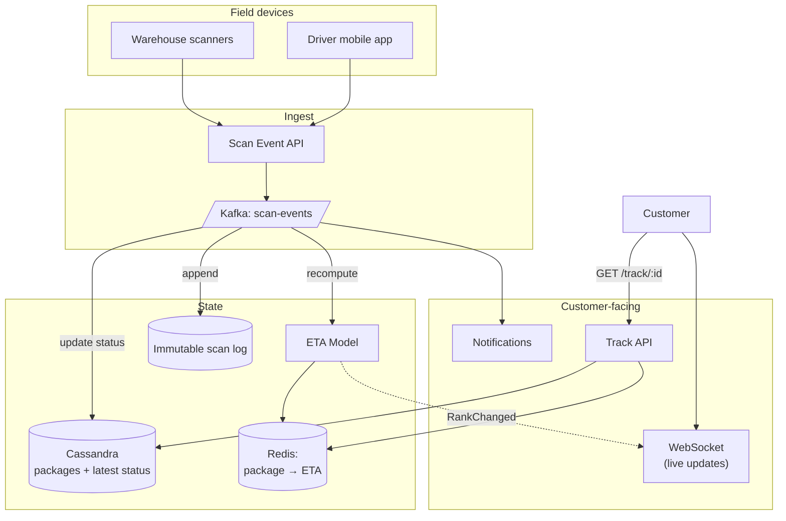

### **Domain 09: Logistics — Package Tracking**

> Difficulty: **Medium**. Tags: **Stream, RT**.

---

#### **The Scenario**

Build a package tracking system (FedEx/DHL-style). Packages flow through warehouses, trucks, planes, hubs, out-for-delivery, delivered. Every scan updates status. Customers view live status; estimated delivery windows update as conditions change.

---

#### **1. Requirements**

| Functional | Non-functional |
|---|---|
| Track package from pickup to delivery | Scan event → customer visibility < 30s |
| Predict delivery window | 10M packages in flight |
| Customer gets delivery notifications | Multi-country operations |
| Driver mobile app: list of stops + scans | Works in low-connectivity |
| SLA monitoring, alerts on late shipments | Durable scan history |

---

#### **2. Estimation**

- 10M packages × avg 15 scans = 150M scan events/day ≈ 1.7k/sec avg, 10k/sec peak.
- 50M users tracking; concentrated around delivery time.

---

#### **3. Architecture**



---

#### **4. Request Flow (Sequence)**

```mermaid
sequenceDiagram
    participant Dev as Scanner / Driver app
    participant SA as Scan API
    participant K as Kafka scan-events (key=package_id)
    participant SP as State Projector
    participant PDB as Cassandra packages
    participant SL as Immutable scan log
    participant ETA as ETA Model
    participant ER as Redis ETA
    participant N as Notifications
    participant WS as WebSocket
    participant C as Customer
    participant TA as Track API

    Dev->>SA: scan event (may arrive in batch if offline)
    SA->>SA: validate, dedupe, client-ts vs server-ts
    SA->>K: produce (key=package_id, strict per-package order)

    par consumers
        K->>SP: consume
        SP->>PDB: UPDATE current_status, last_location
        SP->>SL: APPEND scan_seq
    and
        K->>ETA: recompute
        ETA->>ER: SET eta:package
        alt delay >= 2h threshold
            ETA->>N: notify customer
            N-->>C: push/email
        end
    end

    C->>TA: GET /track/:id
    TA->>PDB: get status
    TA->>ER: GET eta
    TA-->>C: 200 status+eta+history
    C->>WS: subscribe
    SP-->>WS: PUBLISH status change
    WS-->>C: live update

    Note over Dev,SL: corrections are ScanCorrected events appended; projector recomputes current_status without deleting history
```

---

#### **5. Deep Dives**

**4a. Scan event ingest**

- Every scanner (handheld, belt-sorter, truck loader, delivery driver) sends events.
- Events carry `{package_id, location_id, scan_type, ts, scanner_id}`.
- ScanAPI validates, deduplicates, produces to Kafka keyed by package_id.
- Strict per-package ordering on consumer side.

**4b. Offline-capable scanners**

- Field devices often have poor connectivity.
- Scanner stores events locally, ships to ScanAPI in batches when connected.
- Events carry client-side timestamps; server dedupes and reorders.

**4c. Package state projection**

- Consumer reads Kafka, updates Cassandra:
  - `packages(package_id, current_status, current_location, last_scan_at, ...)`
  - `package_scans(package_id, scan_seq, location, ts, scan_type)` — full history.
- State is eventually consistent (~seconds).

**4d. ETA model**

- Features: route, current location, time of day, day of week, weather, historical lane times, destination.
- Model runs whenever a new scan updates the package — publishes `{package_id, eta, confidence}`.
- Stored in Redis for sub-ms read.
- On significant change (+2h delay), triggers push notification to customer.

**4e. Customer real-time view**

- Customer opens the track page → API returns current status + ETA + map.
- WS connection (optional) keeps updates flowing: new scans, ETA changes.
- Mobile push + email for milestones ("Out for delivery", "Delivered").

---

#### **6. Failure Modes**

- **Scanner offline for hours:** events arrive in bulk when reconnected; dedup + re-order. Customer might see status jump.
- **ETA model outage:** last-known ETA served; stale indicator shown.
- **Package physically lost:** after time-since-last-scan exceeds threshold, alert ops + customer.
- **Wrong package marked delivered:** correctable via compensating event; not deletable (scan log is immutable).

---

### **Revision Question**

A driver accidentally scans package A as "Delivered" when they actually delivered package B. The customer for package A gets a false "Delivered" notification. How does the architecture handle the correction?

**Answer:**

**Compensating events, not deletion**, per event-sourcing principles:

1. **Detection:** driver notices the mistake (or customer complains). Back-office creates a `ScanCorrected` event: `{original_scan_id, corrected_scan_type: null, reason: "wrong package"}`.
2. **The scan log is immutable** — we don't delete the original "Delivered" scan. It's historically accurate: that is what the driver did.
3. **State projector** consumes `ScanCorrected`, inverts the effect on current state:
   - Recomputes `current_status` from the full scan history, ignoring corrected scans.
   - Updates Cassandra `packages.current_status = "Out for delivery"` (previous scan state).
4. **Customer notification:**
   - Service emits `StatusReverted` event.
   - Push notification to customer: "Package update: previous 'Delivered' status was issued in error; your package is still en route. We apologize for the confusion."
5. **Audit trail preserved:** the original scan + the correction remain. Investigation can see exactly what happened.
6. **Correction also applies to Driver B's package:** the scan that should have been for Package B is issued correctly, if it hasn't been already.

Why this matters architecturally:

- **Deleting history loses audit accuracy.** Mistakes that happened must be recordable; correcting them is another event.
- **Projections rebuild from events.** If the correction logic has a bug, fix and re-project — the source of truth is the event log.
- **Customer transparency** — honest correction builds trust. Silent re-update would look suspicious.

This is the fintech/bank-ledger pattern (cd-06) applied to logistics: **events are the record, state is a projection**. Events + projections let any mistake be corrected without damaging history.
