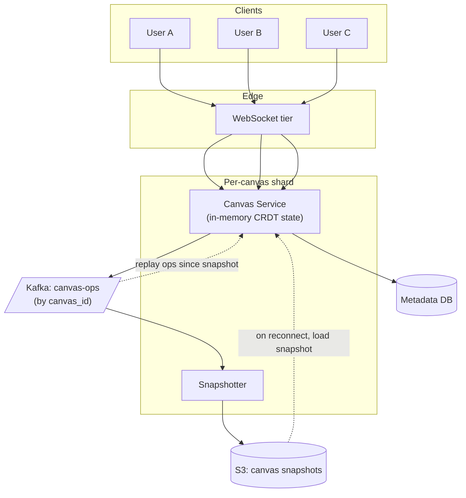
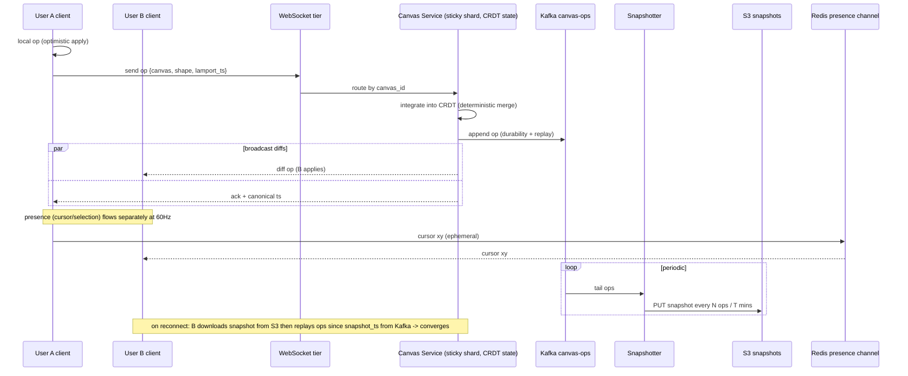

### **Domain 10: Figma-style Live Collaboration**

> Difficulty: **Expert**. Tags: **RT, Stream**.

---

#### **The Scenario**

Build a collaborative design tool (Figma/Miro/tldraw). Multiple users edit the same canvas in real-time with sub-100ms feedback — drag a shape, everyone sees it move instantly. Canvases can be 100MB with thousands of objects. Offline edits reconcile on reconnect.

---

#### **1. Requirements**

| Functional | Non-functional |
|---|---|
| Multi-user real-time editing | End-to-end latency < 100ms |
| Cursor + selection presence | 50 concurrent editors per canvas |
| Offline edits merge | Canvas size up to 100MB |
| Undo / redo per user | Lossless conflict resolution |
| Version history | Supports smooth high-refresh interaction |

---

#### **2. Estimation**

- 10M active users, 1M concurrent sessions.
- Avg ops per user per second: 5-20 during active editing.
- Peak on one canvas: 50 users × 20 ops/sec = 1k ops/sec.

---

#### **3. Architecture**

---

#### **4. Request Flow (Sequence)**

---

#### **5. Deep Dives**

**4a. CRDTs for conflict-free merging**

- Each canvas object has a unique, immutable ID (assigned client-side using Lamport-timestamp-like counter).
- Operations: "create object ID", "move object ID", "update property X on ID".
- CRDTs guarantee convergence regardless of op arrival order. Used libraries: Yjs, Automerge.

**4b. Sticky sharding by canvas**

- Each canvas has one home server holding its in-memory state.
- Clients connect to a WS that proxies to the canvas's home server.
- Consistent hashing: `shard = hash(canvas_id) % N`.
- On shard failure, state rebuilds from snapshot + ops replay.

**4c. Optimistic local + authoritative server**

- User drags a shape → local state updates instantly; op sent to server.
- Server receives op, integrates into CRDT, broadcasts to all connected clients.
- If local op and remote op conflict, CRDT merges deterministically → same final state.

**4d. Presence (cursors, selections)**

- Not part of the persistent doc — ephemeral, high-frequency (60 Hz).
- Separate Redis Pub/Sub channel per canvas for cursors.
- Dropped messages OK; next frame overwrites.

**4e. Snapshots + op log**

- Canvas state snapshotted every N ops or every T minutes to S3.
- Kafka retains ops for ~7 days.
- New connection: client downloads snapshot + replays ops since snapshot → current state.
- Version history: load snapshot + replay until target time.

**4f. Rendering performance**

- Canvas service sends **diffs**, not full state.
- Client maintains local scene graph; applies diffs.
- 60 Hz rendering independent of 1-20 Hz network ops.

---

#### **6. Failure Modes**

- **Canvas server crash:** clients reconnect to new shard; state rebuilt from snapshot + Kafka replay. 2-10s gap.
- **Network drop mid-edit:** client keeps editing locally; queues ops. Reconnect → batch upload; CRDT merges.
- **Large canvas load:** snapshot ~100MB; stream incrementally with progressive rendering.
- **Malicious op:** server-side validation (schema, size, permission).

---

### **Revision Question**

Two users both drag shape X at the same time. User A moves it to position (100, 200). User B moves it to (300, 400). What position is it in after both ops land, and is this deterministic?

**Answer:**

Depends on the CRDT design. For a "position" property on a shape, two common approaches:

1. **Last-Writer-Wins (LWW) Register.** Each op carries a timestamp (often a Lamport timestamp — ordered pair `(counter, client_id)`). The op with the higher timestamp wins. All clients see the same winner after seeing both ops.

   Example: A's op has Lamport (42, "user_A"). B's has (42, "user_B"). Tie on counter, break by client_id lexicographically → user_B wins → shape ends at (300, 400).

   **Deterministic:** yes. Any client processing both ops converges on the same state, regardless of arrival order.

2. **Operational approach (in OT systems):** the server transforms ops against each other. If A applied first, B's op becomes "move by delta" → final position is (something + B's delta). Depends on op definition.

CRDT guarantee: **strong eventual consistency**. Every client, given the same set of operations, converges to the same state. Order of arrival doesn't matter, as long as causality (happens-before) is preserved.

The tradeoff: CRDTs aren't lossless in all cases. In LWW, user A's move is simply lost — overwritten by B. Some teams prefer explicit conflict markers, but in graphics editing, LWW position is usually the right UX: the last user who touched the shape "wins." The client UI immediately shows the server's resolved state, so users perceive it as "B grabbed it from A" rather than "we merged weirdly."

For more complex structures (text, lists), CRDTs preserve both users' intents (see [cl-12 Google Docs](../classics/12-google_docs_realtime_collab.md)). The data model chooses the CRDT type; the CRDT type chooses the merge behavior.
