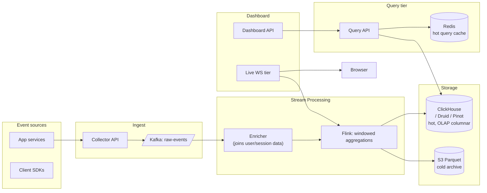

### **Domain 11: Realtime Analytics Dashboard**

> Difficulty: **Hard**. Tags: **Stream, RT**.

---

#### **The Scenario**

Build a real-time business analytics dashboard (like Datadog, Mixpanel, or a company's internal "live revenue" board). Data streams in from thousands of services; dashboards display aggregations (counts, sums, percentiles, cohorts) updated every few seconds. Analysts define new charts on the fly.

---

#### **1. Requirements**

| Functional | Non-functional |
|---|---|
| Stream 1M events/sec into the system | Dashboard lag < 5s |
| Group-by, filter, aggregate on any dimension | Query latency < 500ms |
| Ad-hoc drill-down queries | Store 90 days hot, 2y cold |
| Alerts on thresholds | Per-user dashboards |
| Export to CSV / PDF | Multi-tenant |

---

#### **2. Estimation**

- 1M events/sec × 1KB = 1 GB/sec ingest = 86 TB/day raw.
- Hot storage 90 days = 7 PB, compressed ~1 PB.
- Concurrent dashboards: ~100k.

---

#### **3. Architecture**



---

#### **4. Request Flow (Sequence)**

```mermaid
sequenceDiagram
    participant Src as App / SDK
    participant Col as Collector API
    participant K as Kafka raw-events
    participant En as Enricher
    participant Fl as Flink (windowed aggregations)
    participant Hot as ClickHouse / Druid / Pinot
    participant Cold as S3 Parquet
    participant QC as Redis query cache
    participant QA as Query API
    participant WS as Live WS tier
    participant Br as Browser dashboard

    Src->>Col: emit event (tenant_id, dims, metrics)
    Col->>K: produce (partition=tenant or key)
    K->>En: consume
    En->>En: join user/session dims
    En->>Fl: enriched stream
    par output
        Fl->>Hot: append materialized window (1s/1m)
    and
        Fl->>Cold: archive raw/rollups
    end

    Br->>QA: open dashboard, POST query
    QA->>QC: GET cached result
    alt cache hit
        QC-->>QA: rows
    else miss
        QA->>Hot: SQL (prefer pre-agg cube, partition prune by tenant/day)
        Hot-->>QA: rows (< 500ms SLA or reject)
        QA->>QC: SET result (short TTL)
    end
    QA-->>Br: initial chart data

    Br->>WS: subscribe(query)
    Fl-->>WS: window delta
    WS-->>Br: push delta (< 5s)

    Note over Fl: alerts evaluated inline; fire via notification system
```

---

#### **5. Deep Dives**

**4a. Columnar OLAP store (ClickHouse / Druid / Pinot)**

- Events written as wide rows with many dimensions and metrics.
- Columnar: queries read only needed columns; fast aggregations over billions of rows.
- Partitioning by day + primary dim (e.g. tenant_id).
- Real-time ingest: events appended to partitions; queryable within seconds.

**4b. Stream processing with Flink**

- Joins raw events with user/session dimension data from Kafka.
- Aggregates in windowed views: "revenue per minute per product in last 1h rolling."
- Writes materialized views to OLAP store + a fast KV (Redis) for "exactly right now" numbers.

**4c. Two-tier query strategy**

- **Pre-aggregated rollups** for common dashboards. "Users per day by country" is a pre-materialized cube. Query = single lookup.
- **Ad-hoc drill-down** goes to raw events in OLAP. Slower but flexible.
- Query planner chooses which path based on query features.

**4d. Live dashboard via SSE or WebSocket**

- Dashboard page opens SSE or WS.
- Server subscribes to Flink's windowed outputs; pushes deltas every second.
- Chart renders new points as they arrive.
- Reconnect: fetches last 5 minutes via API, then switches to live stream.

**4e. Alerting**

- User defines: "alert when revenue drops > 20% vs same-time-last-week."
- Evaluated in Flink continuously. Fires → notifies via [notification system](../classics/04-notification_system.md).

**4f. Multi-tenant**

- Every event carries `tenant_id`.
- OLAP partition pruning skips other tenants.
- Query planner refuses cross-tenant queries (except for tenant admins with scope).

---

#### **6. Failure Modes**

- **Flink job restart:** checkpoints to S3; resumes from last checkpoint. Recent numbers briefly stale.
- **OLAP write lag:** visible in "as of" timestamp on charts.
- **Bad query eats cluster:** per-tenant query quotas; kill queries exceeding time/memory budget.
- **Alert storm:** dedup + throttle alerts.

---

### **Revision Question**

An analyst writes an ad-hoc query: "show me hourly revenue for the last 90 days, grouped by country and product category." The query is expected to scan hundreds of billions of rows. The dashboard times out. Fix this.

**Answer:**

Multiple layers of fix, from cheap to expensive:

1. **Pre-aggregation (cube materialization).** "Hourly revenue by country by category" is a textbook OLAP cube. Precompute nightly into a small materialized view (90 days × 24h × ~200 countries × ~50 categories ≈ 21M rows — trivial). The query hits the cube, returns in ms. This is CQRS applied to analytics.
2. **Time-bucket downsampling for long ranges.** Showing 90 days at 1h resolution = 2,160 points per series — chart can't render more anyway. Pre-downsample to daily for > 7-day ranges; hourly only for recent windows.
3. **Approximate queries.** HyperLogLog for distinct counts, t-digest for percentiles. Often 100× faster with < 1% error — good enough for dashboards, bad for billing.
4. **Lazy loading.** Render the top-level aggregate first; drill-down charts load only when user clicks into them.
5. **Query budgets.** Queries that scan more than N billion rows are rejected at plan time; UI prompts user to narrow filters.
6. **Horizontal scaling of OLAP store.** More nodes = more parallel scan. Expensive but linear.

The architectural lesson: **you cannot scan arbitrary amounts of data at dashboard speeds.** Real-time analytics systems are 90% precomputation and 10% ad-hoc. The precomputation strategy (cubes, materialized views, downsampling) is the heart of the system — the query engine is almost a commodity underneath.

For pure "ad-hoc whatever the analyst wants," you need a separate analytics warehouse (Snowflake, BigQuery) with minute-to-second latency, decoupled from the user-facing dashboard.
