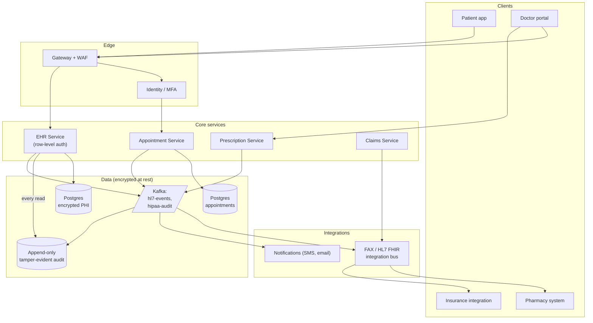

### **Domain 12: Healthcare — Appointments + Records**

> Difficulty: **Hard**. Tags: **Sec, Resil**.

---

#### **The Scenario**

Build a healthcare platform (hospital + clinic network). Patients book appointments with doctors; doctors view medical records (EHR); pharmacy gets prescriptions; insurance gets claims. HIPAA compliance is non-negotiable. Every access to a record must be logged and justified.

---

#### **1. Requirements**

| Functional | Non-functional |
|---|---|
| Patient books appointment | HIPAA audit for every record access |
| Doctor views EHR | Zero unauthorized access |
| Prescriptions to pharmacy | 99.99% availability during business hours |
| Claims to insurance | Multi-location redundancy (disaster) |
| SMS reminders | Cryptographic proof of consent |

---

#### **2. Estimation**

- 10M patients, 100k doctors.
- 500k appointments/day, 2M record accesses/day.
- Low QPS; high-value data; extreme compliance.

---

#### **3. Architecture**



---

#### **4. Request Flow (Sequence)**

```mermaid
sequenceDiagram
    participant P as Patient
    participant D as Doctor
    participant GW as Gateway + WAF
    participant IAM as Identity / MFA
    participant A as Appointment Svc
    participant AD as Appt DB
    participant E as EHR Svc (row-level auth)
    participant ED as EHR DB (encrypted PHI)
    participant Cn as Consent Store
    participant K as Kafka
    participant Au as Tamper-evident Audit
    participant N as Notifications

    P->>GW: POST /appointments {doctor, slot}
    GW->>IAM: verify patient JWT + MFA
    IAM-->>GW: ok (claims)
    GW->>A: forward
    A->>AD: BEGIN tx; lock slot row
    alt slot free
        A->>AD: INSERT appointment; release lock; COMMIT
        A->>K: AppointmentBooked
        A-->>P: 201 booked
        par audit + notify
            K->>Au: audit write (MUST succeed)
        and
            K->>N: schedule SMS/email reminders
            N-->>P: confirmation
        end
    else conflict
        A->>AD: ROLLBACK
        A-->>P: 409 slot taken
    end

    D->>GW: GET /patients/P/records
    GW->>IAM: verify doctor SSO + MFA
    IAM-->>GW: claims (role, scope)
    GW->>E: forward
    E->>Cn: check treatment_relationship(D,P) + consent
    alt authorized
        E->>ED: decrypt+read fields
        E->>Au: append access audit {who, what, why, ts, ip}
        Note over E,Au: fail-closed: if audit write fails, the read MUST fail
        E-->>D: 200 PHI
    else denied / missing consent
        E->>Au: append denied-access audit
        E-->>D: 403
    end
```

---

#### **5. Deep Dives**

**4a. Identity and access**

- Patients: MFA via phone or authenticator app.
- Doctors: SSO from hospital IdP + MFA + role.
- Each request carries JWT with user, role, scope (which patients they have relationships with).
- EHR Service enforces: doctor D can access patient P's records only if `treatment_relationship(D, P)` exists or emergency override justified.

**4b. PHI at rest and in transit**

- Database column-level encryption for sensitive fields (SSN, DOB, diagnoses).
- TLS 1.3 everywhere.
- Keys managed by HSM/KMS; rotate regularly.
- Backups encrypted; stored cross-region for DR.

**4c. HIPAA audit log**

- Every access to any PHI field emits an event: `{accessor, patient_id, field, reason, ts, source_ip}`.
- Written to **append-only, tamper-evident** store (blockchain-like hash chain or immutable S3 with object lock).
- Consumed by monitoring: unusual patterns (doctor viewing 100 patients in an hour) → alert.
- Audit is replayable and signable for regulators.

**4d. HL7 FHIR integration**

- Healthcare interop protocol. Messages exchanged with external systems (pharmacies, labs, insurers).
- Async via Kafka → FHIR adapter → external system.
- Retries with idempotency (order IDs, prescription IDs).

**4e. High availability + DR**

- Active-active across two regions (patients and doctors load-balanced by geography).
- RPO: 0 for appointments (synchronous replication); 5min for EHR (async replication acceptable since writes are low-QPS and reads can fall back to primary).
- Annual DR drill: simulate region loss, verify recovery.

**4f. Patient consent model**

- Consents stored as records: "Patient P consents to Doctor D reading records X for purpose Y until date Z."
- Cryptographically signed by patient (digital signature).
- Auditable chain: "record X was accessed under consent C signed by patient P."

---

#### **6. Failure Modes**

- **EHR DB down:** read-only mode from replica; urgent ops only; primary restored ASAP.
- **Audit write fails:** the operation **must fail**. Cannot allow an access without an audit trail. Fail-closed.
- **HL7 partner down:** messages queue in Kafka; retries with backoff; ops alerted for long outages.
- **Unauthorized access detected:** automatic suspension; forensic audit; regulator notification within legal timeframe.

---

### **Revision Question**

A doctor's account is compromised. The attacker views 500 patient records over 2 hours before detection. Walk through what the architecture provides for containment and forensics.

**Answer:**

The architecture's HIPAA posture transforms this from "unknowable breach" to "fully forensically characterized incident":

**Detection (0-2 hours):**
- Every record access is in the tamper-evident audit log. Unusual pattern (500 records in 2h for a doctor who normally sees 20/day) trips an anomaly alert.
- Alert routes to security operations + the compromised doctor's supervisor.

**Containment (immediate):**
- Doctor's JWT and SSO session are revoked at IAM → all requests fail within seconds.
- Doctor's role membership is suspended in IAM → no new JWT can be issued.
- Access to privileged operations is blocked; active sessions terminated.

**Forensics (hours-days):**
- Audit log tells us exactly: which patient IDs, which fields, which timestamps, source IP.
- 500 affected patients can be precisely enumerated. HIPAA breach notification laws require this list.
- Network logs + IAM sign-in logs correlate to determine the attack vector (phishing, credential stuffing, etc.).
- Other potentially-affected systems (other records the attacker could have touched) are audited; audit trails are independent and tamper-evident.

**Notification (within 60 days under HIPAA):**
- Each affected patient is notified (required by law).
- Regulator (HHS OCR) is notified.
- Public notification if > 500 individuals.

**Remediation:**
- MFA enforcement strengthened (hardware key instead of SMS).
- Rate limiting per-doctor access velocity (already should have limited 500 records / 2h).
- Additional approval required for high-sensitivity records.

Contrast with a lax architecture:
- **No audit log** → you don't know who accessed what. You'd tell every patient "your data MIGHT have been accessed." Regulatory disaster.
- **No anomaly detection** → 500 becomes 50,000 before anyone notices.
- **No session revocation** → you can change the password but old tokens keep working.

The architectural principle: in high-stakes domains (healthcare, finance, government), **auditability is a first-class feature, not an afterthought**. Every layer — identity, data access, audit writes, monitoring — is designed to make breaches detectable, containable, and forensically complete. The same distributed patterns from Weeks 1-4 apply, but every pattern is hardened: tamper-evident logs, signed consents, fail-closed on audit write failure, cross-region immutable audits. Compliance is not a separate system; it's the architecture.
