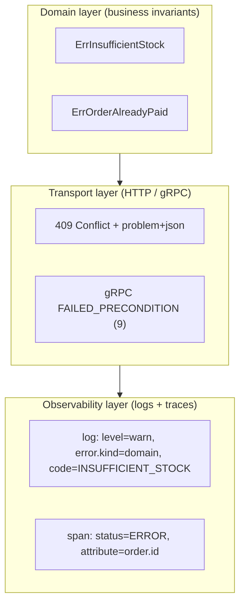
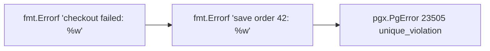
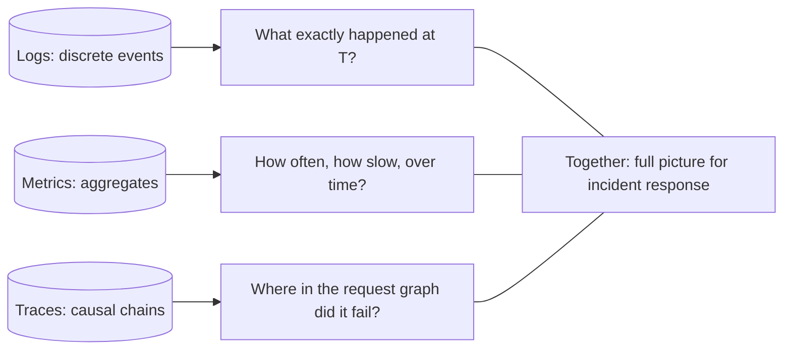
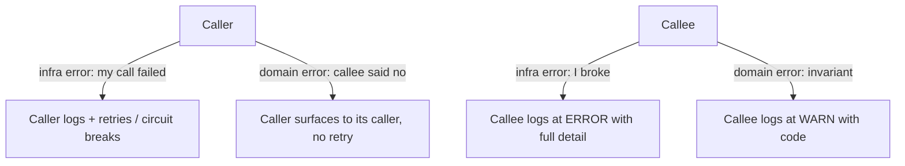

# Extra — Error Handling & Observability, Deep Intro

[Back to top README](../../README.md)

## TL;DR

- **What you learn:** how to model, propagate, log, trace, and report errors so they survive crossing service and protocol boundaries.
- **Tools:** Go `errors` (`%w`, `errors.Is`, `errors.As`), `slog` / `zap`, OpenTelemetry, gRPC status, RFC 7807.
- **Mental model:** every error has a **type** (business vs infrastructure), an **owner layer**, and a **propagation contract**. The hardest bugs come from violating those.

---

## The three-layer error model



- **Domain errors** describe broken business invariants. They are **expected**, frequently observed, and often retryable by changing inputs (different SKU, top up the wallet).
- **Infrastructure errors** describe broken assumptions about the world (DB down, broker unreachable, timeout). They are **unexpected for the request**, but expected statistically.
- The **transport** layer translates them into a status code or gRPC code. The **observability** layer attaches them to logs and traces — at the right severity.

---

## Protocol / byte level

### gRPC status codes (Status Codes & Their Use in gRPC)

```text
HTTP/2 trailers on a failed call:
grpc-status: 9                                     // FAILED_PRECONDITION
grpc-message: "stock=0 for sku=ABC-123"
grpc-status-details-bin: <base64( google.rpc.Status proto )>
```

The `grpc-status-details-bin` trailer carries a Protobuf `google.rpc.Status` with rich `details` (e.g. `BadRequest.FieldViolation`, `RetryInfo`, `LocalizedMessage`). This is how you ship structured, machine-readable error details across language boundaries.

Common codes and their meaning at a glance:

| Code | Name                  | Retry?     | Typical cause                                  |
|------|-----------------------|------------|------------------------------------------------|
| 0    | OK                    | n/a        | success                                        |
| 3    | INVALID_ARGUMENT      | no         | bad input — fix the caller                     |
| 4    | DEADLINE_EXCEEDED     | no (same path) | budget consumed                            |
| 5    | NOT_FOUND             | no         | entity does not exist                          |
| 6    | ALREADY_EXISTS        | no         | duplicate create                               |
| 7    | PERMISSION_DENIED     | no         | authz failure                                  |
| 8    | RESOURCE_EXHAUSTED    | yes, with backoff | rate limit / quota                       |
| 9    | FAILED_PRECONDITION   | no         | system state forbids the op                    |
| 10   | ABORTED               | yes        | concurrency conflict (CAS lost)                |
| 13   | INTERNAL              | maybe      | bug or invariant violation in the callee       |
| 14   | UNAVAILABLE           | yes, with backoff | transient — restart, deploy, network flap |
| 16   | UNAUTHENTICATED       | no         | missing/expired credential                     |

### HTTP problem+json (RFC 7807)

```http
HTTP/1.1 409 Conflict
Content-Type: application/problem+json

{
  "type":     "https://errors.example.com/insufficient-stock",
  "title":    "Insufficient stock",
  "status":   409,
  "detail":   "Only 0 units available for SKU ABC-123",
  "instance": "/orders/42",
  "code":     "INSUFFICIENT_STOCK",
  "trace_id": "4bf92f3577b34da6a3ce929d0e0e4736"
}
```

- `type` is a stable URI clients can dispatch on. Never rely on `title` or `detail` for logic — those are human-readable.
- Always include the `trace_id` in the body so a user-visible error message can be pasted into a support ticket and immediately joined to the full trace.

### OpenTelemetry semantic conventions

A span attached to a failed call should carry standard attributes — names matter so dashboards work across services:

```text
span.kind:           "client" | "server" | "producer" | "consumer"
span.status.code:    "ERROR"
span.status.message: "stock=0 for sku=ABC-123"
exception.type:      "InsufficientStockError"
exception.message:   "stock=0 for sku=ABC-123"
exception.stacktrace: "..."
rpc.system:          "grpc"
rpc.service:         "inventory.InventoryService"
rpc.method:          "Reserve"
rpc.grpc.status_code: 9
```

Standard names = portable dashboards, alerts, and exemplars across vendors.

---

## System internals

### Go error wrapping with `%w`

```go
if err := repo.Save(order); err != nil {
    return fmt.Errorf("save order %s: %w", order.ID, err)
}
```

Every `%w` builds a node in a singly-linked chain:



- `errors.Is(err, sentinel)` walks the chain looking for `==` or `Is(target)` match → ideal for typed sentinels (`var ErrNotFound = errors.New("not found")`).
- `errors.As(err, &target)` walks the chain looking for the first node assignable to `target` → ideal for typed structs you want to inspect (e.g. `*pgconn.PgError`).
- **Never** use `fmt.Errorf("...: %s", err)` for an error you intend to introspect — that flattens the chain to a string.

### Structured logging with trace correlation

```go
logger := slog.With(
    slog.String("trace_id", trace.SpanFromContext(ctx).SpanContext().TraceID().String()),
    slog.String("span_id",  trace.SpanFromContext(ctx).SpanContext().SpanID().String()),
    slog.String("service",  "order"),
)
logger.WarnContext(ctx, "insufficient stock",
    slog.String("error.kind", "domain"),
    slog.String("code", "INSUFFICIENT_STOCK"),
    slog.String("sku", sku),
    slog.Int("requested", qty),
)
```

- Inject `trace_id` and `span_id` into every log line via a context-aware logger so logs join to traces in the backend (Loki + Tempo, ELK + Jaeger, Datadog, etc.).
- Log level discipline: `DEBUG` = developer noise, `INFO` = state transitions ops cares about, `WARN` = recoverable anomaly, `ERROR` = an SLO-impacting failure that warrants attention.
- A domain error logged at `ERROR` is a paging bug. A `WARN` with a code lets the dashboard count it without waking anyone up.

### Three-layer handler in Go (recommended shape)

```go
func (h *OrderHandler) Checkout(ctx context.Context, in *Req) (*Resp, error) {
    out, err := h.svc.Checkout(ctx, toDomain(in))   // 1. call domain
    if err != nil {
        return nil, h.mapError(ctx, err)            // 2. translate to transport error
    }                                                // 3. logging + tracing happens in middleware
    return toResp(out), nil
}

func (h *OrderHandler) mapError(ctx context.Context, err error) error {
    var insuf domain.ErrInsufficientStock
    switch {
    case errors.As(err, &insuf):
        return status.Error(codes.FailedPrecondition, insuf.Error())
    case errors.Is(err, domain.ErrNotFound):
        return status.Error(codes.NotFound, err.Error())
    case errors.Is(err, context.DeadlineExceeded):
        return status.Error(codes.DeadlineExceeded, err.Error())
    default:
        // unknown -> log full detail, return opaque INTERNAL to client
        slog.ErrorContext(ctx, "unhandled error", slog.Any("err", err))
        return status.Error(codes.Internal, "internal error")
    }
}
```

- Domain layer **never** returns `status.Error` — that would couple it to gRPC.
- Transport layer **never** lets unknown errors leak details to the client (information disclosure).
- A trace/log middleware records the error once at the boundary, with full context — so handlers don't log everything inline (the classic "log + return" double-log antipattern).

---

## Mental models

### Three pillars of observability



- **Metrics** answer *how much* — high cardinality is expensive.
- **Logs** answer *what happened* — high volume, low aggregation.
- **Traces** answer *where in the call graph* — sampled, structured.
- All three must share a **trace ID** so you can pivot from a metric spike to the offending traces to the raw logs.

### Who owns which error



The rule: **the layer that knows what the error means is the layer that logs it richly**. Everyone else passes it through.

### Retry safety = idempotency × side effects

| Operation                  | Idempotent? | Safe to retry on UNAVAILABLE? |
|----------------------------|-------------|-------------------------------|
| `GET /orders/42`           | Yes         | Yes                           |
| `PUT /orders/42` with full body | Yes    | Yes                           |
| `POST /orders` (no key)    | No          | No — duplicates                |
| `POST /orders` + `Idempotency-Key` | Yes (server dedupe) | Yes |
| `INSERT ... ON CONFLICT DO NOTHING` | Yes | Yes                       |
| Charge credit card (no idem key) | No   | No                            |

### Logs are not API. Codes are.

- Dashboards and alerts must key off **stable codes** (`code=INSUFFICIENT_STOCK`, `grpc-status=9`), never log message text.
- Message text is for the human reading the line. Codes are for machines.

---

## Failure modes

- **Lost trace context across a goroutine** — `go func() { ... }` without passing `ctx`. Mitigation: always pass `ctx` and use `otel`'s context-aware helpers.
- **Logged an error and also returned it** — appears twice in the trace, distorts counts. Mitigation: log at the boundary only.
- **Returned `INTERNAL` for a domain error** — pages on-call for a normal user mistake. Mitigation: explicit mapping table in the handler.
- **Wrapped with `%s` instead of `%w`** — `errors.Is/As` silently fails. Mitigation: lint rule (`errorlint`).
- **High-cardinality metric labels** (e.g. user ID) — Prometheus OOM. Mitigation: keep labels low-cardinality, push detail into traces.
- **PII in logs** — privacy incident. Mitigation: redact at the logger layer, not at call sites.
- **Sampling drops the only failing trace** — no trace exists for the bug. Mitigation: tail-based sampling that always keeps errored traces.

---

## Notes in this section

- [Extra 1 — Error Classification & Propagation](extra1-error_classification_and_propagation.md)
- [Extra 2 — Structured Logging with Trace IDs](extra2-structured_logging_with_trace_ids.md)
- [Extra 3 — Go Error Patterns](extra3-go_error_patterns.md)
