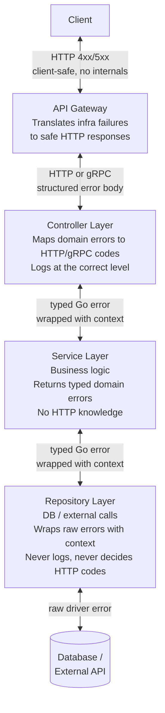
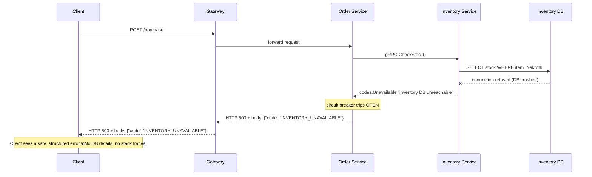

### **Extra 1: Error Classification & Propagation**

In a microservice system, an error is not just an error. Where it comes from, who owns it, and what the client should hear are three completely different questions. Getting this wrong means either leaking internal details to clients (a security risk) or swallowing real problems that engineers need to debug.

---

#### **1. The Two Types of Errors**

**Business / Domain Errors**
These are _expected_. The service ran successfully — it just found a situation the business rules reject.

- "Item is out of stock"
- "User does not have permission"
- "Order ID not found"
- "Insufficient balance"

The service knows about these. They are part of the contract. They should propagate to the client with a meaningful code.

**Infrastructure / Communication Errors**
These are _unexpected_. The service never got a chance to run its business logic.

- Downstream service timed out
- Circuit breaker is OPEN
- Database connection refused
- Network packet lost

The calling service (or the gateway) owns these. The raw internal cause — `dial tcp: connection refused` — must **never** reach the client.

---

#### **2. The Layer Model**

Each boundary has one job:

| Layer | Responsibility | What it must NOT do |
|---|---|---|
| **Repository** | Wrap raw errors with context (`%w`) | Log, decide HTTP codes, expose DB details |
| **Service** | Return typed domain errors | Know about HTTP, call `log.Fatal`, return raw DB errors |
| **Controller** | Map errors → HTTP/gRPC codes, log at the right level | Return raw Go error strings to the client |
| **Gateway** | Translate infra failures, forward domain errors | Expose internal error messages or stack traces |

---

#### **3. HTTP and gRPC Status Code Mapping**

The controller layer is the only place that knows about transport-level codes.

| Domain Error | HTTP Code | gRPC Code |
|---|---|---|
| Resource not found | `404 Not Found` | `codes.NotFound` |
| Invalid input / failed validation | `422 Unprocessable Entity` | `codes.InvalidArgument` |
| Business rule conflict (out of stock, duplicate) | `409 Conflict` | `codes.FailedPrecondition` |
| Caller not authenticated | `401 Unauthorized` | `codes.Unauthenticated` |
| Caller not permitted | `403 Forbidden` | `codes.PermissionDenied` |
| Downstream timeout | `504 Gateway Timeout` | `codes.DeadlineExceeded` |
| Downstream unavailable / circuit open | `503 Service Unavailable` | `codes.Unavailable` |
| Unhandled / unexpected | `500 Internal Server Error` | `codes.Internal` |

**The rule:** `4xx` means the caller did something wrong or the business rejected the request. `5xx` means our infrastructure failed. A client should never receive a `500` for a business rule violation.

---

#### **4. What the Client Receives vs What Happens Internally**

The client sees `INVENTORY_UNAVAILABLE`. It does not see `dial tcp 10.0.1.5:5432: connect: connection refused`. That internal detail lives only in the Inventory Service's logs, tagged with the Trace ID.

---

#### **Actionable Task**

Look at any existing service you have written (Week 1 or Week 3 projects). Find where errors are returned. Ask yourself for each one:

1. Is this a domain error or an infrastructure error?
2. Is the raw error string reachable by the client?
3. Which layer is making the HTTP status decision?

---

#### **Revision Question**

Your Inventory Service's database crashes mid-request. Trace the exact path of that failure:

- What does the Repository layer return?
- What does the Service layer do with it?
- What does the Controller layer return to the gateway?
- What does the Client receive?
- What does the gateway log?

**Answer:**

1. **Repository:** `fmt.Errorf("GetStock: %w", pgErr)` — wraps the raw postgres driver error with context and returns it up. Does not log. Does not decide anything.
2. **Service:** Receives the wrapped error. It doesn't match any domain sentinel (`ErrNotFound`, `ErrOutOfStock`), so it returns it as-is or wraps it further: `fmt.Errorf("CheckStock: %w", err)`.
3. **Controller:** Receives the error. `errors.Is` checks fail for all domain types. Falls into the `default` branch → logs `[ERROR] [trace=abc-123] unexpected error: GetStock: ...` with the full internal chain → returns `codes.Internal` to the gateway.
4. **Client:** Receives `503 Service Unavailable` with body `{"code": "INVENTORY_UNAVAILABLE"}`. No DB details, no stack trace.
5. **Gateway:** Receives `codes.Unavailable` from the Order Service controller → logs `[ERROR] [trace=abc-123] upstream Inventory returned unavailable` → returns HTTP 503 to the client.

The critical guarantee: the postgres error string stays inside the Inventory Service's logs, tagged with the Trace ID, findable by any engineer — but completely invisible to the outside world.
