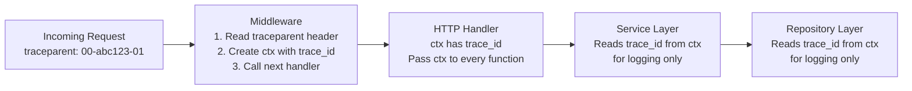
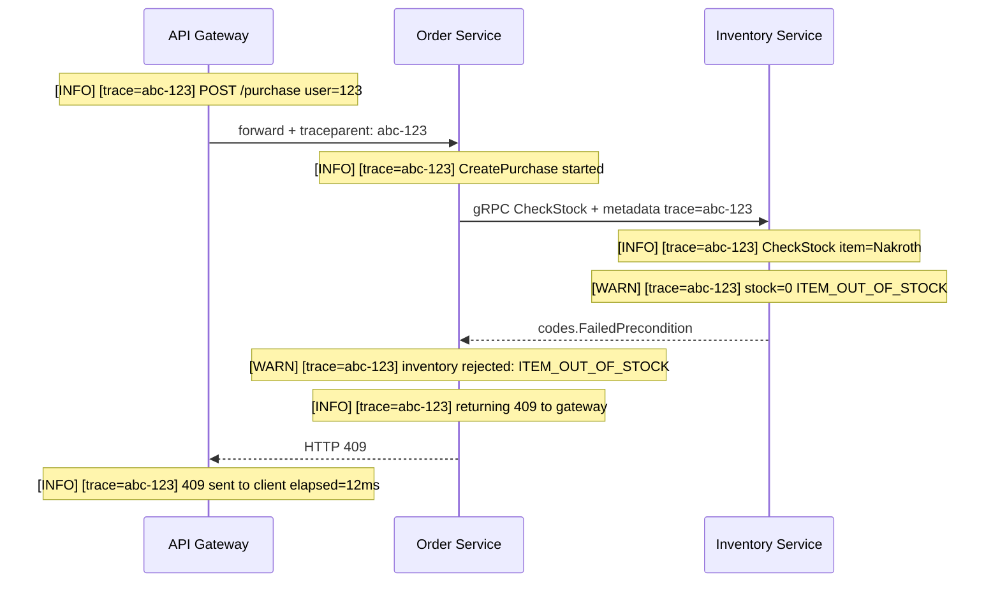

### **Extra 2: Structured Logging with Trace IDs**

In a monolith, logging is simple — one process, one log file, grep and you're done. In microservices, a single user action spawns log lines across 5 different services on 5 different machines. Without discipline, those logs are useless noise. With Trace IDs and structured output, they become a perfect timeline of exactly what happened.

This builds directly on Day 25 (Distributed Tracing). The difference: Day 25 covered _what_ a Trace ID is. Today covers _how to actually use it in every log line_ and _what to log at each layer_.

---

#### **1. Log Levels — The Exact Rules**

| Level | When to use | Example |
|---|---|---|
| `DEBUG` | Dev only. Detailed internals you need while building — query params, raw payloads. **Never in production.** | `[DEBUG] SQL: SELECT * FROM orders WHERE id=999` |
| `INFO` | Normal flow. Request received, response sent, background job completed. | `[INFO] CreatePurchase started user=123 item=Nakroth` |
| `WARN` | Expected failure. Business rule rejected, circuit breaker opened, duplicate message skipped. The system handled it gracefully. | `[WARN] stock=0, returning ITEM_OUT_OF_STOCK` |
| `ERROR` | Unexpected failure. Unhandled error, DB crash, panic. Requires engineer attention. | `[ERROR] inventory DB unreachable: connection refused` |

**The discipline:** If you find yourself logging `ERROR` for a 404, that is wrong — it is a `WARN` at most (the request was invalid, the system handled it). If you find yourself logging `INFO` for a DB crash, that is wrong — it is `ERROR`. Mis-leveled logs destroy the signal-to-noise ratio and make on-call rotations miserable.

---

#### **2. Structured vs Plain Text Logging**

Plain text logs are for humans reading in a terminal during development. In production, every log line should be **structured JSON** so that aggregation tools (Datadog, ELK, Loki) can parse, filter, and alert on them.

```json
{
  "level": "ERROR",
  "time": "2026-04-16T12:03:45Z",
  "service": "inventory",
  "trace_id": "abc-123",
  "span_id": "def-456",
  "handler": "CheckStock",
  "error": "GetStock: pq: connection refused",
  "item": "NakrothSkin"
}
```

With this format, any engineer can go to Datadog and type `trace_id:abc-123` to pull every log line across every service for that single request — sorted by time.

---

#### **3. Injecting the Trace ID — The Right Place**

The Trace ID must be injected **once**, at the outermost entry point (the HTTP or gRPC middleware), and then carried through `context.Context` for the lifetime of the request. No service below the middleware should ever generate or assign a Trace ID.



The pattern in Go: inject once in middleware, read everywhere.

```go
// Middleware — runs on every request
func TraceMiddleware(next http.Handler) http.Handler {
    return http.HandlerFunc(func(w http.ResponseWriter, r *http.Request) {
        traceID := r.Header.Get("traceparent")
        if traceID == "" {
            traceID = generateUUID() // this service is the origin
        }
        ctx := context.WithValue(r.Context(), traceIDKey, traceID)
        w.Header().Set("traceparent", traceID) // propagate downstream
        next.ServeHTTP(w, r.WithContext(ctx))
    })
}

// Helper used at every layer
func TraceFromCtx(ctx context.Context) string {
    if v, ok := ctx.Value(traceIDKey).(string); ok {
        return v
    }
    return "no-trace"
}
```

---

#### **4. What Each Layer Should Log**

| Layer | Log | Do not log |
|---|---|---|
| **Middleware** | Request received (method, path, user ID) | Request body, passwords, tokens |
| **Controller** | Handler started, handler result (success / which error code) | Internal error chains verbatim to client |
| **Service** | Nothing for happy path. `WARN` for domain rejections. | DB query internals, raw SQL |
| **Repository** | `ERROR` only for unexpected DB errors (include the error chain) | Query results, row data |
| **Background worker** | Job started, job completed, retry count | Message payloads containing PII |

---

#### **5. Correlated Logs Across Services**



Every log line carries `trace=abc-123`. You type that ID in Datadog once and see the complete timeline above — across three separate services, on three separate machines, in millisecond order.

---

#### **6. Sensitive Data Rules**

These must be enforced by code review, not just convention:

- **Never log** full JWT tokens (they are credentials)
- **Never log** credit card numbers, CVV, expiry dates
- **Never log** passwords, API keys, or database connection strings
- **Never log** personally identifiable information (PII) — names, email addresses, IP addresses — in `ERROR` level logs that might be sent to external aggregators
- **Always log** user IDs (not usernames) and order IDs (not item details) for traceability
- If you must log a token for debugging, log only the last 6 characters: `token=...abc123`

---

#### **Actionable Task**

Take the Week 1 `Order Service` from `day7-consolidation_project`. Add a `TraceMiddleware` that reads or generates a Trace ID and stores it in `context.Context`. Update the `checkoutHandler` to read the Trace ID from context and include it in every log call. Run the service and trace a single request through the logs.

---

#### **Revision Question**

A user messages support: "My purchase of the Nakroth skin is stuck on Pending." They give you their `order_id: 999`. You have access to your centralized log aggregation tool.

**Walk through exactly what you search for, in what order, and what log lines would tell you the answer.**

**Answer:**

1. **Search by order ID:** `order_id:999` across all services. This gives you every log line that touched this order — which is faster than searching by Trace ID when you don't have it yet.
2. **Get the Trace ID:** From the first log line that appears (usually the Gateway receiving the request), extract `trace_id`. Let's say it's `abc-123`.
3. **Search by Trace ID:** `trace_id:abc-123`. Now you see the complete timeline in order.
4. **Read the sequence:**
   - Gateway: `INFO` — request received, forwarded to Order Service. ✓
   - Order Service: `INFO` — `CreatePurchase started`, then `INFO` — `202 returned to client, outbox written`. ✓
   - Outbox Worker: Check for a log line — `INFO` — `published OrderRequested to Kafka for order 999`. If this line is **missing**, the outbox worker is stuck or crashed. Check worker health.
   - Payment Service: `INFO` — `OrderRequested consumed`, then — if present — `INFO` — `PaymentSucceeded published`. If missing, the Payment Service never received the Kafka event. Check consumer group lag.
   - If Payment Service log shows `WARN` — `circuit breaker OPEN` — Stripe is down and the order is sitting in the retry queue. ETA for retry is in the next circuit half-open probe.
5. **Root cause identified** from logs alone — no guessing, no SSH into servers, no `grep` across 5 machines manually.
