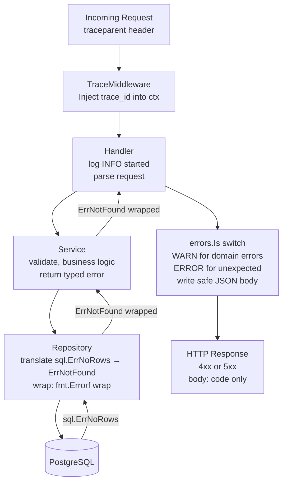

### **Extra 3: Go Error Patterns — Writing It in Code**

Extra 1 covered the theory (which layer owns what). Extra 2 covered structured logging. Today we write the actual Go code that puts both into practice — typed errors, wrapping chains, the three-layer structure, and the middleware that injects the Trace ID.

---

#### **1. Typed Sentinel Errors**

Define your domain errors once, in one place. Every layer uses `errors.Is` to check for them — never string matching.

```go
// errors.go — define at the service package level
package purchase

import "errors"

var (
    ErrNotFound       = errors.New("not found")
    ErrOutOfStock     = errors.New("item out of stock")
    ErrAlreadyExists  = errors.New("already exists")
    ErrInvalidInput   = errors.New("invalid input")
    ErrUnauthorized   = errors.New("unauthorized")
)
```

These are the only error values your controller layer needs to know about. The repository and service layers wrap them; the controller layer unwraps them.

---

#### **2. Wrapping Errors with Context**

Every layer wraps the error it receives with additional context using `fmt.Errorf("...: %w", err)`. The `%w` verb is critical — it allows `errors.Is` and `errors.As` to unwrap the full chain.

```go
// Repository layer — wraps the raw DB error
func (r *repo) GetOrder(ctx context.Context, id string) (*Order, error) {
    var order Order
    err := r.db.QueryRowContext(ctx, "SELECT id, item, status FROM orders WHERE id=$1", id).
        Scan(&order.ID, &order.Item, &order.Status)

    if errors.Is(err, sql.ErrNoRows) {
        // Translate the DB-specific error into a domain sentinel
        return nil, fmt.Errorf("GetOrder %s: %w", id, ErrNotFound)
    }
    if err != nil {
        // Unexpected DB error — wrap with context but don't decide anything
        return nil, fmt.Errorf("GetOrder %s: %w", id, err)
    }
    return &order, nil
}
```

The repository:
- Translates known DB-specific errors (`sql.ErrNoRows`) into domain sentinels
- Wraps unexpected errors with function name and key context
- Never logs, never returns HTTP codes

---

#### **3. Service Layer — Business Logic Only**

```go
// service.go
func (s *service) Purchase(ctx context.Context, req PurchaseRequest) (*Order, error) {
    if req.ItemName == "" {
        return nil, fmt.Errorf("Purchase: %w", ErrInvalidInput)
    }

    order, err := s.repo.GetOrder(ctx, req.OrderID)
    if err != nil {
        // Propagate — the controller will decide what to do with it
        return nil, fmt.Errorf("Purchase: %w", err)
    }

    if order.Status == "completed" {
        return nil, fmt.Errorf("Purchase: order already processed: %w", ErrAlreadyExists)
    }

    // ... business logic

    return order, nil
}
```

The service:
- Returns domain sentinels wrapped with enough context to trace the call chain
- Has zero knowledge of HTTP, gRPC, or log levels
- The string `"Purchase: GetOrder 999: not found"` is the full error chain — readable but never shown to the client

---

#### **4. Controller Layer — The Translation Boundary**

This is the only layer that knows about HTTP codes and log levels.

```go
// handler.go
func (h *handler) CreatePurchase(w http.ResponseWriter, r *http.Request) {
    traceID := TraceFromCtx(r.Context())
    log.Printf(`{"level":"INFO","trace_id":"%s","handler":"CreatePurchase","msg":"started"}`, traceID)

    var req PurchaseRequest
    if err := json.NewDecoder(r.Body).Decode(&req); err != nil {
        log.Printf(`{"level":"WARN","trace_id":"%s","handler":"CreatePurchase","msg":"bad request body"}`, traceID)
        writeError(w, http.StatusBadRequest, "INVALID_REQUEST_BODY")
        return
    }

    order, err := h.service.Purchase(r.Context(), req)
    if err != nil {
        switch {
        case errors.Is(err, ErrNotFound):
            log.Printf(`{"level":"WARN","trace_id":"%s","handler":"CreatePurchase","msg":"not found","error":"%v"}`, traceID, err)
            writeError(w, http.StatusNotFound, "ORDER_NOT_FOUND")

        case errors.Is(err, ErrOutOfStock):
            log.Printf(`{"level":"WARN","trace_id":"%s","handler":"CreatePurchase","msg":"out of stock","error":"%v"}`, traceID, err)
            writeError(w, http.StatusConflict, "ITEM_OUT_OF_STOCK")

        case errors.Is(err, ErrAlreadyExists):
            log.Printf(`{"level":"WARN","trace_id":"%s","handler":"CreatePurchase","msg":"duplicate","error":"%v"}`, traceID, err)
            writeError(w, http.StatusConflict, "ALREADY_PROCESSED")

        case errors.Is(err, ErrInvalidInput):
            log.Printf(`{"level":"WARN","trace_id":"%s","handler":"CreatePurchase","msg":"invalid input","error":"%v"}`, traceID, err)
            writeError(w, http.StatusUnprocessableEntity, "INVALID_INPUT")

        default:
            // Unexpected — log the FULL internal chain, return generic 500
            log.Printf(`{"level":"ERROR","trace_id":"%s","handler":"CreatePurchase","msg":"unexpected error","error":"%v"}`, traceID, err)
            writeError(w, http.StatusInternalServerError, "INTERNAL_ERROR")
        }
        return
    }

    log.Printf(`{"level":"INFO","trace_id":"%s","handler":"CreatePurchase","msg":"success","order_id":"%s"}`, traceID, order.ID)
    writeJSON(w, http.StatusAccepted, order)
}
```

Key rules enforced here:
- Domain errors → `WARN` (expected, handled)
- Unknown errors → `ERROR` (unexpected, requires investigation)
- The `default` branch logs `err.Error()` which includes the full chain (`"Purchase: GetOrder 999: ..."`) — this stays in the logs, never in the response body
- The client body always contains only a safe `code` string

---

#### **5. The Trace ID Middleware**

This runs on every request, before any handler. It is the single place where the Trace ID enters the system.

```go
// middleware.go
type contextKey string

const traceIDKey contextKey = "trace_id"

func TraceMiddleware(next http.Handler) http.Handler {
    return http.HandlerFunc(func(w http.ResponseWriter, r *http.Request) {
        traceID := r.Header.Get("traceparent")
        if traceID == "" {
            // This service is the origin — generate a new ID
            traceID = uuid.New().String()
        }

        // Store in context so every layer can read it
        ctx := context.WithValue(r.Context(), traceIDKey, traceID)

        // Propagate downstream for all outgoing HTTP/gRPC calls
        w.Header().Set("traceparent", traceID)

        next.ServeHTTP(w, r.WithContext(ctx))
    })
}

func TraceFromCtx(ctx context.Context) string {
    if v, ok := ctx.Value(traceIDKey).(string); ok {
        return v
    }
    return "no-trace"
}
```

Wire it up in `main.go`:

```go
func main() {
    h := &handler{service: newService()}

    mux := http.NewServeMux()
    mux.HandleFunc("/purchase", h.CreatePurchase)

    // Wrap the entire mux — every route gets the middleware
    wrapped := TraceMiddleware(mux)

    log.Fatal(http.ListenAndServe(":8080", wrapped))
}
```

---

#### **6. Wiring It All Together**



---

#### **Actionable Task**

Take the Week 1 `Order Service`. Refactor it to follow the three-layer pattern:

1. Create an `errors.go` with at least `ErrNotFound` and `ErrOutOfStock`.
2. Move the `client.Get("http://inventory:8081/check-stock")` call into a repository/client struct. Return `ErrOutOfStock` when `in_stock: false`.
3. Add a service layer that calls the repository and returns domain errors.
4. Rewrite the handler to use `errors.Is` and return correct HTTP codes.
5. Add `TraceMiddleware` and include the Trace ID in every log call.

---

#### **Revision Question**

What is the practical difference between logging at the service layer vs logging at the controller layer? Why does it matter at scale?

**Answer:**

If every layer logs every error, you get **log duplication**. In a system with 10 microservices, each with 3 layers, a single failed request produces 30 log lines instead of 3 — most containing the same error. Log aggregation costs money (Datadog charges per ingested line), and noise makes real `ERROR` alerts meaningless because they fire constantly.

The correct rule:

- **Repository layer:** Does not log. It returns errors. Logging is not its job.
- **Service layer:** Logs `WARN` only for domain rejections that are meaningful to trace (e.g., "idempotency key already exists — skipping"). Does not log every returned error.
- **Controller layer:** Logs once per request, at the appropriate level, with the full context. This is the single source of truth for what happened to a request.

At scale, the controller layer produces exactly **one structured log line per request outcome**. You can set up a Datadog alert: "more than 5 `ERROR` level logs per minute from service `inventory` → page the on-call engineer." If every layer logged, that threshold would be impossible to tune.
