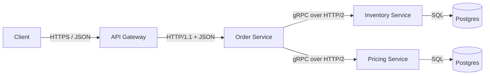
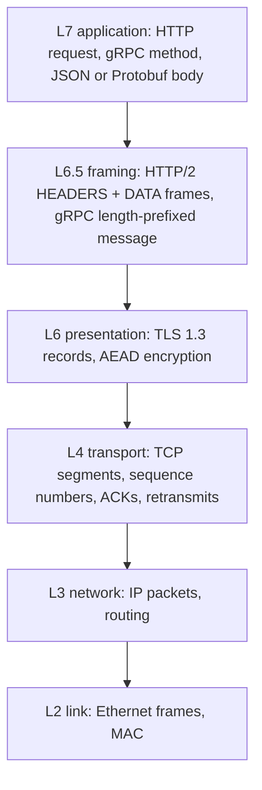
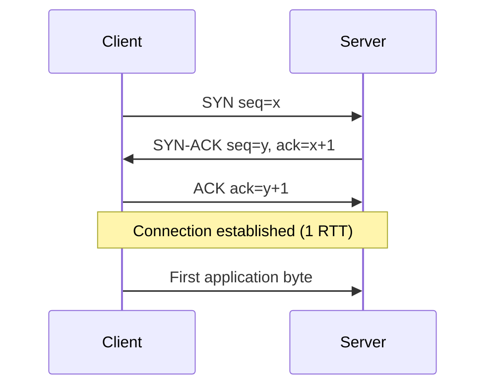
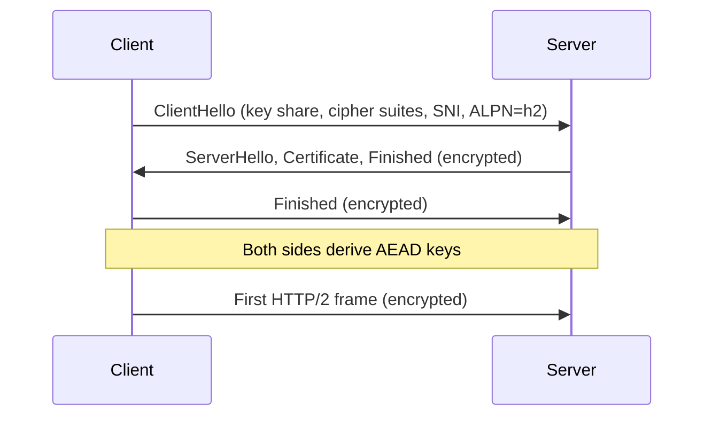
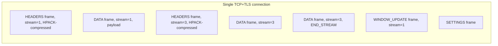
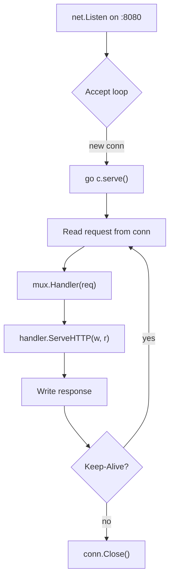
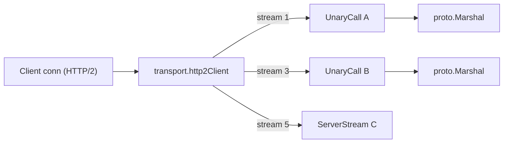
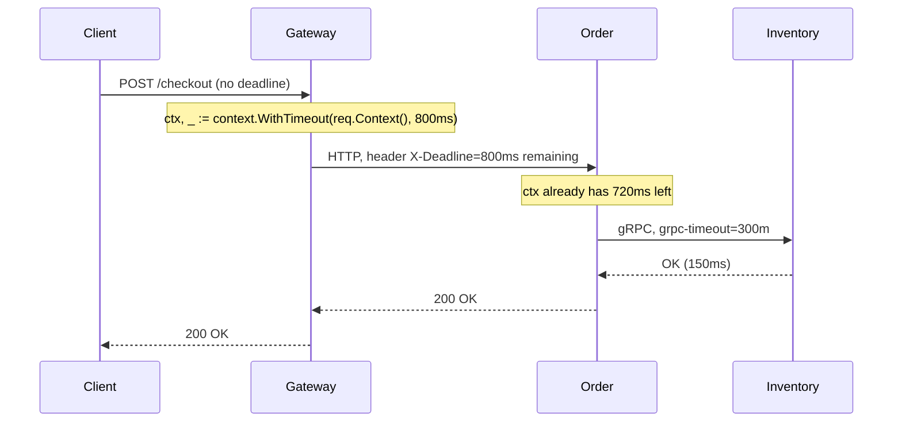
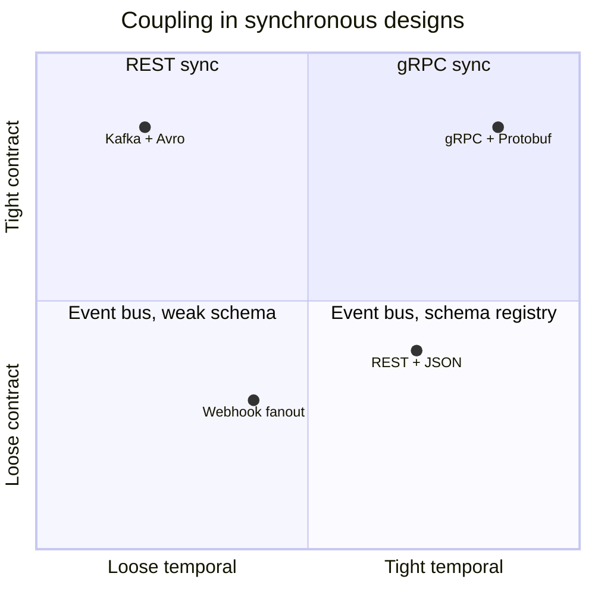

# Week 1 — Synchronous Communication, Deep Intro

[Back to top README](../../README.md)

## TL;DR

- **What you learn:** how one service calls another and waits for the answer, from raw TCP up to gRPC over HTTP/2.
- **Tools:** Go `net/http`, `grpc-go`, Protobuf, an API gateway.
- **Mental model:** every sync call adds latency, failure surface, and coupling — make timeouts, deadlines, and retries first-class.

---

## Architecture at a glance



Every arrow above is a synchronous, blocking call. The caller's goroutine sits with an open socket until the callee returns or the deadline fires. That single fact drives every Week 1 lesson.

---

## Layer-by-layer view of one call



Each layer adds bytes around your payload. A 200-byte JSON request becomes ~1 KB on the wire after TLS, HTTP/2 framing, IP, and Ethernet headers. That overhead is fixed per call — which is why chatty services with tiny payloads burn CPU and bandwidth disproportionately.

---

## Protocol / byte level

### TCP 3-way handshake



- Connection setup costs **1 RTT** before any HTTP byte moves. Across data centers this can be 30–80 ms wasted per cold connection — which is why HTTP keep-alive and gRPC long-lived connections matter so much.
- TCP guarantees in-order, reliable bytes. It does **not** guarantee message boundaries — that is the application's job.

### TLS 1.3 handshake (1-RTT)



- TLS 1.3 collapses the old 2-RTT handshake into 1 RTT. With session resumption it can become 0-RTT (early data).
- ALPN negotiates the next protocol inside the handshake — `h2` for HTTP/2, `http/1.1` for legacy. This is how a single port 443 serves both gRPC and REST.
- After the handshake, every record is `header(5B) | encrypted_payload | auth_tag`. The application sees a clean byte stream; the kernel and userspace TLS library handle framing.

### HTTP/1.1 vs HTTP/2 framing

HTTP/1.1 is text and one request per connection at a time (head-of-line blocking unless you open many sockets):

```text
GET /orders/42 HTTP/1.1\r\n
Host: order.svc\r\n
Authorization: Bearer ...\r\n
\r\n
```

HTTP/2 is binary frames over a single TCP connection, multiplexed by stream ID:



Each frame is `length(24b) | type(8b) | flags(8b) | R(1b) | streamID(31b) | payload`. Streams interleave on the same socket, so one slow response no longer blocks the next request. HPACK keeps a shared header table on both ends so repeated headers compress to a few bytes per request.

### gRPC on top of HTTP/2

A gRPC call is just an HTTP/2 request with a strict shape:

```text
:method = POST
:scheme = https
:path   = /inventory.InventoryService/Reserve
:authority = inventory:50051
content-type = application/grpc+proto
te = trailers
grpc-timeout = 250m
```

The body is a stream of length-prefixed messages:

```text
| 1 byte: compressed flag | 4 bytes: big-endian length | N bytes: Protobuf payload |
| 0x00                     | 0x00 0x00 0x00 0x12       | <18 bytes of protobuf>    |
```

The response ends with **trailers-only** for status:

```text
grpc-status: 0
grpc-message: OK
```

Non-zero `grpc-status` (e.g. `4` DeadlineExceeded, `14` Unavailable) is how the server signals a typed error without breaking the HTTP/2 contract.

### Protobuf wire format

Each field on the wire is `tag | value`, where `tag = (field_number << 3) | wire_type`.

| wire_type | meaning            | encoding                          |
|-----------|--------------------|-----------------------------------|
| 0         | varint             | int32, int64, bool, enum          |
| 1         | 64-bit fixed       | fixed64, double                   |
| 2         | length-delimited   | string, bytes, sub-message, repeated packed |
| 5         | 32-bit fixed       | fixed32, float                    |

A message like:

```proto
message Item { int32 id = 1; string sku = 2; }
```

with `id=300, sku="ABC"` encodes to:

```text
08 AC 02       // field 1 (id), varint, value 300
12 03 41 42 43 // field 2 (sku), len=3, "ABC"
```

This is why Protobuf is small and fast: integers are variable-length, field names are never on the wire (only numbers), and unknown fields are skipped — giving forward/backward compatibility for free as long as you never reuse a field number.

---

## System internals

### Go `net/http` server loop



- One goroutine per connection. With HTTP/2, that goroutine demultiplexes streams into per-stream goroutines — so a single client can have many concurrent in-flight requests on one socket.
- `http.Request.Context()` is **canceled** when the client disconnects. Always pass it down to DB calls and outbound HTTP/gRPC calls so work stops when nobody is listening.

### `grpc-go` stream multiplexing



- A single `*grpc.ClientConn` is safe for concurrent use and multiplexes thousands of RPCs over one socket.
- Server-side, each RPC handler runs in its own goroutine. Backpressure comes from HTTP/2 flow control (`WINDOW_UPDATE`) plus the OS socket buffer.

### Context and deadline propagation



- gRPC encodes the remaining deadline in the `grpc-timeout` header on every hop. Each callee sees a strictly smaller budget than its caller — this is what stops runaway request trees.
- For HTTP, deadlines are **not** standardized; you propagate them yourself (e.g. `X-Request-Deadline` or just per-hop timeouts).

---

## Mental models

### Tail latency amplification

If one downstream call has p99 = 100 ms and your handler fans out to **N** independent calls in parallel and waits for all, the response tail is roughly `1 - (1 - 0.01)^N`:

| N parallel calls | Probability at least one is in p99 tail |
|------------------|-----------------------------------------|
| 1                | 1%                                      |
| 5                | ~5%                                     |
| 20               | ~18%                                    |
| 100              | ~63%                                    |

The fix: hedged requests, tighter per-call timeouts, fewer fan-outs, or async/event-driven where possible.

### Coupling axes



Sync calls force you up and to the right: caller and callee must be alive at the same time, and they must agree on the schema right now.

### Timeouts, retries, idempotency — a triangle

- **No timeout** = your service hangs when the callee hangs.
- **Timeout + retry without idempotency** = duplicate side effects on the callee.
- **Idempotency keys + bounded retries + circuit breaker** = the safe combination. (Circuit breakers are Week 4.)

---

## Failure modes

- **Connection refused / TCP RST** — callee process down → retry with backoff, then fail fast.
- **TLS handshake error** — expired cert, wrong SNI, ALPN mismatch → alert ops, do not retry blindly.
- **HTTP 502 / 503 / 504 from gateway** — upstream timeout or restart → retry idempotent calls only.
- **gRPC `UNAVAILABLE` (14)** — transient, safe to retry; `DEADLINE_EXCEEDED` (4) — your budget ran out, do not retry on the same path.
- **Slow callee, no timeout** — your goroutines and sockets pile up → file descriptor exhaustion, then total outage. The classic cascading failure.

---

## Day-by-day links

- [Day 1 — The Microservices Paradigm & The 8 Fallacies](day1-microservices_paradigm.md)
- [Day 2 — Sync vs. Async trade-offs](day2-sync_vs_async.md)
- [Day 3 — RESTful HTTP](day3-RESTful.md)
- [Day 4 — RPC & gRPC: why binary over HTTP/2](day4-RPC_and_gRPC.md)
- [Day 5 — Implementing gRPC in Go](day5-implementing_gRPC.md)
- [Day 6 — API Gateways](day6-api_gateway.md)
- [Day 7 — Project: Gateway → Order → Inventory](day7-consolidation_project.md)
