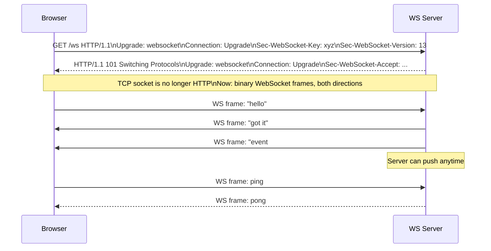
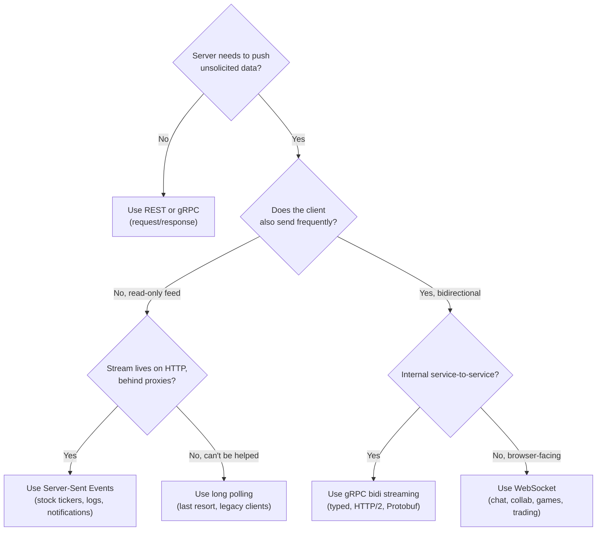

### **Bonus 1: WebSocket Fundamentals — The Persistent Connection**

This is a Week 1 bonus. HTTP, gRPC, and REST are all **request-driven** — the client asks, the server answers. But what if the **server** is the one with something to say? "Your Uber arrived." "New message from Alice." "The price of BTC just moved." You can't poll forever, and you can't pretend a request/response protocol is bidirectional.

Enter **WebSocket** — a long-lived, full-duplex TCP connection between client and server, negotiated via an HTTP handshake, over which either side can send a frame at any time.

---

#### **1. The HTTP Upgrade Handshake**

A WebSocket connection **starts as an HTTP request**. The client sends a normal `GET` with a few magic headers. If the server agrees, the same TCP socket is "upgraded" and stops being HTTP.

The `101 Switching Protocols` response is the pivot point. Every byte after that is a **WebSocket frame**, not HTTP. Frames have a tiny 2-14 byte header (opcode, length, masking key) and then your payload. That's it — no HTTP verbs, no URL paths, no status codes.

---

#### **2. What Problem Does It Actually Solve?**

The fundamental mismatch: HTTP assumes **the client initiates every interaction**. If the server has news, the client must ask first.

The naive workarounds all have pain:

- **Short polling** (`setInterval(fetch, 3000)`): thousands of wasted requests; stale up to the poll interval.
- **Long polling**: client opens a request, server holds it until it has something, responds, client reopens. Works but doubles TCP/TLS handshakes under load, and "half-open" connections are hell to detect.
- **Server-Sent Events (SSE)**: server-to-client stream over HTTP. Elegant, but one-way only.
- **HTTP/2 server push**: deprecated by Chrome; never intended for app messages anyway.

WebSocket solves it cleanly: **one TCP connection, both directions, indefinitely**.

---

#### **3. When to Pick WebSocket vs Its Cousins**

Rules of thumb used in industry:

| Case | Best fit | Why |
|---|---|---|
| Chat, collaboration, multiplayer | WebSocket | Bidirectional, low latency, browser-native |
| Live dashboards, notifications, logs | SSE | Simpler, auto-reconnect built in, goes through every HTTP proxy |
| Internal microservice streams | gRPC streaming | Typed, efficient, HTTP/2 multiplexing |
| One-off commands from client | REST/gRPC unary | No persistent connection needed |
| File upload progress to browser | WebSocket or SSE | Browser can't open bidi gRPC streams |

Notice: **gRPC streaming and WebSocket overlap technically** but live in different worlds. gRPC runs over HTTP/2 with Protobuf — beautiful for service mesh. WebSocket runs over HTTP/1.1 upgrade with whatever payload you want (JSON, MsgPack, Protobuf, binary) — universal in browsers.

---

#### **4. What WebSocket Does NOT Give You**

WebSocket is a **transport**, not a messaging system. It does not give you:

- **Message durability** — if the client is offline, the message is lost unless you save it elsewhere first.
- **Reliable delivery across reconnects** — when the TCP socket drops, messages sent during the gap are gone unless your app layer replays them.
- **Pub/sub fanout** — if you have 5 WS server instances, a publisher on one does not automatically reach subscribers on the others. This is the single biggest architectural problem of WebSocket at scale — and it is exactly why WS is almost always paired with **Redis Pub/Sub** or **Kafka**. Covered in Bonus 3.
- **Ordering across servers** — two messages sent to two different WS servers can arrive in any order. Order guarantees exist only within a single connection.

Treat WebSocket like a `net.Conn` with frame boundaries — that's all it is.

---

#### **5. Security: WSS and Auth on the Upgrade**

- **`ws://` is plaintext**, **`wss://` is TLS**. In production, always WSS — browsers block mixed content anyway.
- **Authentication happens on the `GET /ws` upgrade request**, because cookies, `Authorization` headers, and JWTs travel on the initial HTTP request. Once upgraded, there is no more HTTP — you can't "send a bearer token" with each frame the way you might with REST.
- Common pattern: `wss://api.example.com/ws?token=<JWT>` or `Sec-WebSocket-Protocol: Bearer.<JWT>`. The server validates during handshake and rejects with `401` before `101 Switching Protocols`.

---

### **Actionable Task**

Open your browser DevTools → Network tab → filter "WS". Go to any site that uses live updates (Discord, Slack web, a crypto exchange). Find the WebSocket connection, look at the Messages tab, and watch frames flow in both directions.

Then open the Request Headers for that WebSocket. Find:
- `Connection: Upgrade`
- `Upgrade: websocket`
- `Sec-WebSocket-Key` (base64, random per connection)
- `Sec-WebSocket-Protocol` (app-level subprotocol)

You've just watched the handshake you read about.

---

### **Bonus 1 Revision Question**

Your product manager says: "Let's build a stock price dashboard. Users just watch prices update live — they don't send anything back. Use WebSocket!"

**Is WebSocket the right choice here, or is there a better one? Justify.**

**Answer:** **SSE (Server-Sent Events) is a better fit.** The requirement is strictly one-way (server → client), and SSE gives you: auto-reconnect in the browser with zero code, works through every HTTP proxy/firewall/CDN (it looks like a normal long-lived HTTP response), and is trivially cacheable. WebSocket pays for bidirectional capability with more complexity (ping/pong keepalives, reconnection logic, proxy incompatibilities) that you will never use here.

Use WebSocket when the **client also sends frequently** — chat, collab, games, placing trades. Use SSE for pure fanout feeds. The right tool matches the shape of the data flow, not the hype.
