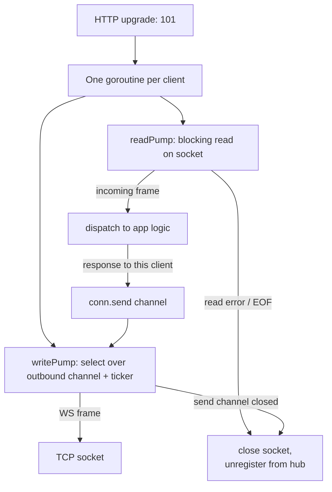

### **Bonus 2: WebSocket in Go — Connections, Hubs, and the Mental Model**

Bonus 1 gave you the handshake and the decision tree. Today you actually hold a WebSocket connection in your hand and feel how it behaves.

The critical mental model: **a WebSocket connection is a long-lived goroutine that owns a TCP socket**. Unlike an HTTP handler that runs for 50 ms and returns, a WS handler can run for 6 hours. Every design decision (authentication, memory, scaling, graceful shutdown) flows from that one fact.

---

#### **1. The Mental Model: Connection-as-Goroutine**

In a typical HTTP server:

```text
request → handler runs → response → handler returns → goroutine ends
```

In a WebSocket server:

```text
upgrade → handler runs → keeps running → reads forever → writes forever → ... → client disconnects → cleanup → handler returns
```



Two goroutines per connection is the standard pattern (`gorilla/websocket` and `nhooyr.io/websocket` both encourage this):

- **`readPump`** — blocks on `conn.ReadMessage()`. When a frame arrives, dispatches it.
- **`writePump`** — selects over an outbound `chan []byte` and a ping ticker. Anything that wants to push to this client drops a message on that channel.

This separation matters because **`conn.WriteMessage` is not safe for concurrent callers**. Funneling all writes through one goroutine (via a channel) is how you keep it safe.

---

#### **2. Minimal Go Server with `gorilla/websocket`**

```go
package main

import (
    "log"
    "net/http"
    "time"

    "github.com/gorilla/websocket"
)

var upgrader = websocket.Upgrader{
    ReadBufferSize:  1024,
    WriteBufferSize: 1024,
    CheckOrigin:     func(r *http.Request) bool { return true },
}

const (
    writeWait  = 10 * time.Second
    pongWait   = 60 * time.Second
    pingPeriod = (pongWait * 9) / 10
    maxMessage = 1 << 20
)

type Client struct {
    conn *websocket.Conn
    send chan []byte
    hub  *Hub
    id   string
}

func (c *Client) readPump() {
    defer func() {
        c.hub.unregister <- c
        c.conn.Close()
    }()
    c.conn.SetReadLimit(maxMessage)
    c.conn.SetReadDeadline(time.Now().Add(pongWait))
    c.conn.SetPongHandler(func(string) error {
        c.conn.SetReadDeadline(time.Now().Add(pongWait))
        return nil
    })
    for {
        _, msg, err := c.conn.ReadMessage()
        if err != nil {
            return
        }
        c.hub.broadcast <- msg
    }
}

func (c *Client) writePump() {
    ticker := time.NewTicker(pingPeriod)
    defer func() {
        ticker.Stop()
        c.conn.Close()
    }()
    for {
        select {
        case msg, ok := <-c.send:
            c.conn.SetWriteDeadline(time.Now().Add(writeWait))
            if !ok {
                c.conn.WriteMessage(websocket.CloseMessage, nil)
                return
            }
            if err := c.conn.WriteMessage(websocket.TextMessage, msg); err != nil {
                return
            }
        case <-ticker.C:
            c.conn.SetWriteDeadline(time.Now().Add(writeWait))
            if err := c.conn.WriteMessage(websocket.PingMessage, nil); err != nil {
                return
            }
        }
    }
}

func serveWS(hub *Hub, w http.ResponseWriter, r *http.Request) {
    userID, ok := authenticate(r)
    if !ok {
        http.Error(w, "unauthorized", http.StatusUnauthorized)
        return
    }

    conn, err := upgrader.Upgrade(w, r, nil)
    if err != nil {
        log.Println("upgrade:", err)
        return
    }

    c := &Client{conn: conn, send: make(chan []byte, 256), hub: hub, id: userID}
    hub.register <- c

    go c.writePump()
    go c.readPump()
}
```

Notice: **authentication happens BEFORE `upgrader.Upgrade`**. Once you call Upgrade, you have passed the point of no return — any `http.Error` after that is invalid because the protocol has already switched.

---

#### **3. The Hub: a Registry of Connected Clients**

The hub is the in-memory map of "who is connected right now on this server."

```go
type Hub struct {
    clients    map[string]*Client
    register   chan *Client
    unregister chan *Client
    broadcast  chan []byte
}

func NewHub() *Hub {
    return &Hub{
        clients:    make(map[string]*Client),
        register:   make(chan *Client),
        unregister: make(chan *Client),
        broadcast:  make(chan []byte, 1024),
    }
}

func (h *Hub) Run() {
    for {
        select {
        case c := <-h.register:
            h.clients[c.id] = c
        case c := <-h.unregister:
            if _, ok := h.clients[c.id]; ok {
                delete(h.clients, c.id)
                close(c.send)
            }
        case msg := <-h.broadcast:
            for _, c := range h.clients {
                select {
                case c.send <- msg:
                default:
                    close(c.send)
                    delete(h.clients, c.id)
                }
            }
        }
    }
}
```

Pay attention to the `default` branch in broadcast: if a client's `send` channel is full, **we hang up on them rather than blocking the hub**. One slow consumer must not freeze every other client. This is your first taste of **backpressure on long-lived connections** — covered more in Bonus 3.

---

#### **4. Authentication During the Upgrade**

Because frames carry no HTTP headers, you must bind the user identity at handshake time and remember it for the life of the connection:

```go
func authenticate(r *http.Request) (string, bool) {
    token := r.URL.Query().Get("token")
    if token == "" {
        token = r.Header.Get("Sec-WebSocket-Protocol")
    }
    claims, err := parseJWT(token)
    if err != nil {
        return "", false
    }
    if claims.IsBanned {
        return "", false
    }
    return claims.UserID, true
}
```

Subtleties:

- Browsers cannot set arbitrary headers on a WebSocket request from JavaScript, which is why `?token=` in the URL is so common. This is fine **over WSS** because TLS encrypts the URL in transit. It does show up in server access logs though — use short-lived tokens.
- Alternative: first hit a normal `POST /ws-ticket` endpoint to get a one-time token, then `wss://api/ws?ticket=...`. The ticket is single-use, rotating, expires in 30 seconds. This avoids leaking the long-lived JWT.

---

#### **5. Ping/Pong Keepalives and Why They Matter**

A TCP socket does not know the other end is dead until it tries to send something. A NAT or load balancer in the middle can silently drop an idle connection after 60-120 seconds and neither side will notice.

The WebSocket protocol defines **`ping` (opcode 0x9)** and **`pong` (opcode 0xA)** frames precisely for this.

- Server sends `ping` every ~54 seconds.
- Client's WebSocket implementation (browser, library) responds with `pong` automatically.
- If server doesn't see a pong within `pongWait` (60s), the read loop hits a deadline error and tears down the connection.

This is how you detect "half-open" connections — where the TCP socket is technically alive but the peer is gone.

---

#### **6. What the Client Looks Like**

Browser side is shockingly simple:

```javascript
const ws = new WebSocket("wss://api.example.com/ws?token=" + jwt);

ws.onopen    = () => console.log("connected");
ws.onmessage = (ev) => render(JSON.parse(ev.data));
ws.onerror   = (e)  => console.error(e);
ws.onclose   = ()   => reconnectLater();

function send(obj) {
    if (ws.readyState === WebSocket.OPEN) {
        ws.send(JSON.stringify(obj));
    }
}
```

All the production pain lives in `reconnectLater()` — exponential backoff, jitter, resume from last-seen-offset, and UI state that doesn't lie about being "online."

---

### **Actionable Task**

Build a 2-file chat server:

1. `main.go` — serves `/ws` and a static `index.html`. On each incoming frame, broadcasts to all connected clients.
2. `index.html` — a `<textarea>` + a send button, wires up the `WebSocket` JS API.

Run it. Open **two browser tabs**. Type in one, watch it appear in the other.

Then, in a third tab, use `curl` to hit `/ws` without the upgrade headers. Observe that the server refuses. You've just confirmed that the upgrade is the only doorway in.

For bonus difficulty: kill the server while the clients are connected. Watch both tabs' `onclose` fire. Now implement reconnect with backoff and see how "live" feels different from "connected."

---

### **Bonus 2 Revision Question**

Your server has 10,000 WebSocket clients connected. One of them is on a terrible mobile connection and its OS socket buffer is full. You call `conn.WriteMessage(...)` on it from the hub. What happens, and what is the fix?

**Answer:**

Without care, `WriteMessage` will **block the hub's goroutine** waiting for the socket buffer to drain. The hub processes register / unregister / broadcast serially, so **every other client stops receiving messages** while we wait for this one slow client — a global outage caused by a single flaky phone.

The fix is exactly the pattern shown above: **per-client bounded `send chan []byte` channels**, and the hub does a non-blocking send (`select { case c.send <- msg: default: ... }`). If a client can't drain fast enough, we hang up on *that* client. The hub never blocks on any single peer.

This is the cardinal rule of long-lived connections: **the slowest client must never slow the fastest one**. It's the same principle as head-of-line blocking — just with 10,000 lines instead of 2.
