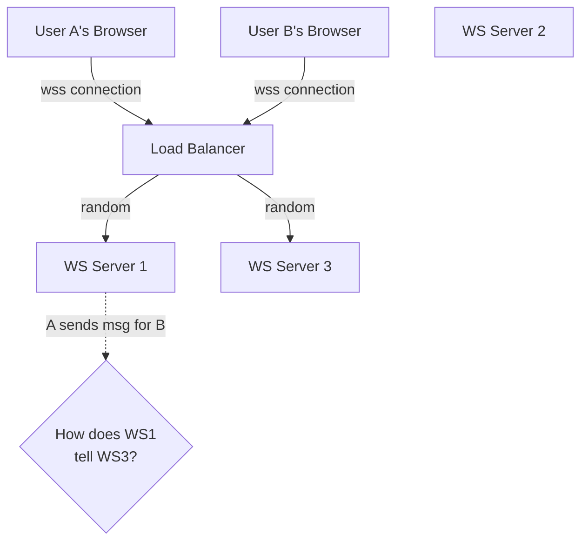
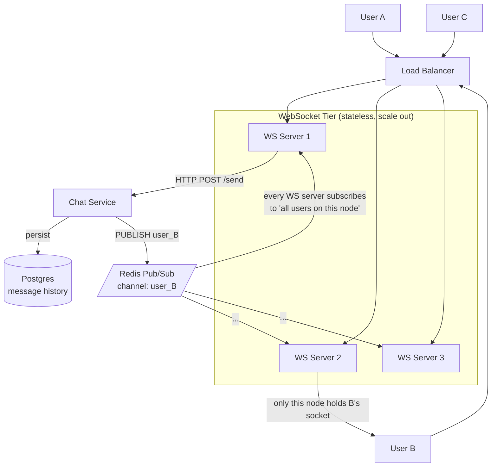
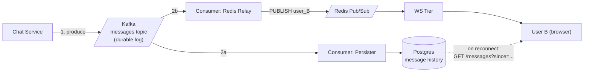
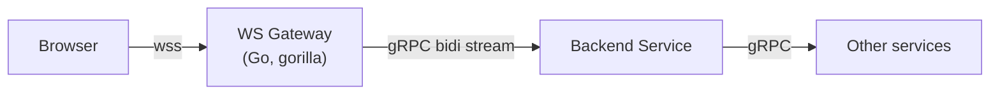
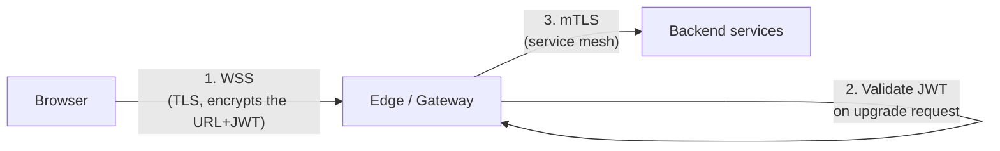
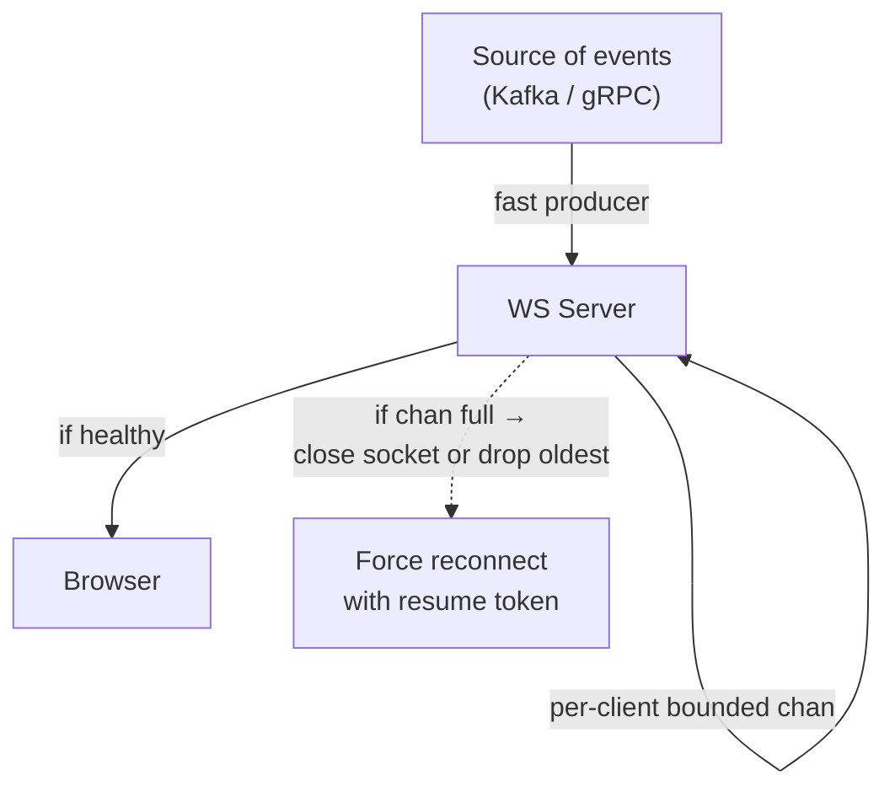
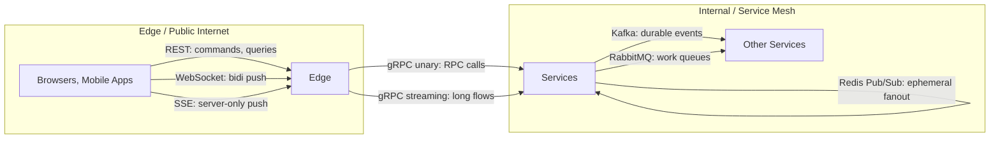

### **Bonus 3: WebSocket Architecture Patterns — How It Plugs Into Everything Else**

This is the most important file in the WS bonus. Bonus 1 was "what is it," Bonus 2 was "how do you write one." This is **how does WebSocket actually live in a distributed system next to HTTP, gRPC, Kafka, RabbitMQ, Redis, load balancers, gateways, and auth layers**.

The short answer: **WebSocket is a delivery channel, not a system.** It almost never appears alone. It is always the last 10 meters between your backend and the user's browser — and the 10 kilometers behind it are where the real architecture lives.

---

#### **1. The Fundamental Scaling Problem**

Run one WebSocket server: easy. Run five: suddenly you have a problem.



User A is connected to WS1. User B is connected to WS3. A sends a message to B. WS1 has A's socket. WS3 has B's socket. They are **different processes, different machines, different in-memory hubs** — they cannot see each other's clients.

There are exactly two architectural answers:

1. **Sticky sessions** — force both A and B to land on the same WS server (rarely useful, only for single-room apps).
2. **A shared fanout layer behind the WS servers** — Redis Pub/Sub, Kafka, or a message bus that every WS server subscribes to.

Option 2 is the real answer. It's what every real chat / collaboration / gaming backend does.

---

#### **2. The Canonical Pattern: Redis Pub/Sub Fanout**



The flow:

1. User A's browser sends a message. The WS server turns it into a normal HTTP call to the Chat Service (or queues it, or both).
2. Chat Service persists the message to Postgres (so history survives).
3. Chat Service **publishes to Redis** on a channel keyed by recipient (e.g. `user:B`).
4. **Every WS server subscribes** to the channels for the users currently connected to it. WS2 subscribed to `user:B` when B opened his socket.
5. WS2 hears the Redis message and writes a frame to B's socket. Done.

Key properties:

- **WS servers are now stateless.** They hold sockets but no authoritative state. You can kill one and clients reconnect to another.
- **The fanout is O(subscribers)**, handled by Redis which is a purpose-built reactor. A single Redis can handle millions of messages per second.
- **No sticky sessions required.** Users land wherever the LB puts them.

This is the pattern [Day 18](../Week3-Event_Streaming_and_Advanced_Patterns/day18-Redis_PubSub.md) introduced from the Redis side. Now you see it from the WebSocket side.

---

#### **3. When Redis Pub/Sub Isn't Enough: Kafka → Relay → Redis → WS**

Redis Pub/Sub is **ephemeral**. A message published when no WS server is subscribed is gone. For a chat app, that's a catastrophe: user B was offline for 10 seconds during a failover and loses a message.

The full durable pattern:



- **Kafka is the source of truth.** Every message is there forever (or for retention).
- **One consumer persists to Postgres.** That's your searchable history.
- **Another consumer relays to Redis Pub/Sub for real-time delivery.** If Redis is down or the relay lags, the message is still safe in Kafka.
- **When user B reconnects** (tab was closed, phone was off), the client does `GET /messages?since=<last_seen_offset>` — a normal REST call — to catch up on anything they missed.

You have now separated three concerns that beginners try to do in one place:

| Concern | Handled by |
|---|---|
| Durable storage | Kafka + Postgres |
| Real-time push to online users | Redis Pub/Sub + WebSocket |
| Catch-up on reconnect | REST fallback from Postgres |

This is also a clean example of the **Outbox / Relay** pattern from Week 4 — avoid dual-writes by making Kafka the single source of truth and replaying to all destinations.

---

#### **4. Where Does the Gateway Fit?**

You have three choices and they all show up in real systems.

**Option A — Gateway terminates WebSocket.**

```text
Browser --(wss)--> Gateway --(internal gRPC/HTTP)--> Backend
```

The gateway holds the socket. Every incoming frame becomes an internal RPC. The gateway owns auth, rate limits, and observability.

- Good for: single-tenant systems, heavy auth requirements, small teams.
- Bad for: massive scale — gateway becomes the bottleneck, and gRPC-per-frame is expensive.

**Option B — Gateway passes WebSocket through.**

```text
Browser --(wss)--> Gateway (reverse proxy mode) --> WS Service
```

Gateway does the TLS termination and the initial auth on the upgrade request, then reverse-proxies the raw WS connection to a dedicated WS service tier.

- Good for: most production systems. Separates concerns. WS tier can scale independently.
- Requires: gateway that understands `Upgrade: websocket`. Nginx, Envoy, HAProxy, Kong all do. AWS ALB does natively. AWS API Gateway does in a special WebSocket mode.

**Option C — Direct to WS tier, no gateway.**

```text
Browser --(wss)--> WS Service (on its own subdomain wss.example.com)
```

Common for ultra-high-scale messaging (Discord, Slack do variants of this). The WS tier has its own edge and its own auth.

- Good for: very large scale, latency-sensitive.
- Bad for: unified auth and observability — you need to duplicate those concerns.

---

#### **5. Combining WebSocket with gRPC Streaming**

A subtle but common internal architecture:



The WS Gateway is a thin translator:
- Browser-facing: WebSocket + JSON (because browsers can't do gRPC streaming).
- Internal: gRPC bidirectional streaming (because gRPC is faster and typed between services).

Each WS frame from the browser becomes a message on the gRPC stream, and vice versa. You get the browser reach of WebSocket plus the engineering benefits of gRPC inside the cluster.

This is how the "Admin Dashboard" in the [Day 28 architecture review](../Week4-Resilience_and_Distributed_transactions_and_Security/day28-the_final_architecture_review.md) is wired: WS to the browser, gRPC streaming from the gateway to the Analytics Service.

---

#### **6. Security Layering: WSS + JWT + mTLS**

A hardened WS edge has three security layers:



- **Layer 1 — WSS:** Public client to edge is always TLS. JWT in the query string is safe in transit, but rotate tokens and keep them short-lived.
- **Layer 2 — JWT on upgrade:** Validated once, during the `101`. Identity bound to the socket until close. If the JWT's TTL expires mid-session, you can either (a) kick the client and force reconnect, or (b) let them send a `refresh_token` frame to extend.
- **Layer 3 — mTLS behind the edge:** Once the WS gateway is calling internal services (Kafka producers, Redis, gRPC backends), use mTLS so every hop is encrypted and mutually authenticated. Week 4 Day 27 covers the SPIFFE/SVID mechanics.

Never run `ws://` to production clients. Never skip the upgrade-time auth. Never let the WS gateway call backends over plaintext just because "it's internal."

---

#### **7. Backpressure: the Long-Lived Connection Problem**

Unlike a 50ms HTTP request, a WebSocket connection is an **indefinite commitment**. If the backend produces faster than the client can consume, bytes pile up — in the send buffer, in kernel buffers, in application queues. Eventually something breaks.

The pattern from Bonus 2 (bounded `send` channel, drop the slow client) is the application-level answer. The system-level answer is a small hierarchy:



Two strategies when the client can't keep up:

- **Drop the slow client.** They reconnect with a resume token and catch up from Kafka/Postgres. Simple, safe.
- **Lossy merge.** For stock tickers or positions, coalesce "10 price updates for AAPL" into the latest one — the user only cares about "now." This is called **conflation**.

Never buffer unboundedly. A single slow phone can eat all the RAM of a server otherwise.

---

#### **8. Reconnection and Resume: Making WS Look Reliable**

WebSocket is built on TCP which is built on IP — any of which can drop your connection. The **perceived reliability** of live apps is entirely the client's reconnect logic:

```text
client maintains: lastSeenMessageID
client loop:
  connect → receive messages → update lastSeenMessageID
  on disconnect → wait (exp backoff + jitter) →
    connect with ?resume_from=lastSeenMessageID
  server replays any missed messages (from Kafka offset or Postgres) then goes live
```

A few real-world tips:

- **Exponential backoff with jitter.** Never reconnect immediately — a thundering herd after an outage can keep the servers down forever.
- **Surface connection state to the UI.** Show "Reconnecting..." if disconnected for >1s. Users tolerate outages; they hate lies.
- **Resume tokens cap the server's replay cost.** Limit replay to N messages or M seconds; beyond that, tell the client to do a full refresh.

---

#### **9. The Cheat Sheet: Where Each Protocol Lives**



- **WebSocket lives at the edge.** It is a browser-friendly transport for real-time UX.
- **gRPC lives internally.** It is the typed, fast RPC between services.
- **Kafka / RabbitMQ / Redis live between services.** They provide durability, queueing, and fanout.
- **REST is everywhere**, as the common-case request/response layer.

A real system uses all of them. The skill is knowing which one handles each arrow.

---

### **Actionable Task: Sketch the Architecture**

Pick one of these and draw the full architecture in mermaid on paper:

1. **Trello-like live collab board** — two users editing the same board in real time.
2. **Multiplayer game lobby** — 100 players, see each other join/leave, chat, ready up.
3. **Exchange trading app** — real-time prices + place orders + fills streaming back.

For each one, your diagram must include:

- Browser / app
- Load balancer / gateway (which option A/B/C from §4?)
- WebSocket tier
- Fanout layer (Redis? Kafka? both?)
- Persistent storage
- Reconnect/resume path

Then list the arrows you would use Kafka for vs Redis for vs gRPC for. If you can defend each choice, you have internalized this file.

---

### **Bonus 3 Revision Question**

You run 20 WebSocket servers behind a load balancer. Each holds ~50,000 live client connections. You need any backend service to be able to push a message to a specific user without knowing which WS server currently holds their socket. You also need the system to survive a WS server crashing without losing messages for users who were connected to it.

**Design the fanout layer. What do you use, and how do you handle the crash case?**

**Answer:**

Use **Kafka as the durable source of truth** plus a **Redis Pub/Sub relay** for real-time delivery.

1. When any backend wants to push to user `U`, it produces to Kafka topic `user-events`, keyed by user ID.
2. A Relay Consumer reads Kafka and publishes each message to Redis Pub/Sub on channel `user:U`.
3. Every WS server subscribes to the Redis channels for users currently connected to it. When `user:U` fires, the one WS server holding U's socket writes the frame.
4. The WS servers **also** store each delivered `lastSeenOffset` per user (in Redis or a fast KV).

Crash handling:

- If a WS server dies, its ~50k clients' TCP sockets drop. Clients reconnect to a different WS server (carrying their `lastSeenOffset`).
- Messages published during the gap were **durable in Kafka** — not in Redis.
- On reconnect, the new WS server issues a catch-up request: "give me everything for user U since offset X." This is served by Postgres (if you persisted) or directly from Kafka by reading from offset X on a per-user-partition basis.
- Once caught up, the WS server flips the client to "live" mode and future messages come through Redis.

**Why not Redis alone?** Because Redis Pub/Sub has zero durability. A message published while a WS server was failing over is gone forever. Kafka gives you replayability; Redis gives you fanout speed. Using both is the canonical high-scale pattern.

**Why not Kafka alone?** Because subscribing 20 WS servers × 50k users × partition-per-user is an unusable fanout shape for Kafka. Kafka partitions are for parallelism across ~100s of consumers, not ~millions. Redis Pub/Sub is the right fanout primitive for user-granularity push.

This is also exactly how WhatsApp-style and Discord-style architectures are designed in principle.
