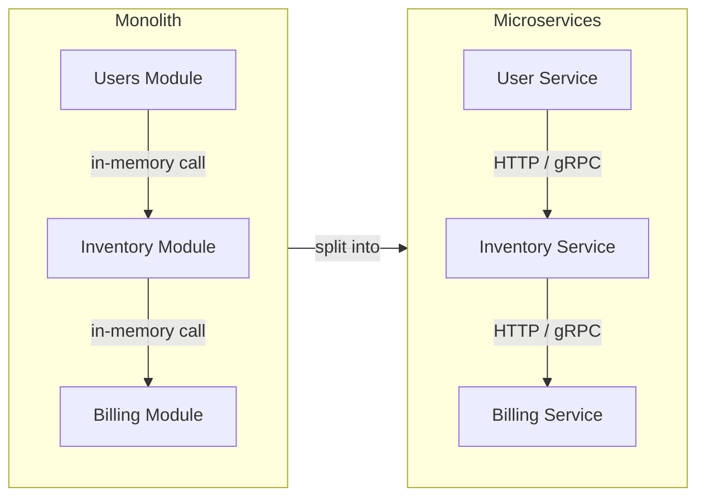

### **Week 1: Fundamentals & Synchronous Communication**

### **Day 1: The Microservices Paradigm & The Hard Truths**

#### **1. Monolith vs. Microservices**

Before services can communicate, you need to understand why they are split apart in the first place.

- **The Monolith:** All business logic (users, inventory, billing) lives in one codebase and runs as a single process. Functions call other functions directly in memory. It is fast and easy to deploy initially, but it becomes a nightmare to scale or update as teams grow.
- **Microservices:** The monolith is split into independent, deployable services organized around business capabilities.
- **The Trade-off:** You are trading _codebase complexity_ for _infrastructure complexity_. Instead of a guaranteed in-memory function call, Service A now reaches out over a network to talk to Service B.

#### **2. The 8 Fallacies of Distributed Computing**

This is the most important concept to internalize. Junior developers often assume the network behaves like a local function call. It doesn't. In 1994, Peter Deutsch at Sun Microsystems listed these 8 false assumptions:

1. **The network is reliable.** _(Cables break, routers crash, AWS goes down.)_
2. **Latency is zero.** _(Sending data across the country takes time.)_
3. **Bandwidth is infinite.** _(You cannot send a 5 GB JSON payload instantly.)_
4. **The network is secure.** _(Assume traffic can be intercepted.)_
5. **Topology doesn't change.** _(Servers spin up and die constantly in Docker/Kubernetes.)_
6. **There is one administrator.** _(Different teams own different services.)_
7. **Transport cost is zero.** _(Data transfer costs money and compute power.)_
8. **The network is homogeneous.** _(Your Python service might talk to a Go service on Linux, receiving data from an iOS app.)_

Every pattern we learn over the next 4 weeks — queues, retries, circuit breakers — exists specifically to solve one of these 8 fallacies.

#### **3. Actionable Task: Environment Setup**

1. **Choose your language:** Install [Go](https://go.dev/doc/install) or [Python](https://www.python.org/downloads/).
2. **Install Docker:** Download [Docker Desktop](https://www.docker.com/products/docker-desktop/). We rely heavily on `docker-compose` to spin up databases, gateways, and message brokers locally.

---

### **Weekly Challenge Teaser**

At the end of Week 1 (Day 7), you will build a locally running 3-tier synchronous architecture using Docker Compose: an API Gateway routing HTTP traffic to an `Order Service` (Go), which synchronously calls an `Inventory Service` via gRPC before confirming the order.

---

### **Day 1 Revision Question**

Imagine you have an e-commerce monolith that you just split into a `Checkout Service` and a `Payment Service`. They now communicate over HTTP.

**Based on the 8 Fallacies, name two specific things that could go wrong when the `Checkout Service` asks the `Payment Service` to process a credit card — things that would never have happened inside the monolith.**

**Answer:**

1. **Network failure** _(Fallacy 1: The network is reliable)._ In a monolith, if the checkout code calls the payment code, it works unless the whole server is dead. In microservices, a router could glitch, DNS could fail, or the Payment Service container might be restarting — causing the HTTP request to drop into a black hole.
2. **Latency causing cascading timeouts** _(Fallacy 2: Latency is zero)._ If the Payment Service takes 5 seconds to process a card, the Checkout Service hangs for those 5 seconds. If thousands of users do this simultaneously, the Checkout Service runs out of memory waiting for replies.
