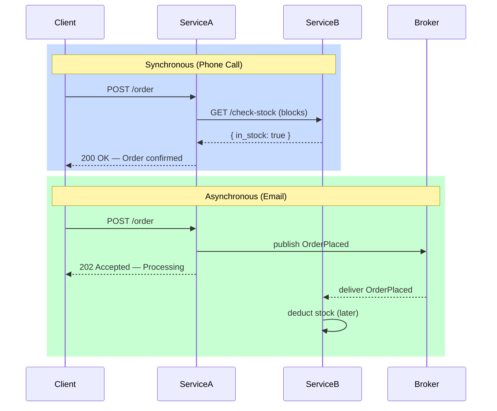

### **Day 2: Sync vs. Async Overview**

Today is about understanding the two fundamental communication styles. You don't need to write code yet — you need to understand the architectural trade-offs so you know _which_ code to write tomorrow.

#### **1. Synchronous Communication (Request/Response)**

Think of this like a **phone call**. You ask a question and wait on the line until you get an answer.

- **How it works:** Service A sends a request (HTTP/REST or gRPC) to Service B and _blocks_ until Service B responds.
- **The Good:** Conceptually simple. You know immediately whether the action succeeded or failed.
- **The Bad:** It creates **temporal coupling**. Both services must be alive and healthy at the same time. If Service B is slow, Service A becomes slow — a cascading failure.
- **When to use it:** When you absolutely must have an immediate answer before proceeding (e.g., verifying a password during login).

#### **2. Asynchronous Communication (Event-Driven / Message Passing)**

Think of this like an **email**. You send it, go about your day, and the receiver handles it when ready.

- **How it works:** Service A drops a message into a middleman (a Message Broker like RabbitMQ or Kafka) and immediately moves on. Service B picks it up at its own pace.
- **The Good:** Total decoupling. If Service B goes down for 10 minutes, Service A keeps accepting traffic and dropping messages into the queue. When Service B comes back, it processes the backlog.
- **The Bad:** It introduces **eventual consistency**. Service A has no immediate confirmation that Service B processed the task. Error handling becomes more complex.
- **When to use it:** Background tasks, notifications, or long-running processes (e.g., generating a PDF, sending an email, resizing an image).

---

### **Actionable Task: Mental Mapping**

Map out a **User Registration Flow** using both paradigms.

1. **Sync Approach:** `Gateway → User Service → Email Service → respond to user`. What happens if the Email Service is down?
2. **Async Approach:** `Gateway → User Service → save user + publish "UserCreated" → respond instantly`. The Email Service reads the queue and sends the email independently.

---

### **Day 2 Revision Question**

When a user clicks "Place Order," two things must happen:

1. Charge their credit card via a third-party banking API.
2. Update the inventory system to deduct the purchased items.

**Which step should be Synchronous, and which should be Asynchronous? Why?**

**Answer:**

1. **Payment → Synchronous.** You need to know right then whether the card is valid and has funds before the user leaves the checkout screen. (Capturing the funds can be async, but the authorization should be sync.)
2. **Inventory → Asynchronous.** A queue is the best way to prevent race conditions. If 1,000 people try to buy the last 5 items at the exact same millisecond, the queue lines up those requests one by one so you don't accidentally oversell — exactly how Amazon handles this.
