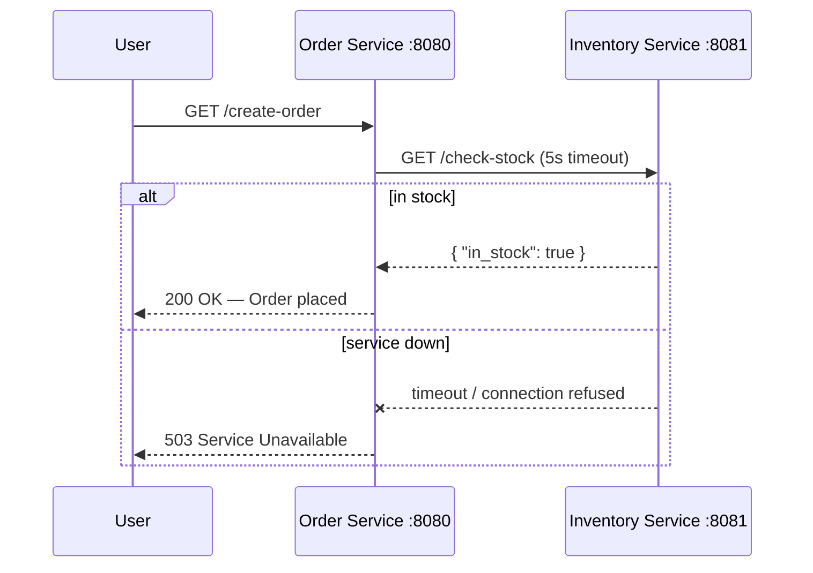

### **Day 3: RESTful Communication (Writing the Code)**

Today we build a synchronous HTTP interaction. We will create two Go microservices connected via Docker Compose.

Service A (`Order Service`) receives a user request and synchronously calls Service B (`Inventory Service`) via HTTP/REST to ask: "Do we have this in stock?"



#### **1. The Project Structure**

```text
day3-sync/
├── docker-compose.yml
├── inventory/
│   ├── Dockerfile
│   ├── go.mod
│   └── main.go
└── order/
    ├── Dockerfile
    ├── go.mod
    └── main.go
```

#### **2. The Inventory Service (Service B)**

In `inventory/go.mod`:

```go
module inventory
go 1.21
```

In `inventory/main.go`:

```go
package main

import (
	"encoding/json"
	"log"
	"net/http"
)

func checkStockHandler(w http.ResponseWriter, r *http.Request) {
	log.Println("Received stock check request...")
	w.Header().Set("Content-Type", "application/json")
	json.NewEncoder(w).Encode(map[string]bool{"in_stock": true})
}

func main() {
	http.HandleFunc("/check-stock", checkStockHandler)
	log.Println("Inventory Service running on port 8081")
	log.Fatal(http.ListenAndServe(":8081", nil))
}
```

In `inventory/Dockerfile`:

```dockerfile
FROM golang:1.21-alpine
WORKDIR /app
COPY . .
RUN go build -o main .
CMD ["./main"]
```

#### **3. The Order Service (Service A)**

In `order/go.mod`:

```go
module order
go 1.21
```

In `order/main.go`:

```go
package main

import (
	"encoding/json"
	"fmt"
	"log"
	"net/http"
	"time"
)

type StockResponse struct {
	InStock bool `json:"in_stock"`
}

func createOrderHandler(w http.ResponseWriter, r *http.Request) {
	log.Println("Starting order creation process...")

	// Notice the URL uses "inventory" — Docker resolves this to the other container
	client := http.Client{Timeout: 5 * time.Second}
	resp, err := client.Get("http://inventory:8081/check-stock")

	if err != nil {
		http.Error(w, "Failed to reach Inventory Service: "+err.Error(), http.StatusServiceUnavailable)
		return
	}
	defer resp.Body.Close()

	var stockResp StockResponse
	json.NewDecoder(resp.Body).Decode(&stockResp)

	if stockResp.InStock {
		w.Write([]byte("Success! Order placed for 1x Millennium Falcon Lego Set.\n"))
	} else {
		w.Write([]byte("Failed: Item out of stock.\n"))
	}
}

func main() {
	http.HandleFunc("/create-order", createOrderHandler)
	log.Println("Order Service running on port 8080")
	log.Fatal(http.ListenAndServe(":8080", nil))
}
```

In `order/Dockerfile`:

```dockerfile
FROM golang:1.21-alpine
WORKDIR /app
COPY . .
RUN go build -o main .
CMD ["./main"]
```

#### **4. The Docker Compose Glue**

```yaml
version: "3.8"
services:
  inventory:
    build: ./inventory
    ports:
      - "8081:8081"

  order:
    build: ./order
    ports:
      - "8080:8080"
    depends_on:
      - inventory
```

---

### **Actionable Task for Today**

1. Open your terminal in the `day3-sync` folder.
2. Run: `docker-compose up --build`
3. Go to: `http://localhost:8080/create-order`
4. Watch the logs — you'll see the Order Service reach out over the Docker network to the Inventory Service, receive the JSON, and send the final response back to you.

---

### **Day 3 Revision Question**

While `docker-compose` is running, open a new terminal and run `docker-compose pause inventory` to simulate the Inventory Service crashing.

**Hit `http://localhost:8080/create-order` again. What happens, and how does this demonstrate the core flaw of synchronous communication?**

**Output:** `Failed to reach Inventory Service: context deadline exceeded (Client.Timeout exceeded while awaiting headers)`

**Explanation:** Because the Order Service actively waits for a response, if the Inventory Service is down or paused, the entire operation fails with "Service Unavailable." This is the essence of **Temporal Coupling** — both services must be alive, healthy, and fast at the exact same moment.

If your system has 5 services calling each other synchronously, each with 99% uptime, your overall system availability drops to approximately 95% (0.99⁵).

But for things like checking inventory during checkout, we are often _forced_ to be synchronous — which raises the question: if we must be synchronous, how do we make it faster and more efficient than HTTP/REST?
