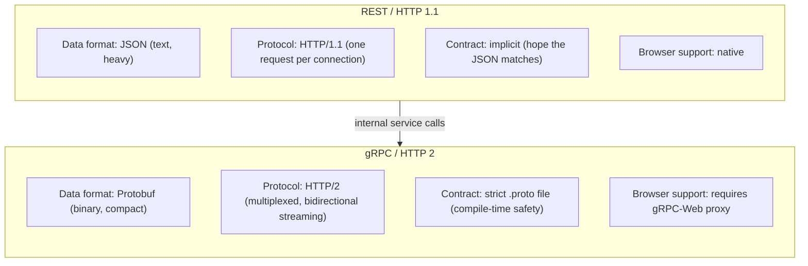
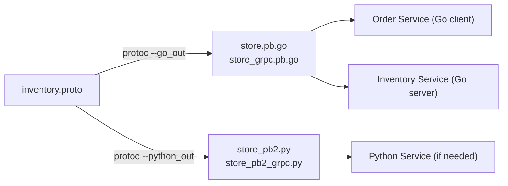

### **Day 4: RPC & gRPC Fundamentals**

Today we move away from standard REST (JSON over HTTP/1.1) and look at the industry standard for fast internal microservice communication: **gRPC**.

#### **1. What is RPC? (Remote Procedure Call)**

In a REST API, you think in terms of **resources** (e.g., `GET /inventory/123`).
In RPC, you think in terms of **actions**. The goal is to make a network call look and feel exactly like calling a local function — `checkStock(item_id)`.

#### **2. Why gRPC over REST?**

gRPC was developed by Google and has become the standard for service-to-service communication.



- **Protocol Buffers (Protobuf):** JSON is text-based and requires CPU time to parse. Protobuf serializes data into a highly compressed binary format — smaller on the wire and dramatically faster to serialize/deserialize.
- **HTTP/2:** REST generally uses HTTP/1.1, which handles one request at a time per TCP connection. HTTP/2 allows multiplexing (hundreds of requests simultaneously over one connection) and bidirectional streaming.
- **Strict Contracts:** In REST, you hope the other service sends the JSON structure you expect. In gRPC, both sides generate code from the exact same `.proto` file. If the contract changes, the code won't compile — catching bugs at build time instead of runtime.

#### **3. The Protobuf Contract (`.proto`)**

This is the heart of gRPC. Write it once; generate Go, Python, Java, or any other language from it.



```protobuf
// inventory.proto
syntax = "proto3";

option go_package = "./pb";

message StockRequest {
  string item_id = 1;
}

message StockResponse {
  bool in_stock = 1;
}

service InventoryService {
  rpc CheckStock (StockRequest) returns (StockResponse);
}
```

> The `= 1` is not a value — it is a unique field tag used by the binary compression algorithm.

---

### **Actionable Task for Today**

Get your machine ready to compile `.proto` files into Go code.

1. **Install the Protobuf compiler (`protoc`):**
   - Mac: `brew install protobuf`
   - Linux: `sudo apt install -y protobuf-compiler`
   - Windows: Download from [github.com/protocolbuffers/protobuf/releases](https://github.com/protocolbuffers/protobuf/releases), extract, add to PATH.

2. **Install the Go plugins:**
   ```bash
   go install google.golang.org/protobuf/cmd/protoc-gen-go@latest
   go install google.golang.org/grpc/cmd/protoc-gen-go-grpc@latest
   ```

3. Create `inventory.proto` in a new `day4-grpc` folder and paste the contract from above.

---

### **Day 4 Revision Question**

If gRPC is so much faster, uses less bandwidth, and enforces type safety, why don't we use it for _everything_? Why does your browser still use HTTP/REST instead of gRPC?

**Answer:** It comes down to how JavaScript works inside the browser. gRPC relies on a feature of HTTP/2 called **Trailers** — headers sent at the very _end_ of a response rather than the beginning. Browsers do not expose a way for JavaScript (`fetch()` or `XMLHttpRequest`) to read trailing headers. Since JS can't read the trailers, it cannot determine whether a gRPC call succeeded or failed.

_(If you absolutely need your web frontend to talk to a gRPC backend, you use a tool called `gRPC-Web`, which acts as a translator proxy between the browser and the server.)_
